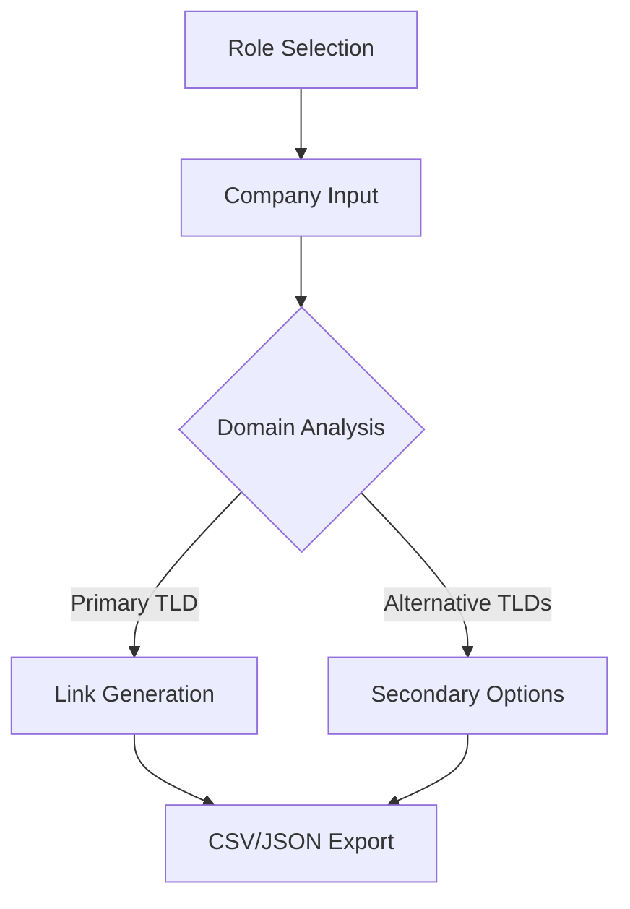

# 🔗 LinkForge: Enterprise-Grade Search Link Generator
**Craft precision-targeted company search links at scale**  
*A React-powered solution for high-performance teams to generate bulk LinkedIn search URLs with intelligent domain handling and organizational insights*

<div align="center">
  
  
  
</div>

## ✨ Core Capabilities

### 🎯 Targeted Search Generation

| Team Type | Key Functions | Sample Use Cases |
|-----------|---------------|------------------|
| **Sales Teams** | Technical decision makers, Security | Enterprise account mapping |
| **Recruiters** | Candidate sourcing, HR contacts | High-volume talent acquisition |
| **Job Seekers** | Position discovery, Team composition | Strategic career targeting |

### 🌐 Advanced Domain Management
- Intelligent .com/.fr/.es/.it prioritization
- 100+ global TLD support with auto-suggest
- Interactive domain matrix with confidence scoring

### ⚙️ Technical Highlights
```javascript
// Dynamic team size categorization
const categorizeOrganization = (devSize, secSize) => ({
  TECH_GIANT: devSize >= 1e4,
  ENTERPRISE: devSize >= 5e3,
  MID_MARKET: devSize >= 1e3,
  STARTUP: devSize < 1e3
});
```

## 🚀 Getting Started

### 📦 Installation

```bash
git clone https://github.com/AliKelDev/LinkForge.git
cd LinkForge
```

```bash
# Install dependencies
yarn install  # Preferred
# OR
npm install
```

```bash
# Launch development environment
yarn dev
# OR
npm run dev
```

## 🖥 Usage Workflow



## 📊 Data Handling

### Export Schema Example
```json
{
  "metadata": {
    "generatedAt": "2024-02-15T09:30:00Z",
    "roleContext": "SALES_TEAM"
  },
  "results": [{
    "company": "TechCorp",
    "primaryDomain": ".com",
    "organizationSize": "ENTERPRISE",
    "searchLinks": {
      "technicalDecisionMakers": "https://linkedin.com/sales/search?...",
      "securityContacts": "https://linkedin.com/sales/search?..."
    }
  }]
}
```

## 📚 Documentation Hub

### Role Configuration Matrix

| Parameter | Sales Team | Recruiting | Job Search |
|-----------|------------|------------|------------|
| Default Filters | Dev, Security | HR, Engineering | Open Positions |
| Exclusions | Accounting, Finance | Executive | Contract Roles |
| Result Depth | 100+ | 500+ | 50+ |

## 🌟 Roadmap 2025

| Initiative | Status |
|------------|---------|
| 🛠️ CRM Integration Framework | Planned |
| 🔌 Browser Extension MVP | Planned |
| 🤝 Team Collaboration Suite | Planned |
| 🧠 AI-Powered Domain Validation | Planned |

## 🤝 Contribution Guidelines

1. Fork & Clone the repository
2. Create feature branch:
```bash
git checkout -b feature/[name]-[description]
```
3. Commit changes with semantic messages:
```bash
git commit -m "feat: add domain validation module"
```
4. Push to branch & open PR

## 📜 License & Credits

MIT Licensed - Full details in LICENSE

Crafted with precision by Jordan.M  
Maintained by the LinkForge OSS Collective
