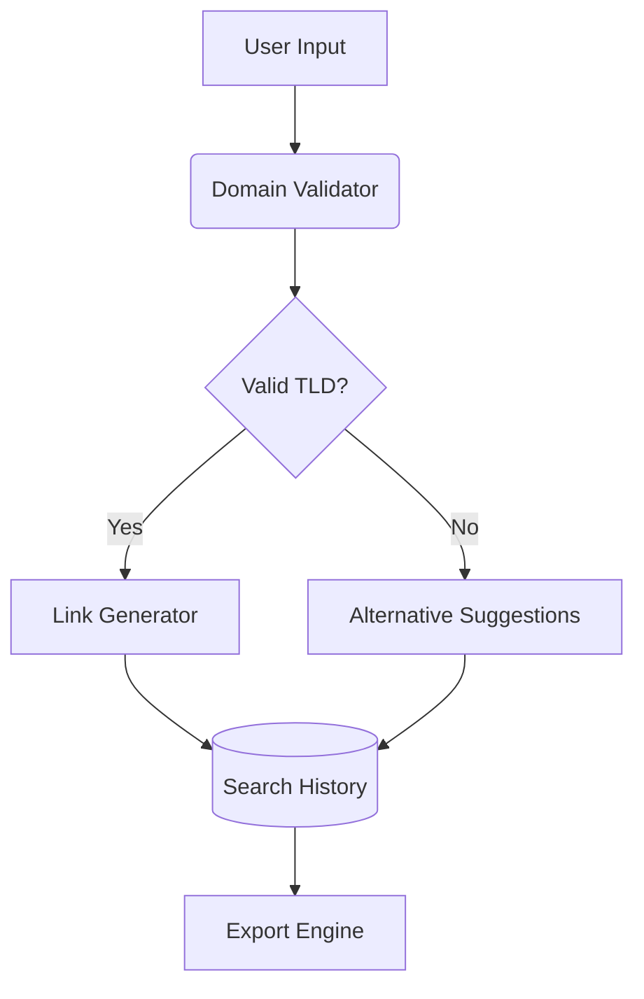

# 🔗 LinkForge: Enterprise-Grade Search Automation

**Precision-targeted company search links at scale**  
*React-powered solution for generating bulk LinkedIn search URLs with AI-assisted domain validation*

<div align="center">
  <a href="https://linkforge-alikeldev.netlify.app/">
    
  </a>
  
  
</div>

<div align="center">
  
</div>

## 🚀 Live Demo

Experience LinkForge in action:  
[https://linkforge-alikeldev.netlify.app/](https://linkforge-alikeldev.netlify.app/)

## ✨ Core Capabilities

| Feature | Implementation | Tech Stack |
|---------|----------------|------------|
| **Multi-Role Generation** | Sales/Recruiter/JobSeeker modes | Context API + Dynamic Routing |
| **Domain Intelligence** | 150+ TLD support with priority scoring | Domain Matrix Engine |
| **Bulk Processing** | CSV/JSON export with search history | PapaParse + XLSX |
| **Interactive UI** | Animated workspace transitions | Framer Motion + Tailwind |

```jsx
// Current role switching implementation
const RoleContext = createContext({
  currentRole: 'sales',
  updateRole: (newRole) => {}
});
```

## 🛠 Technical Architecture



## 🚧 Future Roadmap

### Q4 2024: Sector Expansion

| Sector | Status | Target Features |
|--------|--------|----------------|
| Finance | Planned | Banking TLDs, Compliance Filters |
| Healthcare | Research | Medical Domains, HIPAA Patterns |
| Web3 | Prototype | .crypto, .dao, Blockchain Filters |

```js
// Planned sector configuration
const FINANCE_CONFIG = {
  domains: ['.finance', '.bank', '.invest'],
  filters: {
    include: ['CFO', 'Compliance'],
    exclude: ['Engineering', 'IT']
  }
};
```

## 🛠️ Development Setup

```bash
# Clone with depth
git clone --depth=1 https://github.com/AliKelDev/LinkForge.git

# Install dependencies
npm install

# Launch dev server
npm run dev
```

## 🌍 Connect

[](https://aliceleiserblog.netlify.app/)
[](https://twitter.com/AliLeisR)

"Great tools are never finished - only iterated" - @AliKelDev

<sub>🔍 Developed by Jordan.M under the Alice Leiser alias</sub>