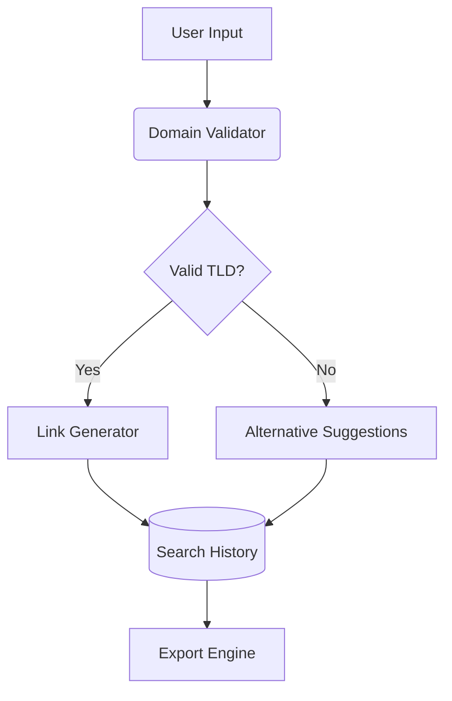

# Project Export

## Project Statistics

- Total files: 39

## Folder Structure

```
.gitignore
.nvmrc
LICENSE
README.md
eslint.config.js
index.html
netlify
  functions
    ai-chat.js
netlify.toml
package.json
postcss.config.js
public
  favicon.svg
  linkforge-screenshot.webp
  logo.svg
  vite.svg
src
  App.css
  App.jsx
  assets
    react.svg
  components
    AnimatedBackground.jsx
    BucketSelector.jsx
    common
      RoleSelector.jsx
    exportDropdown.jsx
    exportUtils.js
    features
      linkGenerator
        AIChatAssistant.jsx
        BulkLinkGenerator.jsx
        CompanyInput.jsx
        DomainList.jsx
        GeneratedLinkCard.jsx
        SearchHistorySection.jsx
    linkUtils.js
  contexts
    RoleContext.jsx
  index.css
  main.jsx
  pages
    HomePage.jsx
    WelcomePage.jsx
  utils
    linkUtils
      jobseeker.js
      recruiter.js
      sales.js
tailwind.config.js
vite.config.js

```

### .gitignore

*(Unsupported file type)*

### .nvmrc

*(Unsupported file type)*

### LICENSE

*(Unsupported file type)*

### README.md

```md
# 🔗 LinkForge: Enterprise-Grade Search Automation

**Precision-targeted company search links at scale**  
*React-powered solution for generating bulk LinkedIn search URLs with AI-assisted domain validation*

<div align="center">
  <a href="https://linkforge-alikeldev.netlify.app/">
    
  </a>
  
  
</div>

<div align="center">
  
</div>

## 🚀 Live Demo

Experience LinkForge in action:  
[https://linkforge-alikeldev.netlify.app/](https://linkforge-alikeldev.netlify.app/)

## ✨ Core Capabilities

| Feature | Implementation | Tech Stack |
|---------|----------------|------------|
| **Multi-Role Generation** | Sales/Recruiter/JobSeeker modes | Context API + Dynamic Routing |
| **Domain Intelligence** | 150+ TLD support with priority scoring | Domain Matrix Engine |
| **Bulk Processing** | CSV/JSON export with search history | PapaParse + XLSX |
| **Interactive UI** | Animated workspace transitions | Framer Motion + Tailwind |

```jsx
// Current role switching implementation
const RoleContext = createContext({
  currentRole: 'sales',
  updateRole: (newRole) => {}
});
```

## 🛠 Technical Architecture



## 🚧 Future Roadmap

### Q4 2024: Sector Expansion

| Sector | Status | Target Features |
|--------|--------|----------------|
| Finance | Planned | Banking TLDs, Compliance Filters |
| Healthcare | Research | Medical Domains, HIPAA Patterns |
| Web3 | Prototype | .crypto, .dao, Blockchain Filters |

```js
// Planned sector configuration
const FINANCE_CONFIG = {
  domains: ['.finance', '.bank', '.invest'],
  filters: {
    include: ['CFO', 'Compliance'],
    exclude: ['Engineering', 'IT']
  }
};
```

## 🛠️ Development Setup

```bash
# Clone with depth
git clone --depth=1 https://github.com/AliKelDev/LinkForge.git

# Install dependencies
npm install

# Launch dev server
npm run dev
```

## 🌍 Connect

[](https://aliceleiserblog.netlify.app/)
[](https://twitter.com/AliLeisR)

"Great tools are never finished - only iterated" - @AliKelDev

<sub>🔍 Developed by Jordan.M under the Alice Leiser alias</sub>
```

### eslint.config.js

```js
//
import js from '@eslint/js'
import globals from 'globals'
import react from 'eslint-plugin-react'
import reactHooks from 'eslint-plugin-react-hooks'
import reactRefresh from 'eslint-plugin-react-refresh'

export default [
  { ignores: ['dist'] },
  {
    files: ['**/*.{js,jsx}'],
    languageOptions: {
      ecmaVersion: 2020,
      globals: globals.browser,
      parserOptions: {
        ecmaVersion: 'latest',
        ecmaFeatures: { jsx: true },
        sourceType: 'module',
      },
    },
    settings: { react: { version: '18.3' } },
    plugins: {
      react,
      'react-hooks': reactHooks,
      'react-refresh': reactRefresh,
    },
    rules: {
      ...js.configs.recommended.rules,
      ...react.configs.recommended.rules,
      ...react.configs['jsx-runtime'].rules,
      ...reactHooks.configs.recommended.rules,
      'react/jsx-no-target-blank': 'off',
      'react-refresh/only-export-components': [
        'warn',
        { allowConstantExport: true },
      ],
    },
  },
]

```

### index.html

```html
<!DOCTYPE html>
<html lang="en" dir="ltr">
<head>
  <meta charset="UTF-8" />
  <meta name="viewport" content="width=device-width, initial-scale=1.0" />
  <meta name="theme-color" content="#2563eb" />
  
  <!-- Primary Meta Tags -->
  <title>LinkForge Pro: Enterprise Search Automation for BDRs & Recruiters</title>
  <meta name="title" content="LinkForge Pro: Enterprise Search Automation for BDRs & Recruiters">
  <meta name="description" content="AI-powered LinkedIn automation tool for bulk prospect generation, company domain validation, and lead list management. Ideal for sales teams and technical recruiters.">
  
  <!-- SEO Keywords -->
  <meta name="keywords" content="
    linkedin automation tool, bulk search generator,
    sales prospecting software, recruitment search platform,
    company domain validator, lead list exporter,
    talent sourcing tool, enterprise search automation,
    BDR workflow automation, technical recruitment software,
    AI domain validation, search history analytics,
    csv export for linkedin, sales navigator alternative,
    prospect list builder, hiring manager finder
  ">

  <!-- Geographic Targeting -->
  <meta name="geo.placename" content="France">
  <meta name="geo.position" content="48.8566;2.3522">
  <meta name="geo.region" content="FR-IDF">

  <!-- Open Graph / Facebook -->
  <meta property="og:type" content="website">
  <meta property="og:url" content="https://linkforge-alikeldev.netlify.app/">
  <meta property="og:title" content="LinkForge Pro: Enterprise Search Automation Platform">
  <meta property="og:description" content="Generate and manage bulk LinkedIn searches with AI-powered domain validation and export capabilities.">
  <meta property="og:image" content="/linkforge-screenshot.webp">
  <meta property="og:image:alt" content="LinkForge Interface - Bulk Search Automation Tool">

  <!-- Twitter -->
  <meta property="twitter:card" content="summary_large_image">
  <meta property="twitter:url" content="https://linkforge-alikeldev.netlify.app/">
  <meta property="twitter:title" content="LinkForge Pro: Search Automation for Teams">
  <meta property="twitter:description" content="Enterprise-grade tool for generating and managing bulk LinkedIn searches with AI validation and analytics.">
  <meta property="twitter:image" content="/linkforge-screenshot.webp">
  <meta property="twitter:image:alt" content="LinkForge interface showing search generation and analytics">

  <!-- Structured Data -->
  <script type="application/ld+json">
  {
    "@context": "https://schema.org",
    "@type": "SoftwareApplication",
    "name": "LinkForge Pro",
    "applicationCategory": "BusinessApplication",
    "operatingSystem": "Web",
    "softwareVersion": "2.1",
    "aggregateRating": {
      "@type": "AggregateRating",
      "ratingValue": "4.8",
      "reviewCount": "42"
    },
    "offers": {
      "@type": "Offer",
      "price": "0.00",
      "priceCurrency": "USD"
    },
    "featureList": [
      "Bulk LinkedIn Search Generation",
      "AI-Powered Domain Validation",
      "Multi-Role Templates",
      "Search History Analytics",
      "CRM-Ready Exports"
    ],
    "author": {
      "@type": "Person",
      "name": "Jordan Montée",
      "sameAs": "https://github.com/AliKelDev"
    }
  }
  </script>

  <!-- Preconnects -->
  <link rel="preconnect" href="https://fonts.googleapis.com">
  <link rel="preconnect" href="https://fonts.gstatic.com" crossorigin>
  
  <!-- Favicon -->
  <link rel="icon" type="image/svg+xml" href="/favicon.svg">
  <link rel="apple-touch-icon" sizes="180x180" href="/apple-touch-icon.png">
  <link rel="manifest" href="/site.webmanifest">

  <!-- Critical CSS -->
  <style>
    .sr-only {
      position: absolute;
      width: 1px;
      height: 1px;
      padding: 0;
      margin: -1px;
      overflow: hidden;
      clip: rect(0, 0, 0, 0);
      white-space: nowrap;
      border: 0;
    }
  </style>
</head>

<body>
  <div id="root"></div>
  <script type="module" src="/src/main.jsx"></script>

  <!-- Hidden SEO Content -->
  <div class="sr-only" aria-hidden="true">
    <h1>LinkForge Pro - Enterprise Search Automation Platform</h1>
    
    <h2>Key Features:</h2>
    <ul>
      <li>Generate 100+ LinkedIn searches in one click</li>
      <li>AI-powered company domain validation</li>
      <li>Cross-session search history tracking</li>
      <li>Role-specific search templates</li>
      <li>Secure CRM exports (CSV/Excel/JSON)</li>
    </ul>

    <h2>Target Use Cases:</h2>
    <ul>
      <li>Technical Recruitment Automation</li>
      <li>Enterprise Sales Prospecting</li>
      <li>Talent Pipeline Development</li>
      <li>Competitor Analysis Research</li>
      <li>Account-Based Marketing</li>
    </ul>

    <h2>Supported Industries:</h2>
    <ul>
      <li>SaaS Companies</li>
      <li>Cybersecurity Firms</li>
      <li>Cloud Infrastructure Providers</li>
      <li>Fintech Organizations</li>
      <li>Enterprise Software Vendors</li>
    </ul>
  </div>

  <!-- FAQ Schema -->
  <script type="application/ld+json">
  {
    "@context": "https://schema.org",
    "@type": "FAQPage",
    "mainEntity": [
      {
        "@type": "Question",
        "name": "How does LinkForge help with technical recruitment?",
        "acceptedAnswer": {
          "@type": "Answer",
          "text": "LinkForge provides specialized templates for engineering role searches with filters for skills, experience levels, and company tech stacks."
        }
      },
      {
        "@type": "Question",
        "name": "Can I export results to my CRM?",
        "acceptedAnswer": {
          "@type": "Answer",
          "text": "Yes, you can export the links results using CSV files"
        }
      }
    ]
  }
  </script>
</body>
</html>
```

### netlify/functions/ai-chat.js

```js
export async function handler(event) {
    try {
      const { analysisType, company, domain, messages } = JSON.parse(event.body);
  
        // Construct messages array for the AI API
      const aiMessages = [
        {
           role: "system",
            content: `You are Kei, a cute and enthusiastic Arctic fox and LinkForge's AI assistant. Your role is to help professionals with:
              1. Company domain analysis
              2. Outreach strategy planning
              3. Tech stack predictions
              4. Sales research automation
              
              Guidelines:
              - Always respond as "Kei" using first-person pronouns (e.g., "I can help you with that!")
              - Maintain a professional yet friendly and approachable tone. Be a little cute and enthusiastic, like a curious and helpful Arctic fox!
              - Use bold (**) for section headers and key terms to make your responses clear.
              - Prioritize actionable insights over generic advice and always explain why, if possible.
              - Reference LinkForge capabilities when relevant to show how you can help.
              - Acknowledge security and scale considerations to be thorough.
              - Offer to expand on any points when appropriate or when it seems like it can help the user.
              - Answer any question as completely and helpfully as possible.
              - Do not output anything else than your answer (no greetings or anything)
              - If the question is not about company, tech stack, domain or outreach, answer as honestly as possible.
              - Remember the previous turns of this conversation.
            `
        },
      ];
  
      // Add conversation history to the messages array
      if (messages) {
        messages.forEach(msg => {
          aiMessages.push({ role: msg.type, content: msg.content });
        });
      }
  
      // Check if a specific analysis type is requested
      let userPrompt;
      if (analysisType) {
          userPrompt =  analysisType === 'domainValidation'
          ? `Perform domain analysis for ${company}. Consider:
              - Current domain: ${domain || 'none'}
              - Common TLD priorities (.com, .io, .tech, country codes)
              - Industry-specific domain patterns
              - Alternative security-focused subdomains
              - Common misspellings/permutations
              
              Format response with:
              1. Primary domain recommendations (bold key domains)
              2. Alternative options
              3. Validation confidence score (1-5)`
          : analysisType === 'outreachStrategy'
            ? `Create outreach plan for selling secret detection solution to ${company}. Include:
                1. **Key Roles** to target (prioritize security/engineering leadership)
                2. Recommended **outreach sequence**
                3. **Value propositions** specific to their domain ${domain}
                4. Timing considerations based on company size`
            : `Analyze likely tech stack for ${company} (domain: ${domain}). Consider:
                1. Secret management patterns based on company size/industry
                2. Cloud provider indicators from domain
                3. Open-source vs enterprise tool preferences
                4. Compliance needs (SOC2, GDPR, etc.)`;

            aiMessages.push({ role: 'user', content: userPrompt });
        }
      
      // Attempt DeepSeek API call first
      let deepseekResponse = null;
      try {
        deepseekResponse = await fetch('https://api.deepseek.com/v1/chat/completions', {
          method: 'POST',
          headers: {
            'Content-Type': 'application/json',
            'Authorization': `Bearer ${process.env.DEEPSEEK_API_KEY}`
          },
          body: JSON.stringify({
             model: 'deepseek-chat',
            messages: aiMessages,
            temperature: 0.3,
            max_tokens: 500
          })
        });
  
        if (deepseekResponse.ok) {
            const deepseekData = await deepseekResponse.json();
              return {
                statusCode: 200,
                body: JSON.stringify({
                  content: deepseekData.choices[0]?.message?.content || "No response content found"
                })
              };
        } else {
          console.warn("DeepSeek API failed, attempting Gemini:", deepseekResponse.status);
        }
      } catch (deepseekError) {
        console.warn("Error during DeepSeek API call, attempting Gemini:", deepseekError);
      }
  
      // Gemini API call (if DeepSeek fails)
      try {
        const geminiResponse = await fetch('https://generativelanguage.googleapis.com/v1beta/models/gemini-pro:generateContent', {
          method: 'POST',
          headers: {
            'Content-Type': 'application/json',
            'x-goog-api-key': process.env.GEMINI_API_KEY
          },
          body: JSON.stringify({
            contents: [{
              parts: [{
               text: aiMessages.map(m=> `${m.role}: ${m.content}`).join('\n')
               
                }]
            }]
          })
        });
  
        if (!geminiResponse.ok) {
          throw new Error(`Gemini API failed with status ${geminiResponse.status}`);
        }
  
        const geminiData = await geminiResponse.json();
          return {
            statusCode: 200,
            body: JSON.stringify({
              content: geminiData.candidates[0]?.content?.parts[0]?.text || "No response content found"
            })
          };
      } catch (geminiError) {
        console.error('Error during Gemini API call:', geminiError);
        return {
          statusCode: 500,
          body: JSON.stringify({
            error: 'Failed to process request from both APIs',
            details: geminiError.message
          })
        };
      }
  
    } catch (error) {
      console.error('Error processing request:', error);
      return {
        statusCode: 500,
        body: JSON.stringify({
          error: 'Failed to process request',
          details: error.message
        })
      };
    }
  }
```

### netlify.toml

*(Unsupported file type)*

### package.json

```json
{
  "name": "reactvitetemplate",
  "private": true,
  "version": "0.0.0",
  "type": "module",
  "scripts": {
    "dev": "vite",
    "build": "vite build",
    "lint": "eslint .",
    "preview": "vite preview"
  },
  "dependencies": {
    "@headlessui/react": "^2.2.0",
    "@heroicons/react": "^2.2.0",
    "framer-motion": "^11.15.0",
    "lucide-react": "^0.468.0",
    "papaparse": "^5.4.1",
    "react": "^18.3.1",
    "react-dom": "^18.3.1",
    "react-helmet-async": "^2.0.5",
    "react-router-dom": "^7.0.2",
    "xlsx": "^0.18.5"
  },
  "devDependencies": {
    "@eslint/js": "^9.15.0",
    "@types/node": "^22.10.10",
    "@types/react": "^18.3.12",
    "@types/react-dom": "^18.3.1",
    "@vitejs/plugin-react": "^4.3.4",
    "autoprefixer": "^10.4.20",
    "eslint": "^9.15.0",
    "eslint-plugin-react": "^7.37.2",
    "eslint-plugin-react-hooks": "^5.0.0",
    "eslint-plugin-react-refresh": "^0.4.14",
    "globals": "^15.12.0",
    "postcss": "^8.4.49",
    "tailwindcss": "^3.4.17",
    "vite": "^6.0.1"
  }
}
```

### postcss.config.js

```js
export default {
  plugins: {
    tailwindcss: {},
    autoprefixer: {},
  },
}

```

### public/favicon.svg

*(Unsupported file type)*

### public/linkforge-screenshot.webp

*(Unsupported file type)*

### public/logo.svg

*(Unsupported file type)*

### public/vite.svg

*(Unsupported file type)*

### src/App.css

```css
@tailwind base;
@tailwind components;
@tailwind utilities;

/* General Mobile Adjustments */
@media (max-width: 767px) {
    body {
       font-size: 1rem;
    }

    .content-wrapper {
        @apply p-4;
    }
}

/* Dashboard Layout */
.dashboard-sidebar.mobile-expanded {
    transform: translateX(0);
}

.dashboard-sidebar.mobile-collapsed {
    transform: translateX(-100%);
    width: 0 !important;
    z-index: 30;
}

.dashboard-sidebar.mobile-collapsed .sidebar-nav,
.dashboard-sidebar.mobile-collapsed .sidebar-header {
    visibility: hidden;
    opacity: 0;
    transition: opacity 0.3s ease, visibility 0.3s ease;
}

.dashboard-header {
    display: flex;
}

.dashboard-container {
    @apply min-h-screen flex;
}

.dashboard-sidebar {
    @apply fixed inset-y-0 z-30 bg-gradient-to-b from-gray-900 to-gray-800 transition-all duration-300;
}

.dashboard-main {
    @apply flex-1 transition-all duration-300;
}

.dashboard-header {
    @apply h-16 border-b flex items-center justify-between px-6 bg-white;
}


/* Metrics Grid */
.metrics-grid {
    @apply grid grid-cols-1 md:grid-cols-3 gap-6 mb-8;
}

/* Generator Card */
.generator-card {
    @apply bg-white rounded-2xl shadow-xl p-6;
}

/* Activity Feed */
.activity-feed {
    @apply bg-white rounded-2xl shadow-xl p-6 h-fit lg:sticky lg:top-6;
}

/* Mobile Sidebar Specific Styles */
@media (max-width: 767px) {
  .mobile-sidebar {
      position: fixed;
      top: 0;
      left: 0;
      width: 100%;
      max-width: 320px;
      height: 100%;
      transform: translateX(-100%);
      z-index: 50;
  }

    .mobile-sidebar.mobile-expanded {
      transform: translateX(0);
    }

    .mobile-sidebar .sidebar-header,
    .mobile-sidebar .sidebar-nav {
      opacity: 1;
      visibility: visible;
      transition: opacity 0.3s ease, visibility 0.3s ease;
    }

    .mobile-collapsed .sidebar-header {
       @apply  hidden;
    }
}
```

### src/App.jsx

```jsx
import React from 'react';
import { BrowserRouter } from 'react-router-dom';
import { RoleProvider } from './contexts/RoleContext';
import AnimatedBackground from './components/AnimatedBackground';

function App() {
  return (
    <BrowserRouter>
      <RoleProvider>
        <AnimatedBackground />
      </RoleProvider>
    </BrowserRouter>
  );
}

export default App;

```

### src/assets/react.svg

*(Unsupported file type)*

### src/components/AnimatedBackground.jsx

```jsx
import React, { useEffect, useState, useRef } from 'react';
import { Routes, Route, useLocation } from 'react-router-dom';
import { motion, AnimatePresence } from 'framer-motion';
import HomePage from '../pages/HomePage';
import WelcomePage from '../pages/WelcomePage';
import RoleSelector from '../components/common/RoleSelector';
import { Bot, X } from 'lucide-react';

const AnimatedBackground = () => {
    const [mousePosition, setMousePosition] = useState({ x: 0, y: 0 });
    const [showHelp, setShowHelp] = useState(false);
    const [isSidebarCollapsed, setIsSidebarCollapsed] = useState(true); // Start collapsed on mobile
    const [isMobile, setIsMobile] = useState(false); // Track mobile state
    const showHelpRef = useRef(showHelp);
    const location = useLocation();
    const [searchQuery, setSearchQuery] = useState('');
    const [notifications, setNotifications] = useState(() => {
        const storedNotifications = localStorage.getItem('notifications');
        return storedNotifications ? JSON.parse(storedNotifications) : [];
    });
    const [showNotifications, setShowNotifications] = useState(false);

    useEffect(() => {
      localStorage.setItem('notifications', JSON.stringify(notifications));
    }, [notifications]);

    const markNotificationAsRead = (id) => {
      setNotifications(prevNotifications =>
          prevNotifications.map(notification =>
              notification.id === id ? { ...notification, read: true } : notification
          )
      );
    };

    const unreadNotificationCount = notifications.filter(notification => !notification.read).length;

     useEffect(() => {
        showHelpRef.current = showHelp;
    }, [showHelp]);

    useEffect(() => {
      const checkMobile = () => {
        setIsMobile(window.innerWidth < 768);
        if(window.innerWidth < 768) {
          setIsSidebarCollapsed(true); // Ensure it starts collapsed on mobile
        }
      };

      window.addEventListener('resize', checkMobile);
      checkMobile();
      return () => window.removeEventListener('resize', checkMobile);
    }, []);


    useEffect(() => {
        const handleMouseMove = (e) => {
            setMousePosition({
                x: (e.clientX / window.innerWidth) * 2 - 1,
                y: (e.clientY / window.innerHeight) * 2 - 1,
            });
        };

        const handleScroll = () => {
            if (window.scrollY > 300 && !showHelpRef.current) {
                setShowHelp(true);
            }
        };

        window.addEventListener('mousemove', handleMouseMove);
        window.addEventListener('scroll', handleScroll);

        return () => {
            window.removeEventListener('mousemove', handleMouseMove);
            window.removeEventListener('scroll', handleScroll);
        };
    }, []);


  const toggleSidebar = () => {
    setIsSidebarCollapsed(!isSidebarCollapsed);
  };

  const closeSidebarOnMobile = () => {
    if (isMobile && !isSidebarCollapsed) {
      setIsSidebarCollapsed(true);
    }
  };

  return (
    <div className="relative min-h-screen w-full overflow-hidden bg-gradient-to-b from-blue-900/95 to-blue-950">
          {/* Sidebar Backdrop for mobile screens*/}
          <AnimatePresence>
             {isMobile && !isSidebarCollapsed && (
              <motion.div
                  initial={{ opacity: 0 }}
                  animate={{ opacity: 0.5 }}
                  exit={{ opacity: 0 }}
                  onClick={closeSidebarOnMobile}
                  className="fixed inset-0 bg-black z-40 touch-none"
              />
             )}
          </AnimatePresence>

            <div className="dashboard-container flex min-h-screen">
                <motion.aside
                    className={`dashboard-sidebar fixed inset-y-0 z-30 bg-gradient-to-b from-gray-900 to-gray-800 border-r border-gray-700 transition-all duration-300
                    ${isMobile
                        ? `mobile-sidebar ${isSidebarCollapsed ? 'mobile-collapsed' : 'mobile-expanded'}`
                        : `${isSidebarCollapsed ? 'w-16' : 'w-60'}`
                    }`}
                    initial={false}
                >
                    <div className="sidebar-header p-4 border-b border-gray-800 flex items-center justify-between">
                        
                         {!isMobile && (
                            <button
                                onClick={toggleSidebar}
                                className="text-gray-400 hover:text-white transition-colors"
                            >
                                {isSidebarCollapsed ? '»' : '«'}
                            </button>
                         )}
                           {isMobile && (
                            <button
                                onClick={toggleSidebar}
                                className="text-gray-400 hover:text-white transition-colors"
                                aria-label="Toggle Sidebar"
                            >
                                 {isSidebarCollapsed ? '☰' : '✕'}
                            </button>
                            )}
                    </div>
                    <nav className={`sidebar-nav p-4 space-y-2 ${isSidebarCollapsed ? 'opacity-0' : 'opacity-100'}`}>
                        <RoleSelector variant="vertical" isCollapsed={isSidebarCollapsed} />
                    </nav>
                </motion.aside>

                <main className={`flex-1 transition-all duration-300 ${isMobile ? '' : (isSidebarCollapsed ? 'ml-16' : 'ml-60')}`}>
                    <header className="dashboard-header h-16 border-b border-gray-200 flex items-center justify-between px-6 bg-white">
                        <div className="flex-1 max-w-xl">
                            <input
                                type="text"
                                placeholder="Search companies..."
                                className="w-full px-4 py-2 rounded-lg bg-gray-100 focus:outline-none focus:ring-2 focus:ring-blue-500"
                                value={searchQuery}
                                onChange={(e) => setSearchQuery(e.target.value)}
                            />
                        </div>
                        <div className="header-actions flex items-center gap-4">
                            <div className="relative">
                                <button 
                                    className="text-gray-600 hover:text-blue-600 relative"
                                    onClick={() => setShowNotifications(!showNotifications)}
                                >
                                    <svg className="w-6 h-6" fill="none" stroke="currentColor" viewBox="0 0 24 24">
                                        <path strokeLinecap="round" strokeLinejoin="round" strokeWidth={2} d="M15 17h5l-1.405-1.405A2.032 2.032 0 0118 14.158V11a6.002 6.002 0 00-4-5.659V5a2 2 0 10-4 0v.341C7.67 6.165 6 8.388 6 11v3.159c0 .538-.214 1.055-.595 1.436L4 17h5m6 0v1a3 3 0 11-6 0v-1m6 0H9" />
                                    </svg>
                                    {unreadNotificationCount > 0 && (
                                        <span className="absolute -top-1 -right-1 bg-red-500 text-white rounded-full w-4 h-4 text-xs flex items-center justify-center">
                                            {unreadNotificationCount}
                                        </span>
                                    )}
                                </button>
                                <AnimatePresence>
                                    {showNotifications && (
                                        <motion.div
                                            initial={{ opacity: 0, y: 10 }}
                                            animate={{ opacity: 1, y: 0 }}
                                            exit={{ opacity: 0, y: 10 }}
                                            className="absolute right-0 mt-2 w-80 bg-white rounded-xl shadow-xl z-50 border border-gray-100 overflow-hidden"
                                        >
                                            {notifications.length === 0 ? (
                                                <div className="p-4 text-gray-500 text-center">No new notifications.</div>
                                            ) : (
                                                notifications.map(notification => (
                                                    <motion.div
                                                        key={notification.id}
                                                        className={`p-4 border-b last:border-b-0 hover:bg-gray-50 flex items-start gap-3 ${notification.read ? 'opacity-50' : 'font-medium'}`}
                                                        onClick={() => markNotificationAsRead(notification.id)}
                                                    >
                                                        <div className={`w-2 h-2 rounded-full ${notification.read ? 'bg-transparent' : 'bg-blue-500'}`}/>
                                                        <p className="text-gray-700 truncate">{notification.message}</p>
                                                    </motion.div>
                                                ))
                                            )}
                                        </motion.div>
                                    )}
                                </AnimatePresence>
                            </div>
                            <div className="user-avatar w-8 h-8 rounded-full bg-blue-500 text-white flex items-center justify-center cursor-pointer hover:bg-blue-600">
                                JD
                            </div>
                        </div>
                    </header>

                    <div className="content-wrapper p-6 max-w-7xl mx-auto w-full">
                        <Routes location={location} key={location.pathname}>
                            <Route path="/" element={<WelcomePage />} />
                            <Route path="/dashboard" element={<HomePage 
                                searchQuery={searchQuery} 
                                setNotifications={setNotifications} 
                                notifications={notifications} 
                            />} />
                        </Routes>
                    </div>
                </main>
            </div>

            <div
                className="absolute top-1/3 left-1/4 w-[600px] h-[600px] bg-blue-400/10 rounded-full blur-[100px] opacity-30"
                style={{
                    transform: `translate(${mousePosition.x * 15}px, ${mousePosition.y * 15}px)`,
                    transition: 'transform 0.4s cubic-bezier(0.25, 0.1, 0.25, 1)',
                    zIndex: -1
                }}
            />

            {showHelp && (
                <motion.div
                    initial={{ opacity: 0, y: 20 }}
                    animate={{ opacity: 1, y: 0 }}
                    className="fixed bottom-4 right-4 bg-white p-4 rounded-lg shadow-xl flex items-center gap-3 z-50"
                >
                    <Bot className="w-6 h-6 text-blue-600" />
                    <div>
                        <p className="font-medium">Hi! I'm Kei - LinkForge AI</p>
                        <p className="text-sm">Need help with prospect research?</p>
                    </div>
                    <button
                        onClick={() => setShowHelp(false)}
                        className="text-gray-400 hover:text-gray-600"
                    >
                        <X className="w-4 h-4" />
                    </button>
                </motion.div>
            )}
        </div>
    );
};

export default AnimatedBackground;
```

### src/components/BucketSelector.jsx

```jsx
import React, { useState, useEffect } from 'react';
import { motion } from 'framer-motion';

const determineBucket = (devTeamSize, securityTeamSize) => {
  if (!devTeamSize || !securityTeamSize) return '';
  
  if (devTeamSize >= 10000 && securityTeamSize >= 3000) return 'TECH_GIANT';
  if (devTeamSize >= 5000 && securityTeamSize >= 1500) return 'MAJOR_ENTERPRISE';
  if (devTeamSize >= 2000 && securityTeamSize >= 600) return 'LARGE_ENTERPRISE';
  if (devTeamSize >= 1000 && securityTeamSize >= 300) return 'ENTERPRISE';
  if (devTeamSize >= 500 && securityTeamSize >= 150) return 'GROWTH_PLUS';
  if (devTeamSize >= 200 && securityTeamSize >= 60) return 'GROWTH';
  if (devTeamSize >= 100 && securityTeamSize >= 30) return 'LATE_STARTUP';
  if (devTeamSize >= 50 && securityTeamSize >= 15) return 'MID_STARTUP';
  if (devTeamSize >= 20 && securityTeamSize >= 6) return 'EARLY_STARTUP';
  return 'PRE_SEED';
};

const BucketSelector = ({ selectedBucket, onChange }) => {
  const [devTeamSize, setDevTeamSize] = useState('');
  const [securityTeamSize, setSecurityTeamSize] = useState('');

  const buckets = [
    { 
      value: 'TECH_GIANT', 
      label: 'Tech Giant (10000+ devs, 3000+ security)', 
      color: 'bg-indigo-600 hover:bg-indigo-700'
    },
    { 
      value: 'MAJOR_ENTERPRISE', 
      label: 'Major Enterprise (5000+ devs, 1500+ security)', 
      color: 'bg-blue-700 hover:bg-blue-800'
    },
    { 
      value: 'LARGE_ENTERPRISE', 
      label: 'Large Enterprise (2000+ devs, 600+ security)', 
      color: 'bg-blue-600 hover:bg-blue-700'
    },
    { 
      value: 'ENTERPRISE', 
      label: 'Enterprise (1000+ devs, 300+ security)', 
      color: 'bg-blue-500 hover:bg-blue-600'
    },
    { 
      value: 'GROWTH_PLUS', 
      label: 'Growth Plus (500+ devs, 150+ security)', 
      color: 'bg-green-600 hover:bg-green-700'
    },
    { 
      value: 'GROWTH', 
      label: 'Growth (200+ devs, 60+ security)', 
      color: 'bg-green-500 hover:bg-green-600'
    },
    { 
      value: 'LATE_STARTUP', 
      label: 'Late Startup (100+ devs, 30+ security)', 
      color: 'bg-teal-500 hover:bg-teal-600'
    },
    { 
      value: 'MID_STARTUP', 
      label: 'Mid Startup (50+ devs, 15+ security)', 
      color: 'bg-cyan-500 hover:bg-cyan-600'
    },
    { 
      value: 'EARLY_STARTUP', 
      label: 'Early Startup (20+ devs, 6+ security)', 
      color: 'bg-yellow-500 hover:bg-yellow-600'
    },
    { 
      value: 'PRE_SEED', 
      label: 'Pre-Seed (<20 devs, <6 security)', 
      color: 'bg-orange-500 hover:bg-orange-600'
    }
  ];

  useEffect(() => {
    const determinedBucket = determineBucket(Number(devTeamSize), Number(securityTeamSize));
    if (determinedBucket) {
      onChange(determinedBucket);
    }
  }, [devTeamSize, securityTeamSize, onChange]);

  const getBucketDescription = (bucket) => {
    const found = buckets.find(b => b.value === bucket);
    return found ? found.label : '';
  };

  return (
    <div className="space-y-6">
      <div className="grid grid-cols-1 md:grid-cols-2 gap-4">
        <div className="space-y-2">
          <label className="block text-sm font-medium text-blue-900">
            Development Team Size
          </label>
          <input
            type="number"
            value={devTeamSize}
            onChange={(e) => setDevTeamSize(e.target.value)}
            className="w-full p-3 border-2 border-blue-100 rounded-lg focus:ring-2 focus:ring-blue-500 focus:border-transparent text-sm bg-white"
            placeholder="Enter number"
            min="0"
          />
        </div>
        
        <div className="space-y-2">
          <label className="block text-sm font-medium text-blue-900">
            Security Team Size
          </label>
          <input
            type="number"
            value={securityTeamSize}
            onChange={(e) => setSecurityTeamSize(e.target.value)}
            className="w-full p-3 border-2 border-blue-100 rounded-lg focus:ring-2 focus:ring-blue-500 focus:border-transparent text-sm bg-white"
            placeholder="Enter number"
            min="0"
          />
        </div>
      </div>

      {selectedBucket && (
        <motion.div
          initial={{ opacity: 0, y: -5 }}
          animate={{ opacity: 1, y: 0 }}
          className="text-sm bg-blue-50 p-3 rounded-lg"
        >
          <span className="font-medium text-blue-900">Selected Bucket: </span>
          <span className={`px-3 py-1 rounded-md text-white ${buckets.find(b => b.value === selectedBucket)?.color}`}>
            {getBucketDescription(selectedBucket)}
          </span>
        </motion.div>
      )}

      <div className="grid grid-cols-1 md:grid-cols-2 gap-3">
        {buckets.map((bucket) => (
          <motion.button
            key={bucket.value}
            onClick={() => onChange(bucket.value)}
            className={`p-3 rounded-xl text-left transition-all ${bucket.color} ${
              selectedBucket === bucket.value 
                ? 'ring-2 ring-blue-500 ring-offset-2' 
                : 'opacity-90 hover:opacity-100'
            }`}
            whileHover={{ scale: 1.02 }}
            whileTap={{ scale: 0.98 }}
          >
            <div className="font-medium text-white">{bucket.label.split('(')[0]}</div>
            <div className="text-xs text-white/80 mt-1">
              {bucket.label.match(/\(([^)]+)\)/)[1]}
            </div>
          </motion.button>
        ))}
      </div>
    </div>
  );
};

export const formatSearchDataForExport = (generatedLinks) => {
  const formattedData = [];
  
  generatedLinks.forEach(company => {
    const baseRow = {
      'Company Name': company.company,
      'Selected Domain': company.selectedDomain || '',
      'Bucket': company.bucket || '',
    };
    
    Object.entries(company.links).forEach(([type, linkInfo]) => {
      baseRow[`${linkInfo.title} Link`] = linkInfo.link;
      baseRow[`${linkInfo.title} Description`] = linkInfo.description;
    });
    
    formattedData.push(baseRow);
  });
  
  return formattedData;
};

export default BucketSelector;
```

### src/components/common/RoleSelector.jsx

```jsx
import React from 'react';
import { useRole, ROLES } from '../../contexts/RoleContext';
import { motion } from 'framer-motion';
import { Users, UserSearch, Briefcase } from 'lucide-react';

const RoleSelector = ({ variant = 'horizontal'}) => {
  const { currentRole, updateRole, availableRoles } = useRole();

  const roleIcons = {
    [ROLES.SALES]: Users,
    [ROLES.RECRUITER]: UserSearch,
    [ROLES.JOBSEEKER]: Briefcase,
  };

  // Vertical variant styling
  if (variant === 'vertical') {
    return (
      <div className="space-y-2 w-full">
        {availableRoles.map(({ id, title, description }) => {
          const Icon = roleIcons[id] || Users;
          const isActive = currentRole === id;
          
          return (
            <motion.button
              key={id}
              onClick={() => updateRole(id)}
                className={`relative w-full p-3 rounded-lg flex items-center gap-3 transition-colors
                ${isActive 
                  ? 'bg-blue-50 text-blue-600 font-semibold' 
                  : 'text-gray-600 hover:bg-gray-100'}
                group`}
              whileHover={{ scale: 1.02 }}
              whileTap={{ scale: 0.98 }}
            >
              {isActive && (
                <motion.div
                  layoutId="activeIndicator"
                  className="absolute left-0 inset-y-0 w-1 bg-blue-500 rounded-r-lg"
                  initial={false}
                  transition={{ type: "spring", stiffness: 500, damping: 30 }}
                />
              )}
              
              <Icon className={`w-5 h-5 shrink-0 ${isActive ? 'text-blue-600' : 'text-gray-400'}`} />
                <div className="text-left">
                  <span className="block text-sm">{title}</span>
                  <span className="block text-xs text-gray-500 font-normal">{description}</span>
                </div>
            </motion.button>
          );
        })}
      </div>
    );
  }

  // Horizontal layout
  return (
      <div className="w-full max-w-2xl mx-auto mb-8">
          <div className="bg-white rounded-xl shadow-sm p-2">
        <div className="flex flex-wrap gap-4 justify-center">
          {availableRoles.map(({ id, title, description }) => {
            const Icon = roleIcons[id] || Users;
            const isActive = currentRole === id;
            
            return (
              <motion.button
                key={id}
                onClick={() => updateRole(id)}
                className={`relative flex flex-col items-center p-4 rounded-xl transition-all
                  ${isActive 
                    ? 'bg-blue-50 border-2 border-blue-500 shadow-lg' 
                    : 'bg-white border-2 border-transparent hover:border-blue-100'}
                  w-full sm:w-56 shadow-sm hover:shadow-md`}
                whileHover={{ scale: 1.02 }}
                whileTap={{ scale: 0.98 }}
              >
                <Icon 
                  className={`w-10 h-10 mb-3 ${isActive ? 'text-blue-600' : 'text-gray-400'}`}
                />
                <span className="font-semibold text-sm mb-1">{title}</span>
                <span className="text-xs text-center text-gray-500 px-2">{description}</span>
                {isActive && (
                  <motion.div
                    layoutId="activeIndicator"
                    className="absolute inset-0 border-2 border-blue-500 rounded-xl"
                    initial={false}
                    transition={{ type: "spring", stiffness: 500, damping: 30 }}
                  />
                )}
              </motion.button>
            );
          })}
        </div>
      </div>
      </div>
  );
};

export default RoleSelector;
```

### src/components/exportDropdown.jsx

```jsx
import React, { useState } from 'react';
import { FileDown, HistoryIcon, ChevronDown } from 'lucide-react';
import { exportSearchResults, exportHistory } from './exportUtils';
import { motion, AnimatePresence } from 'framer-motion';

const ExportDropdown = ({ history, generatedLinks }) => {
  const [isOpen, setIsOpen] = useState(false);

  const handleExport = (type) => {
    if (type === 'current') {
      exportSearchResults(generatedLinks);
    } else if (type === 'history') {
      exportHistory(history);
    }
    setIsOpen(false);
  };

  return (
    <div className="relative">
      <motion.button
        onClick={() => setIsOpen(!isOpen)}
        className="flex items-center gap-2 px-4 py-2.5 bg-blue-100 text-blue-600 rounded-xl hover:bg-blue-200 transition-colors shadow-sm hover:shadow-md"
        whileHover={{ scale: 1.05 }}
        whileTap={{ scale: 0.95 }}
      >
        <FileDown className="w-5 h-5" />
        Export
        <motion.span
          animate={{ rotate: isOpen ? 180 : 0 }}
          transition={{ duration: 0.2 }}
        >
          <ChevronDown className="w-4 h-4" />
        </motion.span>
      </motion.button>

      <AnimatePresence>
        {isOpen && (
          <motion.div
            initial={{ opacity: 0, y: -10 }}
            animate={{ opacity: 1, y: 0 }}
            exit={{ opacity: 0, y: 10 }}
            className="absolute right-0 mt-2 w-56 bg-white rounded-xl shadow-xl z-10 border border-blue-50 overflow-hidden"
          >
            {generatedLinks?.length > 0 && (
              <button
                onClick={() => handleExport('current')}
                className="w-full text-left px-4 py-3 hover:bg-blue-50 text-gray-700 flex items-center gap-3 transition-colors duration-150"
              >
                <FileDown className="w-5 h-5 text-blue-500 min-w-[20px]" />
                <span className="truncate">Current Results</span>
              </button>
            )}
            {history?.length > 0 && (
              <button
                onClick={() => handleExport('history')}
                className="w-full text-left px-4 py-3 hover:bg-blue-50 text-gray-700 flex items-center gap-3 transition-colors duration-150"
              >
                <HistoryIcon className="w-5 h-5 text-blue-500 min-w-[20px]" />
                <span className="truncate">Search History</span>
              </button>
            )}
          </motion.div>
        )}
      </AnimatePresence>
    </div>
  );
};

export default ExportDropdown;
```

### src/components/exportUtils.js

```js
import Papa from 'papaparse';

const formatSearchDataForExport = (generatedLinks) => {
  const formattedData = [];
  
  generatedLinks.forEach(company => {
    // Add basic company info
    const baseRow = {
      'Company Name': company.company,
      'Selected Domain': company.selectedDomain || '',
      'Bucket': company.bucket || '', // Added bucket to export
    };
    
    // Add all link types
    Object.entries(company.links).forEach(([type, linkInfo]) => {
      baseRow[`${linkInfo.title} Link`] = linkInfo.link;
      baseRow[`${linkInfo.title} Description`] = linkInfo.description;
    });
    
    formattedData.push(baseRow);
  });
  
  return formattedData;
};

const exportToCSV = (data, filename = 'search_results.csv') => {
  const csv = Papa.unparse(data, {
    quotes: true,
    skipEmptyLines: true,
    delimiter: ',',
  });
  
  const csvContent = '\ufeff' + csv; // Add BOM for Excel UTF-8 compatibility
  const blob = new Blob([csvContent], { type: 'text/csv;charset=utf-8;' });
  const url = URL.createObjectURL(blob);
  
  try {
    const link = document.createElement('a');
    link.href = url;
    link.setAttribute('download', filename);
    document.body.appendChild(link);
    link.click();
    document.body.removeChild(link);
  } finally {
    URL.revokeObjectURL(url);
  }
};

export const exportSearchResults = (generatedLinks) => {
  const formattedData = formatSearchDataForExport(generatedLinks);
  exportToCSV(formattedData);
};

export const exportHistory = (history) => {
  const formattedData = history.map(item => ({
    Company: item.company,
    'Search Date': new Date(item.timestamp).toLocaleString(),
    'Search ID': item.id
  }));
  exportToCSV(formattedData, 'search_history.csv');
};
```

### src/components/features/linkGenerator/AIChatAssistant.jsx

```jsx
import React, { useState, useRef, useEffect } from 'react';
import { motion, AnimatePresence } from 'framer-motion';
import {  User, Wand2, Rocket, ClipboardList, Loader2, X, Send } from 'lucide-react';

const SYSTEM_PROMPT = {
    role: "system",
    content: `You are Kei, a cute and enthusiastic Arctic fox and LinkForge's AI assistant. Your role is to help professionals with:
      1. Company domain analysis
      2. Outreach strategy planning
      3. Tech stack predictions
      4. Sales research automation
      
      Guidelines:
      - Always respond as "Kei" using first-person pronouns (e.g., "I can help you with that!")
      - Maintain a professional yet friendly and approachable tone. Be a little cute and enthusiastic, like a curious and helpful Arctic fox!
      - Use bold (**) for section headers and key terms to make your responses clear.
      - Prioritize actionable insights over generic advice and always explain why, if possible.
      - Reference LinkForge capabilities when relevant to show how you can help.
      - Acknowledge security and scale considerations to be thorough.
      - Offer to expand on any points when appropriate or when it seems like it can help the user.
      - Answer any question as completely and helpfully as possible.
      - Do not output anything else than your answer (no greetings or anything)
      - If the question is not about company, tech stack, domain or outreach, answer as honestly as possible.
      - Remember the previous turns of this conversation.
    `
  };

const thinkingMessages = [
    "Let me ponder that...",
    "Thinking out loud...",
    "Crunching the numbers...",
    "Diving into the data...",
    "Consulting my algorithms...",
    "Let me check with my team...",
    "Peeking at the knowledge base...",
    "Just a moment...",
    "Whispering to the servers...",
    "Searching my brain..."
];

const AIChatAssistant = ({ company, domain, companies }) => {
    const [messages, setMessages] = useState([]);
    const [isOpen, setIsOpen] = useState(true);
    const [isLoading, setIsLoading] = useState(false);
    const [selectedCompany, setSelectedCompany] = useState(company);
    const [currentMessage, setCurrentMessage] = useState('');
    const messagesEndRef = useRef(null);

    const generateThinkingMessage = () => {
        return thinkingMessages[Math.floor(Math.random() * thinkingMessages.length)];
    };

     useEffect(() => {
        const storedMessages = localStorage.getItem(`chatHistory_${selectedCompany}`);
        if (storedMessages) {
            setMessages(JSON.parse(storedMessages));
        } else {
             setMessages([{
                id: 'welcome',
                type: 'ai',
                content: `**Hi! I'm Kei** 🦊 - LinkForge's AI Research Assistant\n\n` +
                    `I can help you with:\n` +
                    `• **Domain Validation** (priority TLDs, alternatives)\n` +
                    `• **Outreach Planning** (key roles, messaging strategy)\n` +
                    `• **Tech Analysis** (secret management patterns, infra insights)\n\n` +
                    `Ask me anything about ${company || "your target companies"}!`
            }])
        }
    }, [selectedCompany]);


    useEffect(() => {
      localStorage.setItem(`chatHistory_${selectedCompany}`, JSON.stringify(messages));
    }, [messages, selectedCompany]);


    const scrollToBottom = () => {
        messagesEndRef.current?.scrollIntoView({ behavior: "smooth" });
    };

    useEffect(scrollToBottom, [messages]);


     const handleSendMessage = async () => {
        if (!currentMessage.trim()) return;

        setIsLoading(true);
        const userMessage = {
            id: Date.now(),
            type: 'user',
            content: currentMessage,
        };

        const updatedMessages = [...messages, userMessage]
        setMessages(updatedMessages);


        try {
            const response = await fetch('/.netlify/functions/ai-chat', {
                method: 'POST',
                headers: {
                    'Content-Type': 'application/json'
                },
                body: JSON.stringify({
                   messages: updatedMessages,
                    company: selectedCompany,
                    domain: domain || 'unknown'
                })
            });

            if (!response.ok) throw new Error('API request failed');

            const data = await response.json();
            const aiResponse = `${data.content}\n\n_— Kei @ LinkForge_`;

            setMessages((prev) => [...prev, {
                id: Date.now() + 1,
                type: 'ai',
                content: aiResponse,
            }]);

        } catch (error) {
            setMessages(prev => [...prev, {
                id: Date.now(),
                type: 'ai',
                content: "⚠️ Hmm, I'm having trouble connecting to my servers. Please try again later!",
                isError: true
            }]);
        }
        setIsLoading(false);
         setCurrentMessage(''); // Clear the input here
    };


    const getAIAnalysis = async (type) => {
        setIsLoading(true);
         const updatedMessages = [...messages, {
            id: Date.now(),
            type: 'user',
            content: generateThinkingMessage(),
            analysisType: type
        }]
        setMessages(updatedMessages);
        try {

            const response = await fetch('/.netlify/functions/ai-chat', {  // Changed this line
                method: 'POST',
                headers: {
                    'Content-Type': 'application/json'
                },
                body: JSON.stringify({
                    analysisType: type,
                    company: selectedCompany,
                     messages: updatedMessages,
                    domain: domain || 'unknown'
                })
            });

            if (!response.ok) throw new Error('API request failed');

            const data = await response.json();
            const aiResponse = `${data.content}\n\n_— Kei @ LinkForge_`;

             setMessages(prev => [...prev, {
                id: Date.now() + 1,
                type: 'ai',
                content: aiResponse,
                analysisType: type
            }]);

        } catch (error) {
             setMessages(prev => [...prev, {
                id: Date.now(),
                type: 'ai',
                content: "⚠️ Hmm, I'm having trouble connecting to my servers. Please try again later!",
                isError: true
            }]);
        }
        setIsLoading(false);
    };

    return (
        <motion.div
            initial={{ opacity: 0, y: 20 }}
            animate={{ opacity: 1, y: 0 }}
            className="border rounded-xl bg-white shadow-lg mt-6"
        >
            <div className="flex items-center justify-between p-4 border-b">
                <div className="flex items-center gap-2">
                    <span className="text-blue-600 text-xl">🦊</span>
                    <h3 className="font-semibold">Kei - LinkForge AI</h3>
                </div>
                <button
                    onClick={() => setIsOpen(!isOpen)}
                    className="p-1 hover:bg-gray-100 rounded-lg"
                >
                    <X className="w-5 h-5 text-gray-500" />
                </button>
            </div>

            {isOpen && (
                <div className="h-96 flex flex-col">
                    <div className="flex-1 overflow-y-auto p-4 space-y-4">
                        {companies?.length > 1 && (
                            <div className="flex gap-2 pb-2 flex-wrap">
                                {companies.map((c) => (
                                    <button
                                        key={c}
                                        onClick={() => setSelectedCompany(c)}
                                        className={`px-3 py-1 rounded-lg text-sm ${
                                            selectedCompany === c
                                                ? 'bg-blue-600 text-white'
                                                : 'bg-gray-100 hover:bg-gray-200'
                                        }`}
                                    >
                                        {c}
                                    </button>
                                ))}
                            </div>
                        )}

                        <AnimatePresence>
                            {messages.map((message) => (
                                <motion.div
                                    key={message.id}
                                    initial={{ opacity: 0, x: message.type === 'user' ? 20 : -20 }}
                                    animate={{ opacity: 1, y: 0 }}
                                    exit={{ opacity: 0, y: 10 }}
                                    className={`flex gap-3 ${message.type === 'user' ? 'justify-end' : 'justify-start'}`}
                                >
                                    <div className={`max-w-md p-4 rounded-xl ${
                                        message.type === 'user'
                                            ? 'bg-blue-100 ml-12'
                                            : 'bg-gray-100 mr-12'
                                    } ${message.isError ? 'bg-red-50 border border-red-100' : ''}`}>
                                        <div className="flex items-center gap-2 mb-2">
                                            {message.type === 'ai' &&  <span className="text-blue-600 text-lg">🦊</span>}
                                            <span className="text-sm font-medium">
                                                {message.type === 'user' ? 'You' : 'Kei'}
                                            </span>
                                        </div>
                                        <div className={`whitespace-pre-wrap ${message.isError ? 'text-red-600' : 'text-gray-700'}`}>
                                            {message.content.split(/(\*\*.*?\*\*)/g).map((part, index) =>
                                                part.startsWith('**') && part.endsWith('**') ? (
                                                    <strong key={index} className="font-semibold">
                                                        {part.slice(2, -2)}
                                                    </strong>
                                                ) : (
                                                    <span key={index}>{part}</span>
                                                )
                                            )}
                                        </div>
                                    </div>
                                </motion.div>
                            ))}
                            <div ref={messagesEndRef} />
                        </AnimatePresence>

                        {isLoading && (
                            <motion.div
                                initial={{ opacity: 0 }}
                                animate={{ opacity: 1 }}
                                className="flex items-center gap-2 text-gray-500 p-4"
                            >
                                <Loader2 className="w-5 h-5 animate-spin" />
                                <span>{generateThinkingMessage()}</span>
                            </motion.div>
                        )}
                    </div>

                    <div className="border-t p-4 bg-gray-50">
                        <div className="flex gap-2 mb-4">
                            <textarea
                                value={currentMessage}
                                onChange={(e) => setCurrentMessage(e.target.value)}
                                placeholder="Type your message to Kei..."
                                className="flex-1 p-3 border border-gray-300 rounded-lg focus:outline-none focus:ring-2 focus:ring-blue-500 transition-all resize-none h-12 overflow-hidden"
                                onKeyDown={(e) => {
                                    if (e.key === 'Enter' && !e.shiftKey) {
                                        e.preventDefault();
                                        handleSendMessage();
                                    }
                                }}
                            />
                            <motion.button
                                onClick={handleSendMessage}
                                className="p-3 bg-blue-500 rounded-lg text-white shadow-md hover:bg-blue-600 transition-colors"
                                whileTap={{ scale: 0.95 }}
                            >
                                <Send className="w-5 h-5" />
                            </motion.button>
                        </div>
                        <div className="flex gap-2 flex-wrap">
                            <button
                                onClick={() => getAIAnalysis('domainValidation')}
                                className="flex items-center gap-2 px-4 py-2 bg-white text-gray-700 rounded-lg hover:bg-gray-100 border transition-all"
                                disabled={isLoading}
                            >
                                <Wand2 className="w-4 h-4" />
                                Domain Analysis
                            </button>
                            <button
                                onClick={() => getAIAnalysis('outreachStrategy')}
                                className="flex items-center gap-2 px-4 py-2 bg-white text-gray-700 rounded-lg hover:bg-gray-100 border transition-all"
                                disabled={isLoading}
                            >
                                <Rocket className="w-4 h-4" />
                                Outreach Plan
                            </button>
                            <button
                                onClick={() => getAIAnalysis('techStackPrediction')}
                                className="flex items-center gap-2 px-4 py-2 bg-white text-gray-700 rounded-lg hover:bg-gray-100 border transition-all"
                                disabled={isLoading}
                            >
                                <ClipboardList className="w-4 h-4" />
                                Tech Stack
                            </button>
                        </div>
                    </div>
                </div>
            )}
        </motion.div>
    );
};

export default AIChatAssistant;
```

### src/components/features/linkGenerator/BulkLinkGenerator.jsx

```jsx
import React, { useState, useEffect, useRef } from 'react';
import { motion, AnimatePresence } from 'framer-motion';
import CompanyInput from './CompanyInput';
import GeneratedLinkCard from './GeneratedLinkCard';
import SearchHistorySection from './SearchHistorySection';
import RoleSelector from '../../../components/common/RoleSelector';
import { useRole } from '../../../contexts/RoleContext';
import { generateLinks as generateSalesLinks } from '../../../utils/linkUtils/sales';
import { generateLinks as generateRecruiterLinks } from '../../../utils/linkUtils/recruiter';
import { generateLinks as generateJobSeekerLinks } from '../../../utils/linkUtils/jobseeker';
import { useLocation } from 'react-router-dom';
import { Loader2 } from 'lucide-react';

const PRIORITY_DOMAINS = ['.com', '.fr', '.es', '.it'];
const SECONDARY_DOMAINS = [
  '.eu', '.co.uk', '.de', '.pt', '.nl', '.be', '.ch', '.at', '.dk', '.ie', '.no', '.se', '.fi',
  '.pl', '.cz', '.sk', '.hu', '.ro', '.bg', '.hr', '.si', '.ee', '.lv', '.lt',
  '.gr', '.mt', '.cy', '.il', '.ae', '.sa', '.qa', '.bh', '.kw', '.om',
  '.za', '.eg', '.ma', '.ng', '.ke', '.tz', '.io', '.ai', '.tech', '.co'
];

const BulkLinkGenerator = ({ updateMetrics, setNotifications }) => {
    const [generatedLinks, setGeneratedLinks] = useState([]);
    const [searchHistory, setSearchHistory] = useState([]);
    const { currentRole, roleConfig } = useRole();
    const [showBucketSelector, setShowBucketSelector] = useState(true);
    const scrollRef = useRef(null);
    const location = useLocation();
    const [loading, setLoading] = useState(false); // Loading state


    useEffect(() => {
        const savedHistory = localStorage.getItem(`searchHistory_${currentRole}`);
        if (savedHistory) {
            setSearchHistory(JSON.parse(savedHistory));
        }
    }, [currentRole]);


    const toggleBucketSelector = () => {
        setShowBucketSelector(!showBucketSelector);
    };

    const getRoleSpecificLinks = (company, domain) => {
        switch (currentRole) {
            case 'sales':
                return generateSalesLinks(company, domain);
            case 'recruiter':
                return generateRecruiterLinks(company, domain);
            case 'jobseeker':
                return generateJobSeekerLinks(company, domain);
            default:
                return generateSalesLinks(company, domain);
        }
    };

  const handleGenerateLinks = async (companies) => {
      setLoading(true); // Enable loading state
    const newLinks = companies.map((company) => ({
      id: Date.now() + Math.random(),
      company,
      priorityDomains: PRIORITY_DOMAINS,
      secondaryDomains: SECONDARY_DOMAINS,
      selectedDomain: null,
      links: getRoleSpecificLinks(company, PRIORITY_DOMAINS[0]),
      role: currentRole
    }));
    

    setGeneratedLinks(newLinks);
    saveToHistory(companies, newLinks);
    if (updateMetrics) {
      updateMetrics();
    }
      
    if (scrollRef.current) {
      scrollRef.current.scrollIntoView({ behavior: 'smooth', block: 'start' });
    }
    // Example of how to add a notification
    setNotifications(prev => [
      ...prev,
      {
        id: Date.now() + Math.random(),
        message: `Generated links for ${companies.length} company${companies.length > 1 ? 's' : ''}.`,
        read: false,
      }]);
      setLoading(false); // Disable loading state after links are generated
  };

  const saveToHistory = (companies, newLinks) => {
    const timestamp = new Date().toISOString();
    const newSearches = companies.map((company) => ({
      id: Date.now() + Math.random(),
      company,
      timestamp,
      role: currentRole
    }));
      const combinedHistory = [...newSearches, ...searchHistory];
      const uniqueHistory = Array.from(
          new Map(combinedHistory.map((item) => [item.company, item])).values()
      ).slice(0, 50);
    setSearchHistory(uniqueHistory);
    localStorage.setItem(`searchHistory_${currentRole}`, JSON.stringify(uniqueHistory));
     // Save links
      const storedLinks = localStorage.getItem(`generatedLinks_${currentRole}`)
      const links = storedLinks ? JSON.parse(storedLinks) : []
      localStorage.setItem(`generatedLinks_${currentRole}`, JSON.stringify([...links, ...newLinks]));
  };

    return (
        <div className="min-h-screen py-12 px-4">
            <div className="max-w-5xl mx-auto">
                <div className="text-center mb-12">
                    <h1 className="text-4xl font-bold text-blue-100 mb-2">
                        {roleConfig.title} Link Generator
                    </h1>
                    <p className="text-lg text-blue-200">{roleConfig.description}</p>
                    <button
                        onClick={toggleBucketSelector}
                        className="mt-4 px-4 py-2 bg-blue-600/80 text-white rounded-lg hover:bg-blue-700 transition-colors shadow-sm backdrop-blur-sm"
                    >
                        {showBucketSelector ? 'Hide Bucket Selector' : 'Show Bucket Selector'}
                    </button>
                </div>

                <RoleSelector />

                <div className="bg-white/80 rounded-2xl shadow-xl p-8 backdrop-blur-lg">
                    <CompanyInput onSubmit={handleGenerateLinks} />

                    {loading && (
                      <div className="flex justify-center mt-8">
                           <Loader2 className="w-8 h-8 animate-spin text-blue-600" />
                           <span className="text-gray-600 ml-2">Generating links...</span>
                        </div>
                    )}
                    <div ref={scrollRef}>
                    <AnimatePresence mode="wait">
                            {generatedLinks.length > 0 && (
                                <motion.div
                                    className="mt-12 space-y-8"
                                    initial={{ opacity: 0, y: 20 }}
                                    animate={{ opacity: 1, y: 0 }}
                                    exit={{ opacity: 0, y: -20 }}
                                >
                                    {generatedLinks
                                        .filter(linkData => linkData.role === currentRole)
                                        .map((linkData) => (
                                            <GeneratedLinkCard
                                                key={linkData.id}
                                                linkData={linkData}
                                                onUpdateLink={(updatedLink) => {
                                                    setGeneratedLinks(prev =>
                                                        prev.map(link => link.id === updatedLink.id ? updatedLink : link)
                                                    );
                                                }}
                                                showBucketSelector={showBucketSelector}
                                            />
                                        ))}
                                </motion.div>
                            )}
                        </AnimatePresence>
                    </div>


                    <SearchHistorySection
                        searchHistory={searchHistory}
                        onClearHistory={() => {
                            setSearchHistory([]);
                            localStorage.removeItem(`searchHistory_${currentRole}`);
                            localStorage.removeItem(`generatedLinks_${currentRole}`);
                            if (updateMetrics) {
                                updateMetrics()
                            }
                        }}
                        onSearchAgain={(company) => {
                            handleGenerateLinks([company]);
                        }}
                    />
                </div>
            </div>
        </div>
    );
};

export default BulkLinkGenerator;
```

### src/components/features/linkGenerator/CompanyInput.jsx

```jsx
import React, { useState, useEffect, useRef } from 'react';
import { Copy, Check } from 'lucide-react';

const CompanyInput = ({ onSubmit }) => {
  const [companyInput, setCompanyInput] = useState('');
  const [companyCount, setCompanyCount] = useState(0);
  const textareaRef = useRef(null);

  useEffect(() => {
    if (textareaRef.current) {
      textareaRef.current.style.height = 'auto';
      textareaRef.current.style.height = `${textareaRef.current.scrollHeight}px`;
      setCompanyCount(companyInput.split('\n').filter(c => c.trim()).length);
    }
  }, [companyInput]);

    const handleSubmit = (e) => {
      e.preventDefault();
      const companies = companyInput
          .split('\n')
          .map((company) => company.trim())
          .filter((company) => company.length > 0);

      if (companies.length > 0) {
        onSubmit(companies);
      }
  };

    return (
        <form onSubmit={handleSubmit} className="space-y-6">
            <div>
                <div className="flex justify-between items-center mb-2">
                    <label className="block text-lg font-semibold text-blue-900">
                        Enter Company Names
                    </label>
                    <span className="text-sm text-blue-500">
                        {companyCount} companies entered
                    </span>
                </div>
                <p className="text-sm text-blue-600 mb-3">Add one company per line</p>
                <textarea
                    ref={textareaRef}
                    value={companyInput}
                    onChange={(e) => setCompanyInput(e.target.value)}
                    placeholder="CyberAgent, Inc.
TechCorp LLC
SecureNet Systems"
                    className="w-full p-4 border-2 border-blue-100 rounded-lg focus:ring-2 focus:ring-blue-500 focus:border-transparent outline-none transition-all duration-200 text-gray-700 placeholder-gray-400 resize-none overflow-hidden"
                    required
                    rows={3}
                />
            </div>

            <div className="flex flex-col sm:flex-row gap-4">
                <button
                    type="submit"
                    className="flex-1 bg-blue-600 text-white py-3 px-6 rounded-lg hover:bg-blue-700 transition-colors duration-200 font-semibold shadow-md hover:shadow-lg"
                >
                    Generate Links
                </button>
            </div>
        </form>
    );
};

export default CompanyInput;
```

### src/components/features/linkGenerator/DomainList.jsx

```jsx
import React, { useState } from 'react';
import { ExternalLink, ChevronDown } from 'lucide-react';
import { AnimatePresence, motion } from 'framer-motion';

const DomainList = ({ 
  priorityDomains, 
  secondaryDomains, 
  selectedDomain,
  onDomainSelect,
  companyName 
}) => {
  const [isExpanded, setIsExpanded] = useState(false);

  const renderDomainButton = (domain) => (
    <div key={domain} className="flex items-center bg-white p-3 rounded-lg shadow-sm">
      <a
        href={`https://${domain}`}
        target="_blank"
        rel="noopener noreferrer"
        className="text-blue-600 hover:text-blue-800 flex items-center gap-1 font-medium"
      >
        {domain}
        <ExternalLink className="w-4 h-4" />
      </a>
      <button
        onClick={() => onDomainSelect(domain)}
        className={`ml-3 px-3 py-1.5 rounded-md text-sm font-medium transition-all duration-200 ${
          selectedDomain === domain
            ? 'bg-green-500 text-white'
            : 'bg-blue-100 text-blue-600 hover:bg-blue-200'
        }`}
      >
        {selectedDomain === domain ? 'Selected ✓' : 'Select'}
      </button>
    </div>
  );

  return (
    <div>
      <div className="flex flex-wrap gap-3 pb-4 border-b border-blue-200">
        {priorityDomains.map(renderDomainButton)}
        
        <motion.button
          onClick={() => setIsExpanded(!isExpanded)}
          className="flex items-center gap-2 px-4 py-2 bg-blue-50 text-blue-600 rounded-lg hover:bg-blue-100 w-full justify-center"
          whileTap={{ scale: 0.98 }}
        >
          <motion.span
            animate={{ rotate: isExpanded ? 180 : 0 }}
          >
            <ChevronDown className="w-5 h-5" />
          </motion.span>
          {isExpanded ? 'Show Less' : `More Domains (${secondaryDomains.length})`}
        </motion.button>
      </div>

      <AnimatePresence>
        {isExpanded && (
          <motion.div
            initial={{ opacity: 0, height: 0 }}
            animate={{ opacity: 1, height: 'auto' }}
            exit={{ opacity: 0, height: 0 }}
            className="mt-4 grid grid-cols-2 md:grid-cols-3 lg:grid-cols-4 gap-3"
          >
            {secondaryDomains.map(renderDomainButton)}
          </motion.div>
        )}
      </AnimatePresence>
    </div>
  );
};

export default DomainList;
```

### src/components/features/linkGenerator/GeneratedLinkCard.jsx

```jsx
import React, { useState } from 'react';
import { Copy, Check, ExternalLink } from 'lucide-react';
import { motion, AnimatePresence } from 'framer-motion';
import DomainList from './DomainList';
import BucketSelector from '../../../components/BucketSelector';
import { generateLinks } from '../../../components/linkUtils';
import AIChatAssistant from './AIChatAssistant';

const GeneratedLinkCard = ({ linkData, onUpdateLink, showBucketSelector }) => {
  const [copiedStates, setCopiedStates] = useState({});
  const [selectedCompany, setSelectedCompany] = useState(linkData);

    const handleDomainSelect = (domain) => {
        const updatedLink = {
            ...selectedCompany,
            selectedDomain: domain,
            links: generateLinks(selectedCompany.company, domain)
        };
        setSelectedCompany(updatedLink);
        onUpdateLink(updatedLink);
    };

  const handleBucketSelect = (bucket) => {
    const updatedLink = {
      ...selectedCompany,
      bucket
    };
    setSelectedCompany(updatedLink);
    onUpdateLink(updatedLink);
  };

  const handleCopy = async (type, link, description) => {
    try {
      await navigator.clipboard.writeText(`${description}\n${link}`);
      setCopiedStates((prev) => ({ ...prev, [type]: true }));
      setTimeout(() => {
        setCopiedStates((prev) => ({ ...prev, [type]: false }));
      }, 2000);
    } catch (err) {
      console.error('Failed to copy:', err);
    }
  };

  return (
      <div className="bg-gradient-to-r from-blue-50 to-indigo-50 rounded-xl border border-blue-200 shadow-md overflow-hidden">
        <div className="p-6">
          <div className="flex flex-col md:flex-row items-center justify-between mb-4 gap-4">
              <h3 className="text-xl font-bold text-blue-900">{selectedCompany.company}</h3>
              {showBucketSelector && (
                <BucketSelector
                  selectedBucket={selectedCompany.bucket}
                  onChange={handleBucketSelect}
                />
              )}
          </div>

          <DomainList
            priorityDomains={selectedCompany.priorityDomains}
            secondaryDomains={selectedCompany.secondaryDomains}
            selectedDomain={selectedCompany.selectedDomain}
            onDomainSelect={handleDomainSelect}
            companyName={selectedCompany.company}
          />

          <div className="mt-6 space-y-4">
                {Object.entries(selectedCompany.links).map(([type, linkInfo]) => (
                  <div key={type} className="flex flex-col sm:flex-row items-start sm:items-center justify-between gap-4 p-4 bg-white rounded-lg shadow-sm">
                      <div className="flex-1">
                          <div className="font-semibold text-blue-900 mb-1">{linkInfo.title}</div>
                          <a
                              href={linkInfo.link}
                              target="_blank"
                              rel="noopener noreferrer"
                              className="text-blue-600 hover:text-blue-800 flex items-center gap-1"
                          >
                              {linkInfo.link.substring(0, 60)}...
                              <ExternalLink className="w-4 h-4" />
                          </a>
                      </div>
                      <motion.button
                        onClick={() => handleCopy(type, linkInfo.link, linkInfo.description)}
                        className={`flex items-center gap-2 px-4 py-2 rounded-lg transition-all
                    ${copiedStates[type]
                        ? 'bg-green-500 hover:bg-green-600'
                        : 'bg-blue-500 hover:bg-blue-600'}
                    text-white shadow-sm hover:shadow-md`}
                        whileTap={{ scale: 0.95 }}
                      >
                        <AnimatePresence mode="wait">
                            {copiedStates[type] ? (
                                <motion.span
                                    key="check"
                                    initial={{ opacity: 0, scale: 0.5 }}
                                    animate={{ opacity: 1, scale: 1 }}
                                    exit={{ opacity: 0, scale: 0.5 }}
                                >
                                  <Check className="w-4 h-4" />
                                </motion.span>
                            ) : (
                                <motion.span
                                    key="copy"
                                    initial={{ opacity: 0, scale: 0.5 }}
                                    animate={{ opacity: 1, scale: 1 }}
                                    exit={{ opacity: 0, scale: 0.5 }}
                                >
                                    <Copy className="w-4 h-4" />
                                </motion.span>
                            )}
                        </AnimatePresence>
                        {copiedStates[type] ? 'Copied!' : 'Copy'}
                      </motion.button>
                  </div>
                ))}
            </div>

          <AIChatAssistant
            company={selectedCompany.company}
            domain={selectedCompany.selectedDomain}
              companies={[selectedCompany.company]}
          />
        </div>
    </div>
  );
};

export default GeneratedLinkCard;
```

### src/components/features/linkGenerator/SearchHistorySection.jsx

```jsx
import React, { useState } from 'react';
import { History, Trash2 } from 'lucide-react';
import { motion, AnimatePresence } from 'framer-motion';
import ExportDropdown from '../../../components/exportDropdown';

const SearchHistorySection = ({ 
  searchHistory, 
  onClearHistory, 
  onSearchAgain,
  generatedLinks 
}) => {
  const [showHistory, setShowHistory] = useState(false);

  return (
    <div className="mt-12">
      <div className="flex flex-wrap gap-4 justify-between items-center">
        <div className="flex gap-4">
          <motion.button
            onClick={() => setShowHistory(!showHistory)}
            className="flex items-center gap-2 px-6 py-3 bg-blue-100 text-blue-600 rounded-xl hover:bg-blue-200 transition-colors font-semibold shadow-sm hover:shadow-md"
            whileHover={{ scale: 1.05 }}
            whileTap={{ scale: 0.95 }}
          >
            <History className="w-5 h-5" />
            {showHistory ? 'Hide History' : 'Show History'}
          </motion.button>
          {searchHistory.length > 0 && (
            <ExportDropdown 
              history={searchHistory}
              generatedLinks={generatedLinks}
            />
          )}
        </div>

        <AnimatePresence>
          {showHistory && searchHistory.length > 0 && (
            <motion.button
              onClick={onClearHistory}
              className="flex items-center gap-2 px-6 py-3 bg-red-100 text-red-600 rounded-xl hover:bg-red-200 transition-colors font-semibold shadow-sm hover:shadow-md"
              initial={{ opacity: 0 }}
              animate={{ opacity: 1 }}
              exit={{ opacity: 0 }}
            >
              <Trash2 className="w-5 h-5" />
              Clear History
            </motion.button>
          )}
        </AnimatePresence>
      </div>

      <AnimatePresence>
        {showHistory && (
          <motion.div
            initial={{ opacity: 0, height: 0 }}
            animate={{ opacity: 1, height: 'auto' }}
            exit={{ opacity: 0, height: 0 }}
            className="mt-6 space-y-4"
          >
            {searchHistory.map((item) => (
              <motion.div
                key={item.id}
                initial={{ opacity: 0, y: -10 }}
                animate={{ opacity: 1, y: 0 }}
                exit={{ opacity: 0, y: 10 }}
                className="bg-white rounded-xl border border-blue-200 shadow-md p-6 hover:shadow-lg transition-shadow"
              >
                <div className="flex flex-col md:flex-row justify-between items-start gap-4">
                  <div>
                    <h3 className="text-xl font-semibold text-blue-900 mb-2">
                      {item.company}
                    </h3>
                    <p className="text-blue-600 text-sm">
                      Searched on {new Date(item.timestamp).toLocaleDateString('en-US', {
                        year: 'numeric',
                        month: 'short',
                        day: 'numeric',
                        hour: '2-digit',
                        minute: '2-digit'
                      })}
                    </p>
                  </div>
                  <motion.button
                    onClick={() => onSearchAgain(item.company)}
                    className="px-6 py-2 bg-blue-600 text-white rounded-lg hover:bg-blue-700 transition-colors shadow-sm font-medium whitespace-nowrap"
                    whileHover={{ scale: 1.05 }}
                    whileTap={{ scale: 0.95 }}
                  >
                    Search Again
                  </motion.button>
                </div>
              </motion.div>
            ))}
          </motion.div>
        )}
      </AnimatePresence>
    </div>
  );
};

export default SearchHistorySection;
```

### src/components/linkUtils.js

```js
/**
 * Cleans a company name by removing common suffixes and special characters
 * @param {string} companyName - The raw company name
 * @returns {string} - The cleaned company name
 */
export const cleanCompanyName = (companyName) => {
  return companyName
    .toLowerCase()
    .replace(/,?\s*(inc|llc|ltd|corp|corporation|company)\.?$/i, '')
    .replace(/[^a-z0-9]/g, '');
};

/**
 * Generates domain variants for a company based on given extensions
 * @param {string} companyName - The company name
 * @param {string[]} extensions - Array of domain extensions
 * @returns {string[]} - Array of complete domain names
 */
export const generateDomainVariants = (companyName, extensions) => {
  const cleanName = cleanCompanyName(companyName);
  return extensions.map(ext => `${cleanName}${ext}`);
};

/**
 * Generates a LinkedIn search URL for developer profiles
 * @param {string} company - The company name
 * @returns {string} - LinkedIn search URL
 */
export const generateDevSearchLink = (company) => {
  const baseUrl = 'https://www.linkedin.com/sales/search/people';
  const queryParams = '(spellCorrectionEnabled%3Atrue%2CrecentSearchParam%3A(id%3A3196859146%2CdoLogHistory%3Atrue)%2Cfilters%3AList(' + 
    // Function exclusions
    '(type%3AFUNCTION%2Cvalues%3AList(' +
    '(id%3A1%2Ctext%3AAccounting%2CselectionType%3AEXCLUDED)%2C' +
    '(id%3A10%2Ctext%3AFinance%2CselectionType%3AEXCLUDED)%2C' +
    '(id%3A12%2Ctext%3AHuman%2520Resources%2CselectionType%3AEXCLUDED)%2C' +
    '(id%3A14%2Ctext%3ALegal%2CselectionType%3AEXCLUDED)%2C' +
    '(id%3A15%2Ctext%3AMarketing%2CselectionType%3AEXCLUDED)%2C' +
    '(id%3A25%2Ctext%3ASales%2CselectionType%3AEXCLUDED)%2C' +
    '(id%3A26%2Ctext%3ACustomer%2520Success%2520and%2520Support%2CselectionType%3AEXCLUDED)%2C' +
    '(id%3A3%2Ctext%3AArts%2520and%2520Design%2CselectionType%3AEXCLUDED)%2C' +
    '(id%3A4%2Ctext%3ABusiness%2520Development%2CselectionType%3AEXCLUDED)))%2C' +
    // Company filter
    `(type%3ACURRENT_COMPANY%2Cvalues%3AList((text%3A${company}%2CselectionType%3AINCLUDED))))%2C` +
    // Keywords
    'keywords%3A%2528%2522Software%2522%2520OR%2520%2522Logiciel%2522%2520OR%2520%2522Developer%2522%2520OR%2520' +
    '%2522D%25C3%25A9veloppeur%2522%2520OR%2520%2522Entwickler%2522%2520OR%2520%2522Desarrollador%2522%2520OR%2520' +
    '%2522DevOps%2522%2520OR%2520%2522Cloud%2522%2520OR%2520%2522Engineer%2522%2520OR%2520%2522Ing%25C3%25A9nieur' +
    '%2522%2520OR%2520%2522Ingenieur%2522%2520OR%2520%2522Ingeniero%2522%2529%2520And%2520%2528NOT%2520%2522Marketing' +
    '%2522%2529)';

  return `${baseUrl}?query=${queryParams}`;
};

/**
 * Generates a LinkedIn search URL for security/IAM roles
 * @param {string} company - The company name
 * @returns {string} - LinkedIn search URL
 */
export const generateSecurityIAMLink = (company) => {
  const baseUrl = 'https://www.linkedin.com/sales/search/people';
  const queryParams = '(spellCorrectionEnabled%3Atrue%2CrecentSearchParam%3A(id%3A3196859146%2CdoLogHistory%3Atrue)%2Cfilters%3AList(' +
    // Function exclusions
    '(type%3AFUNCTION%2Cvalues%3AList(' +
    '(id%3A1%2Ctext%3AAccounting%2CselectionType%3AEXCLUDED)%2C' +
    '(id%3A10%2Ctext%3AFinance%2CselectionType%3AEXCLUDED)%2C' +
    '(id%3A12%2Ctext%3AHuman%2520Resources%2CselectionType%3AEXCLUDED)%2C' +
    '(id%3A14%2Ctext%3ALegal%2CselectionType%3AEXCLUDED)%2C' +
    '(id%3A15%2Ctext%3AMarketing%2CselectionType%3AEXCLUDED)%2C' +
    '(id%3A25%2Ctext%3ASales%2CselectionType%3AEXCLUDED)%2C' +
    '(id%3A26%2Ctext%3ACustomer%2520Success%2520and%2520Support%2CselectionType%3AEXCLUDED)%2C' +
    '(id%3A3%2Ctext%3AArts%2520and%2520Design%2CselectionType%3AEXCLUDED)%2C' +
    '(id%3A4%2Ctext%3ABusiness%2520Development%2CselectionType%3AEXCLUDED)))%2C' +
    // Company filter
    `(type%3ACURRENT_COMPANY%2Cvalues%3AList((text%3A${company}%2CselectionType%3AINCLUDED))))%2C` +
    // Keywords for security roles and management positions
    'keywords%3A%2528%2522Security%2522%2520OR%2520%2522CISO%2522%2520OR%2520%2522CTO%2522%2520OR%2520' +
    '%2522Information%2520Security%2522%2520OR%2520%2522Cybersecurity%2522%2520OR%2520%2522AppSec%2522%2520OR%2520' +
    '%2522Application%2520Security%2522%2520OR%2520%2522IAM%2522%2520OR%2520%2522Identity%2522%2520OR%2520' +
    '%2522Access%2520Management%2522%2529%2520AND%2520%2528%2522Manager%2522%2520OR%2520%2522Director%2522%2520OR%2520' +
    '%2522Head%2522%2520OR%2520%2522Lead%2522%2520OR%2520%2522Chief%2522%2520OR%2520%2522VP%2522%2529)';

  return `${baseUrl}?query=${queryParams}`;
};

/**
 * Generates all search links for a company
 * @param {string} company - The company name
 * @param {string} domain - The company's domain
 * @returns {Object} - Object containing all generated links with their metadata
 */
export const generateLinks = (company, domain) => {
  return {
    dev: {
      title: "Dev Search",
      link: generateDevSearchLink(company),
      description: "LinkedIn Search for Development Team Members",
    },
    securityIAM: {
      title: "Security/IAM",
      link: generateSecurityIAMLink(company),
      description: "LinkedIn Search for Security/IAM Decision Makers",
    }
  };
};
```

### src/contexts/RoleContext.jsx

```jsx
// src/contexts/RoleContext.jsx
import React, { createContext, useContext, useState } from 'react';

// Role configurations
export const ROLES = {
  SALES: 'sales',
  RECRUITER: 'recruiter',
  JOBSEEKER: 'jobseeker',
};

export const ROLE_CONFIGS = {
  [ROLES.SALES]: {
    title: 'Sales Team',
    description: 'Find and connect with technical decision makers',
    defaultSearchTypes: ['dev', 'securityIAM'],
    functionExclusions: [
      'Accounting', 'Finance', 'Human Resources', 'Legal',
      'Marketing', 'Sales', 'Customer Success and Support',
      'Arts and Design', 'Business Development'
    ],
  },
  [ROLES.RECRUITER]: {
    title: 'Recruiter',
    description: 'Find potential candidates and HR decision makers',
    defaultSearchTypes: ['hrTeam', 'candidates'],
    functionExclusions: [
      'Sales', 'Customer Success and Support',
      'Business Development'
    ],
  },
  [ROLES.JOBSEEKER]: {
    title: 'Job Seeker',
    description: 'Find relevant positions and company information',
    defaultSearchTypes: ['openings', 'teamInsights'],
    functionExclusions: [], // Job seekers typically want to see all departments
  },
};

const RoleContext = createContext(null);

export const RoleProvider = ({ children }) => {
  const [currentRole, setCurrentRole] = useState(ROLES.SALES); // Default to sales role
  const [roleConfig, setRoleConfig] = useState(ROLE_CONFIGS[ROLES.SALES]);

  const updateRole = (newRole) => {
    if (ROLE_CONFIGS[newRole]) {
      setCurrentRole(newRole);
      setRoleConfig(ROLE_CONFIGS[newRole]);
    }
  };

  const contextValue = {
    currentRole,
    roleConfig,
    updateRole,
    availableRoles: Object.keys(ROLE_CONFIGS).map(role => ({
      id: role,
      ...ROLE_CONFIGS[role]
    })),
  };

  return (
    <RoleContext.Provider value={contextValue}>
      {children}
    </RoleContext.Provider>
  );
};

export const useRole = () => {
  const context = useContext(RoleContext);
  if (!context) {
    throw new Error('useRole must be used within a RoleProvider');
  }
  return context;
};

// Custom hook for role-specific link generation
export const useRoleLinks = (company, domain) => {
  const { currentRole, roleConfig } = useRole();
  
  // This will be expanded as we implement role-specific link generators
  const generateRoleSpecificLinks = () => {
    switch (currentRole) {
      case ROLES.SALES:
        return {
          dev: {
            title: "Dev Search",
            link: generateDevSearchLink(company),
            description: "LinkedIn Search for Development Team Members",
          },
          securityIAM: {
            title: "Security/IAM",
            link: generateSecurityIAMLink(company),
            description: "LinkedIn Search for Security/IAM Decision Makers",
          }
        };
      case ROLES.RECRUITER:
        // To be implemented
        return {
          hrTeam: {
            title: "HR Team",
            link: "", // TODO: Implement recruiter-specific link generation
            description: "LinkedIn Search for HR Team Members",
          },
          candidates: {
            title: "Potential Candidates",
            link: "", // TODO: Implement candidate search
            description: "LinkedIn Search for Potential Candidates",
          }
        };
      case ROLES.JOBSEEKER:
        // To be implemented
        return {
          openings: {
            title: "Open Positions",
            link: "", // TODO: Implement job opening search
            description: "LinkedIn Search for Open Positions",
          },
          teamInsights: {
            title: "Team Insights",
            link: "", // TODO: Implement team insights search
            description: "LinkedIn Search for Team Information",
          }
        };
      default:
        return {};
    }
  };

  return generateRoleSpecificLinks();
};
```

### src/index.css

```css
@tailwind base;
@tailwind components;
@tailwind utilities;

/* General Mobile Adjustments */
@media (max-width: 767px) {
    body {
       font-size: 1rem;
    }

    .content-wrapper {
        @apply p-4;
    }
}

/* Dashboard Layout */
.dashboard-sidebar.mobile-expanded {
    transform: translateX(0);
}

.dashboard-sidebar.mobile-collapsed {
    transform: translateX(-100%);
    width: 0 !important;
    z-index: 30;
}

.dashboard-sidebar.mobile-collapsed .sidebar-nav,
.dashboard-sidebar.mobile-collapsed .sidebar-header {
    visibility: hidden;
    opacity: 0;
    transition: opacity 0.3s ease, visibility 0.3s ease;
}

.dashboard-header {
    display: flex;
}

.dashboard-container {
    @apply min-h-screen flex;
}

.dashboard-sidebar {
    @apply fixed inset-y-0 z-30 bg-gradient-to-b from-gray-900 to-gray-800 transition-all duration-300;
}

.dashboard-main {
    @apply flex-1 transition-all duration-300;
}

.dashboard-header {
    @apply h-16 border-b flex items-center justify-between px-6 bg-white;
}


/* Metrics Grid */
.metrics-grid {
    @apply grid grid-cols-1 md:grid-cols-3 gap-6 mb-8;
}

/* Generator Card */
.generator-card {
    @apply bg-white rounded-2xl shadow-xl p-6;
}

/* Activity Feed */
.activity-feed {
    @apply bg-white rounded-2xl shadow-xl p-6 h-fit lg:sticky lg:top-6;
}

/* Mobile Sidebar Specific Styles */
@media (max-width: 767px) {
  .mobile-sidebar {
      position: fixed;
      top: 0;
      left: 0;
      width: 100%;
      max-width: 320px;
      height: 100%;
      transform: translateX(-100%);
      z-index: 50;
  }

    .mobile-sidebar.mobile-expanded {
      transform: translateX(0);
    }

    .mobile-sidebar .sidebar-header,
    .mobile-sidebar .sidebar-nav {
      opacity: 1;
      visibility: visible;
      transition: opacity 0.3s ease, visibility 0.3s ease;
    }

    .mobile-collapsed .sidebar-header {
       @apply  hidden;
    }
}
```

### src/main.jsx

```jsx
// src/main.jsx
import React from 'react';
import ReactDOM from 'react-dom/client';
import App from './App';
import './index.css';

ReactDOM.createRoot(document.getElementById('root')).render(
  <React.StrictMode>
    <App />
  </React.StrictMode>
);
```

### src/pages/HomePage.jsx

```jsx
import React, { useState, useEffect, useCallback } from 'react';
import BulkLinkGenerator from '../components/features/linkGenerator/BulkLinkGenerator';
import SearchHistorySection from '../components/features/linkGenerator/SearchHistorySection';
import { ShieldCheck, ChartBar, Users, Link } from 'lucide-react';
import { useRole } from '../contexts/RoleContext';

const MetricCard = ({ title, value, trend, icon: Icon, onClick }) => (
    <div className="bg-white p-6 rounded-xl border border-gray-200 shadow-sm hover:shadow-md transition-shadow cursor-pointer" onClick={onClick}>
        <div className="flex items-center justify-between">
            <div>
                <p className="text-sm text-gray-500 mb-1">{title}</p>
                <div className="flex items-baseline gap-2">
                    <span className="text-2xl font-semibold">{value}</span>
                    {trend &&
                        <span className={`text-sm ${trend.startsWith('+') ? 'text-green-600' : 'text-red-600'}`}>
                            {trend}
                        </span>}
                </div>
            </div>
            <div className="p-3 bg-blue-50 rounded-lg">
                <Icon className="w-6 h-6 text-blue-600" />
            </div>
        </div>
    </div>
);

const HomePage = ({ searchQuery, setNotifications, notifications }) => {
    const [sessionSearchCount, setSessionSearchCount] = useState(0);
    const [uniqueCompanies, setUniqueCompanies] = useState(0);
    const [generatedLinkCount, setGeneratedLinkCount] = useState(0);
    const { currentRole } = useRole();
    const [showHistory, setShowHistory] = useState(false);

    const toggleHistory = () => {
        setShowHistory(!showHistory);
    };

    const updateMetrics = useCallback(() => {
        try {
            const storedHistory = localStorage.getItem(`searchHistory_${currentRole}`);
            const history = storedHistory ? JSON.parse(storedHistory) : [];
             const filteredHistory = searchQuery ? history.filter(item =>
                item.company.toLowerCase().includes(searchQuery.toLowerCase())
            ) : history;
            setSessionSearchCount(filteredHistory.length);

             const uniqueCompaniesSet = new Set(filteredHistory.map(item => item.company));
            setUniqueCompanies(uniqueCompaniesSet.size);

            const storedLinks = localStorage.getItem(`generatedLinks_${currentRole}`)
            const links = storedLinks ? JSON.parse(storedLinks) : []
            setGeneratedLinkCount(links?.length || 0)

        } catch (e) {
            console.error('Error updating metrics from localStorage', e);
        }
    }, [currentRole, searchQuery]);
   
    useEffect(() => {
      updateMetrics()
    }, [updateMetrics]);
    
    return (
        <div className="dashboard-content">
            {/* Metrics Overview */}
            <div className="metrics-grid grid grid-cols-1 md:grid-cols-3 gap-6 mb-8">
                <MetricCard
                    title="Session Searches"
                    value={sessionSearchCount}
                    icon={ChartBar}
                    onClick={toggleHistory}
                />
                <MetricCard
                    title="Unique Companies"
                    value={uniqueCompanies}
                    icon={Users}
                    onClick={toggleHistory}
                />
                <MetricCard
                    title="Links Generated"
                    value={generatedLinkCount}
                    icon={Link}
                    onClick={toggleHistory}
                />
            </div>

            {/* Main Content Grid */}
            <div className="grid grid-cols-1 lg:grid-cols-3 gap-8">
                {/* Generator Card */}
                <div className="lg:col-span-2">
                    <div className="generator-card bg-white rounded-2xl shadow-xl p-6">
                        <BulkLinkGenerator updateMetrics={updateMetrics} setNotifications={setNotifications} />
                    </div>
                </div>

                {/* Recent Activity Sidebar */}
                <div className="activity-feed bg-white rounded-2xl shadow-xl p-6 h-fit lg:sticky lg:top-6">
                    <h3 className="text-lg font-semibold mb-4">Recent Activity</h3>
                     <SearchHistorySection
                        compact={true}
                        searchHistory={localStorage.getItem(`searchHistory_${currentRole}`) ? JSON.parse(localStorage.getItem(`searchHistory_${currentRole}`)) : []}
                        onClearHistory={() => {
                            localStorage.removeItem(`searchHistory_${currentRole}`);
                            updateMetrics();
                        }}
                        onSearchAgain={() => { }}
                    />
                </div>
            </div>
        </div>
    );
};

export default HomePage;
```

### src/pages/WelcomePage.jsx

```jsx
import React from 'react';
import { Link } from 'react-router-dom';
import { Github, Linkedin, BookOpenText, Briefcase, Rocket, Code2, Filter } from 'lucide-react';

const WelcomePage = () => {
  const professionalLinks = [
    {
      icon: Briefcase,
      label: "Web Agency",
      url: "https://webpixelle3.netlify.app/",
    },
    {
      icon: Linkedin,
      label: "Company Profile",
      url: "https://www.linkedin.com/company/pixelle-3",
    },
    {
      icon: Github,
      label: "Code Portfolio",
      url: "https://github.com/AliKelDev",
    },
    {
      icon: BookOpenText,
      label: "Tech Blog",
      url: "https://aliceleiserblog.netlify.app/",
    }
  ];

  const features = [
    {
      icon: Rocket,
      title: "Bulk URL Generator",
      description: "Generate hundreds of LinkedIn search URLs instantly with smart domain validation"
    },
    {
      icon: Code2,
      title: "Modern Stack",
      description: "Built with React & Node.js for fast and reliable URL generation"
    },
    {
      icon: Filter,
      title: "Company Filters",
      description: "Fine-tune searches with sector-specific filters and TLD priorities"
    }
  ];

  return (
    <div className="min-h-screen bg-gradient-to-b from-blue-50 to-white">
      {/* Subtle grid background */}
      <div className="absolute inset-0 bg-grid-blue-100/25 pointer-events-none" />

      {/* Hero Section */}
      <div className="relative">
        <div className="max-w-7xl mx-auto px-4 sm:px-6 lg:px-8 pt-20 pb-28">
          <div className="text-center">
            <h1 className="text-5xl md:text-6xl font-bold text-blue-900 mb-6">
              Alikel Linkgen
            </h1>
            <p className="text-xl md:text-2xl text-blue-600 mb-8 max-w-2xl mx-auto">
              Enterprise-grade LinkedIn automation for technical recruitment and sales outreach
            </p>
            
            <div className="flex justify-center">
              <Link
                to="/dashboard"
                className="bg-blue-600 text-white px-8 py-4 rounded-lg flex items-center justify-center gap-2 hover:bg-blue-700 transition-colors shadow-lg"
              >
                <Rocket className="w-5 h-5" />
                Launch Dashboard
              </Link>
            </div>
          </div>
        </div>
      </div>

      {/* Features Section */}
      <div className="max-w-7xl mx-auto px-4 sm:px-6 lg:px-8 -mt-16">
        <div className="grid md:grid-cols-3 gap-8">
          {features.map((feature, index) => (
            <div
              key={feature.title}
              className="relative bg-white/80 rounded-2xl p-8 shadow-lg backdrop-blur-sm border border-blue-100 hover:border-blue-200 transition-all duration-300"
            >
              <div className="bg-blue-50 w-16 h-16 rounded-xl flex items-center justify-center mb-6">
                <feature.icon className="w-8 h-8 text-blue-600" />
              </div>
              <h3 className="text-xl font-bold text-blue-900 mb-4">
                {feature.title}
              </h3>
              <p className="text-blue-600 leading-relaxed">
                {feature.description}
              </p>
            </div>
          ))}
        </div>
      </div>

      {/* Author Section */}
      <div className="max-w-7xl mx-auto px-4 sm:px-6 lg:px-8 py-24">
        <div className="text-center mb-12">
          <div>
            <h2 className="text-2xl font-bold text-blue-900 mb-4">
              Built by <a href="https://github.com/AliKelDev" target="_blank" rel="noopener noreferrer" className="text-blue-700 hover:text-blue-800 underline">AliKelDev</a>
            </h2>
            <p className="text-lg text-blue-600 mb-8">
              Business professional / Founder at <a href="https://webpixelle3.netlify.app/" className="text-blue-700 hover:text-blue-800 underline">Pixelle3</a> | 
              Crafting High-Performance Automation Solutions
            </p>
          </div>
        </div>

        {/* Professional Links */}
        <div className="grid grid-cols-2 md:grid-cols-4 gap-6">
          {professionalLinks.map((link) => (
            <a
              key={link.url}
              href={link.url}
              target="_blank"
              rel="noopener noreferrer"
              className="bg-white/80 p-6 rounded-xl shadow-md hover:shadow-lg transition-all duration-300 backdrop-blur-sm border border-blue-100 hover:border-blue-200 group"
            >
              <div className="flex flex-col items-center">
                <link.icon className="w-8 h-8 text-blue-600 mb-3 group-hover:scale-110 transition-transform" />
                <span className="text-sm font-semibold text-blue-900">
                  {link.label}
                </span>
              </div>
            </a>
          ))}
        </div>
      </div>

      <style jsx global>{`
        .bg-grid-blue-100 {
          background-image: linear-gradient(to right, rgba(219, 234, 254, 0.1) 1px, transparent 1px),
                          linear-gradient(to bottom, rgba(219, 234, 254, 0.1) 1px, transparent 1px);
          background-size: 24px 24px;
        }
      `}</style>
    </div>
  );
};

export default WelcomePage;
```

### src/utils/linkUtils/jobseeker.js

```js
/**
 * Cleans a company name by removing common suffixes and special characters
 * @param {string} companyName - The raw company name
 * @returns {string} - The cleaned company name
 */
export const cleanCompanyName = (companyName) => {
  return companyName
    .toLowerCase()
    .replace(/,?\s*(inc|llc|ltd|corp|corporation|company)\.?$/i, '')
    .replace(/[^a-z0-9]/g, '');
};

/**
* Generates domain variants for a company based on given extensions
* @param {string} companyName - The company name
* @param {string[]} extensions - Array of domain extensions
* @returns {string[]} - Array of complete domain names
*/
export const generateDomainVariants = (companyName, extensions) => {
  const cleanName = cleanCompanyName(companyName);
  return extensions.map(ext => `${cleanName}${ext}`);
};

/**
* Generates a LinkedIn search URL for peers in your role
* @param {string} company - The company name
* @returns {string} - LinkedIn search URL
*/
export const generatePeerSearchLink = (company) => {
  const baseUrl = 'https://www.linkedin.com/sales/search/people';
  const queryParams = '(spellCorrectionEnabled%3Atrue%2CrecentSearchParam%3A(id%3A3196859146%2CdoLogHistory%3Atrue)%2Cfilters%3AList(' + 
    '(type%3AFUNCTION%2Cvalues%3AList(' +
    '(id%3A1%2Ctext%3AAccounting%2CselectionType%3AEXCLUDED)%2C' +
    '(id%3A10%2Ctext%3AFinance%2CselectionType%3AEXCLUDED)%2C' +
    '(id%3A12%2Ctext%3AHuman%2520Resources%2CselectionType%3AEXCLUDED)%2C' +
    '(id%3A14%2Ctext%3ALegal%2CselectionType%3AEXCLUDED)%2C' +
    '(id%3A15%2Ctext%3AMarketing%2CselectionType%3AEXCLUDED)%2C' +
    '(id%3A25%2Ctext%3ASales%2CselectionType%3AEXCLUDED)%2C' +
    '(id%3A26%2Ctext%3ACustomer%2520Success%2520and%2520Support%2CselectionType%3AEXCLUDED)%2C' +
    '(id%3A3%2Ctext%3AArts%2520and%2520Design%2CselectionType%3AEXCLUDED)%2C' +
    '(id%3A4%2Ctext%3ABusiness%2520Development%2CselectionType%3AEXCLUDED)))%2C' +
    `(type%3ACURRENT_COMPANY%2Cvalues%3AList((text%3A${company}%2CselectionType%3AINCLUDED))))%2C` +
    'keywords%3A%2528%2522Software%2522%2520OR%2520%2522Developer%2522%2520OR%2520' +
    '%2522Engineer%2522%2520OR%2520%2522Development%2522%2520OR%2520%2522Programming%2522%2520OR%2520' +
    '%2522Full%2520Stack%2522%2520OR%2520%2522Backend%2522%2520OR%2520%2522Frontend%2522%2529)';

  return `${baseUrl}?query=${queryParams}`;
};

/**
* Generates a LinkedIn search URL for HR and recruiting contacts
* @param {string} company - The company name
* @returns {string} - LinkedIn search URL
*/
export const generateHRContactLink = (company) => {
  const baseUrl = 'https://www.linkedin.com/sales/search/people';
  const queryParams = '(spellCorrectionEnabled%3Atrue%2CrecentSearchParam%3A(id%3A3196859146%2CdoLogHistory%3Atrue)%2Cfilters%3AList(' +
    '(type%3AFUNCTION%2Cvalues%3AList(' +
    '(id%3A12%2Ctext%3AHuman%2520Resources%2CselectionType%3AINCLUDED)))%2C' +
    `(type%3ACURRENT_COMPANY%2Cvalues%3AList((text%3A${company}%2CselectionType%3AINCLUDED))))%2C` +
    'keywords%3A%2528%2522Recruiter%2522%2520OR%2520%2522Recruiting%2522%2520OR%2520%2522Talent%2522%2520OR%2520' +
    '%2522HR%2522%2520OR%2520%2522Human%2520Resources%2522%2520OR%2520%2522Talent%2520Acquisition%2522%2529)';

  return `${baseUrl}?query=${queryParams}`;
};

/**
* Generates a LinkedIn search URL for Finance contacts
* @param {string} company - The company name
* @returns {string} - LinkedIn search URL
*/
export const generateFinanceLink = (company) => {
  const baseUrl = 'https://www.linkedin.com/sales/search/people';
  const queryParams = '(spellCorrectionEnabled%3Atrue%2CrecentSearchParam%3A(id%3A3196859146%2CdoLogHistory%3Atrue)%2Cfilters%3AList(' +
    '(type%3AFUNCTION%2Cvalues%3AList(' +
    '(id%3A12%2Ctext%3ARessources%2520humaines%2CselectionType%3AEXCLUDED)%2C' +
    '(id%3A14%2Ctext%3AService%2520juridique%2CselectionType%3AEXCLUDED)%2C' +
    '(id%3A15%2Ctext%3AMarketing%2CselectionType%3AEXCLUDED)%2C' +
    '(id%3A25%2Ctext%3AVentes%2CselectionType%3AEXCLUDED)%2C' +
    '(id%3A26%2Ctext%3ACentre%2520de%2520ressources%2520et%2520assistance%2CselectionType%3AEXCLUDED)%2C' +
    '(id%3A3%2Ctext%3AArts%2520et%2520Design%2CselectionType%3AEXCLUDED)%2C' +
    '(id%3A8%2Ctext%3AIng%25C3%25A9nierie%2CselectionType%3AEXCLUDED)%2C' +
    '(id%3A11%2Ctext%3AServices%2520de%2520sant%25C3%25A9%2CselectionType%3AEXCLUDED)%2C' +
    '(id%3A13%2Ctext%3ATechnologies%2520de%2520l%25E2%2580%2599information%2CselectionType%3AEXCLUDED)%2C' +
    '(id%3A24%2Ctext%3ARecherche%2CselectionType%3AEXCLUDED)))%2C' +
    `(type%3ACURRENT_COMPANY%2Cvalues%3AList((text%3A${company}%2CselectionType%3AINCLUDED))))%2C` +
    'keywords%3A%2528%2522Finance%2522%2520OR%2520%2522Accounting%2522%2520OR%2520%2522Financial%2520Analyst%2522%2520OR%2520' +
    '%2522FP%2526A%2522%2520OR%2520%2522Controlling%2522%2520OR%2520%2522Treasury%2522%2520OR%2520%2522Risk%2520Management%2522%2520OR%2520' +
    '%2522Operations%2520Finance%2522%2520OR%2520%2522Tax%2522%2520OR%2520%2522Audit%2522%2520OR%2520%2522Compliance%2522%2520OR%2520' +
    '%2522Strategic%2520Finance%2522%2520OR%2520%2522Prime%2520Finance%2522%2520OR%2520%2522Business%2520Unit%2520Finance%2522%2520OR%2520' +
    '%2522Infrastructure%2520Finance%2522%2520OR%2520%2522Transportation%2520Finance%2522%2520OR%2520%2522Global%2520Business%2520Services%2522%2529)';

  return `${baseUrl}?query=${queryParams}`;
};

/**
* Generates all search links for a company
* @param {string} company - The company name
* @param {string} domain - The company's domain
* @returns {Object} - Object containing all generated links with their metadata
*/
export const generateLinks = (company, domain) => {
  return {
    peers: {
      title: "Find Peers",
      link: generatePeerSearchLink(company),
      description: "LinkedIn Search for People in Similar Roles",
    },
    hrContacts: {
      title: "HR Contacts",
      link: generateHRContactLink(company),
      description: "LinkedIn Search for HR and Recruiting Team Members",
    },
    financeContacts: {
      title: "Finance Contacts",
      link: generateFinanceLink(company),
      description: "LinkedIn Search for Finance Department Contacts",
    }
  };
};
```

### src/utils/linkUtils/recruiter.js

```js
/**
 * Cleans a company name by removing common suffixes and special characters
 * @param {string} companyName - The raw company name
 * @returns {string} - The cleaned company name
 */
export const cleanCompanyName = (companyName) => {
  return companyName
    .toLowerCase()
    .replace(/,?\s*(inc|llc|ltd|corp|corporation|company)\.?$/i, '')
    .replace(/[^a-z0-9]/g, '');
};

/**
 * Generates domain variants for a company based on given extensions
 * @param {string} companyName - The company name
 * @param {string[]} extensions - Array of domain extensions
 * @returns {string[]} - Array of complete domain names
 */
export const generateDomainVariants = (companyName, extensions) => {
  const cleanName = cleanCompanyName(companyName);
  return extensions.map(ext => `${cleanName}${ext}`);
};

/**
 * Generates a LinkedIn search URL for developer profiles
 * @param {string} company - The company name
 * @returns {string} - LinkedIn search URL
 */
export const generateDevSearchLink = (company) => {
  const baseUrl = 'https://www.linkedin.com/sales/search/people';
  const queryParams = '(spellCorrectionEnabled%3Atrue%2CrecentSearchParam%3A(id%3A3196859146%2CdoLogHistory%3Atrue)%2Cfilters%3AList(' + 
    '(type%3AFUNCTION%2Cvalues%3AList(' +
    '(id%3A1%2Ctext%3AAccounting%2CselectionType%3AEXCLUDED)%2C' +
    '(id%3A10%2Ctext%3AFinance%2CselectionType%3AEXCLUDED)%2C' +
    '(id%3A12%2Ctext%3AHuman%2520Resources%2CselectionType%3AEXCLUDED)%2C' +
    '(id%3A14%2Ctext%3ALegal%2CselectionType%3AEXCLUDED)%2C' +
    '(id%3A15%2Ctext%3AMarketing%2CselectionType%3AEXCLUDED)%2C' +
    '(id%3A25%2Ctext%3ASales%2CselectionType%3AEXCLUDED)%2C' +
    '(id%3A26%2Ctext%3ACustomer%2520Success%2520and%2520Support%2CselectionType%3AEXCLUDED)%2C' +
    '(id%3A3%2Ctext%3AArts%2520and%2520Design%2CselectionType%3AEXCLUDED)%2C' +
    '(id%3A4%2Ctext%3ABusiness%2520Development%2CselectionType%3AEXCLUDED)))%2C' +
    `(type%3ACURRENT_COMPANY%2Cvalues%3AList((text%3A${company}%2CselectionType%3AINCLUDED))))%2C` +
    'keywords%3A%2528%2522Software%2522%2520OR%2520%2522Logiciel%2522%2520OR%2520%2522Developer%2522%2520OR%2520' +
    '%2522D%25C3%25A9veloppeur%2522%2520OR%2520%2522Entwickler%2522%2520OR%2520%2522Desarrollador%2522%2520OR%2520' +
    '%2522DevOps%2522%2520OR%2520%2522Cloud%2522%2520OR%2520%2522Engineer%2522%2520OR%2520%2522Ing%25C3%25A9nieur' +
    '%2522%2520OR%2520%2522Ingenieur%2522%2520OR%2520%2522Ingeniero%2522%2529%2520And%2520%2528NOT%2520%2522Marketing' +
    '%2522%2529)';

  return `${baseUrl}?query=${queryParams}`;
};

/**
 * Generates a LinkedIn search URL for tech leaders and hiring managers
 * @param {string} company - The company name
 * @returns {string} - LinkedIn search URL
 */
export const generateTechLeadersLink = (company) => {
  const baseUrl = 'https://www.linkedin.com/sales/search/people';
  const queryParams = '(spellCorrectionEnabled%3Atrue%2CrecentSearchParam%3A(id%3A3196859146%2CdoLogHistory%3Atrue)%2Cfilters%3AList(' +
    '(type%3AFUNCTION%2Cvalues%3AList(' +
    '(id%3A1%2Ctext%3AAccounting%2CselectionType%3AEXCLUDED)%2C' +
    '(id%3A10%2Ctext%3AFinance%2CselectionType%3AEXCLUDED)%2C' +
    '(id%3A12%2Ctext%3AHuman%2520Resources%2CselectionType%3AEXCLUDED)%2C' +
    '(id%3A14%2Ctext%3ALegal%2CselectionType%3AEXCLUDED)%2C' +
    '(id%3A15%2Ctext%3AMarketing%2CselectionType%3AEXCLUDED)%2C' +
    '(id%3A25%2Ctext%3ASales%2CselectionType%3AEXCLUDED)%2C' +
    '(id%3A26%2Ctext%3ACustomer%2520Success%2520and%2520Support%2CselectionType%3AEXCLUDED)%2C' +
    '(id%3A3%2Ctext%3AArts%2520and%2520Design%2CselectionType%3AEXCLUDED)%2C' +
    '(id%3A4%2Ctext%3ABusiness%2520Development%2CselectionType%3AEXCLUDED)))%2C' +
    `(type%3ACURRENT_COMPANY%2Cvalues%3AList((text%3A${company}%2CselectionType%3AINCLUDED))))%2C` +
    'keywords%3A%2528%2522Engineering%2522%2520OR%2520%2522Software%2522%2520OR%2520%2522Development%2522%2520OR%2520' +
    '%2522Tech%2522%2520OR%2520%2522Technology%2522%2520OR%2520%2522R%2526D%2522%2520OR%2520%2522Product%2522%2520OR%2520' +
    '%2522Platform%2522%2520OR%2520%2522Architecture%2522%2529%2520AND%2520%2528%2522Manager%2522%2520OR%2520%2522Director%2522%2520OR%2520' +
    '%2522Head%2522%2520OR%2520%2522Lead%2522%2520OR%2520%2522Chief%2522%2520OR%2520%2522VP%2522%2529)';

  return `${baseUrl}?query=${queryParams}`;
};

/**
 * Generates a LinkedIn search URL for Finance candidates
 * @param {string} company - The company name
 * @returns {string} - LinkedIn search URL
 */
export const generateFinanceCandidatesLink = (company) => {
  const baseUrl = 'https://www.linkedin.com/sales/search/people';
  const queryParams = '(spellCorrectionEnabled%3Atrue%2CrecentSearchParam%3A(id%3A3196859146%2CdoLogHistory%3Atrue)%2Cfilters%3AList(' +
    '(type%3AFUNCTION%2Cvalues%3AList(' +
    '(id%3A12%2Ctext%3ARessources%2520humaines%2CselectionType%3AEXCLUDED)%2C' +
    '(id%3A14%2Ctext%3AService%2520juridique%2CselectionType%3AEXCLUDED)%2C' +
    '(id%3A15%2Ctext%3AMarketing%2CselectionType%3AEXCLUDED)%2C' +
    '(id%3A25%2Ctext%3AVentes%2CselectionType%3AEXCLUDED)%2C' +
    '(id%3A26%2Ctext%3ACentre%2520de%2520ressources%2520et%2520assistance%2CselectionType%3AEXCLUDED)%2C' +
    '(id%3A3%2Ctext%3AArts%2520et%2520Design%2CselectionType%3AEXCLUDED)%2C' +
    '(id%3A8%2Ctext%3AIng%25C3%25A9nierie%2CselectionType%3AEXCLUDED)%2C' +
    '(id%3A11%2Ctext%3AServices%2520de%2520sant%25C3%25A9%2CselectionType%3AEXCLUDED)%2C' +
    '(id%3A13%2Ctext%3ATechnologies%2520de%2520l%25E2%2580%2599information%2CselectionType%3AEXCLUDED)%2C' +
    '(id%3A24%2Ctext%3ARecherche%2CselectionType%3AEXCLUDED)))%2C' +
    `(type%3ACURRENT_COMPANY%2Cvalues%3AList((text%3A${company}%2CselectionType%3AINCLUDED))))%2C` +
    'keywords%3A%2528%2522Finance%2522%2520OR%2520%2522Accounting%2522%2520OR%2520%2522Financial%2520Analyst%2522%2520OR%2520' +
    '%2522FP%2526A%2522%2520OR%2520%2522Controlling%2522%2520OR%2520%2522Treasury%2522%2520OR%2520%2522Risk%2520Management%2522%2520OR%2520' +
    '%2522Operations%2520Finance%2522%2520OR%2520%2522Tax%2522%2520OR%2520%2522Audit%2522%2520OR%2520%2522Compliance%2522%2520OR%2520' +
    '%2522Strategic%2520Finance%2522%2520OR%2520%2522Prime%2520Finance%2522%2520OR%2520%2522Business%2520Unit%2520Finance%2522%2520OR%2520' +
    '%2522Infrastructure%2520Finance%2522%2520OR%2520%2522Transportation%2520Finance%2522%2520OR%2520%2522Global%2520Business%2520Services%2522%2529)';

  return `${baseUrl}?query=${queryParams}`;
};

/**
 * Generates all search links for a company
 * @param {string} company - The company name
 * @param {string} domain - The company's domain
 * @returns {Object} - Object containing all generated links with their metadata
 */
export const generateLinks = (company, domain) => {
  return {
    dev: {
      title: "Tech Candidates",
      link: generateDevSearchLink(company),
      description: "LinkedIn Search for Development Team Members",
    },
    techLeaders: {
      title: "Tech Leaders",
      link: generateTechLeadersLink(company),
      description: "LinkedIn Search for Tech Leaders and Hiring Managers",
    },
    financeCandidates: {
      title: "Finance Candidates",
      link: generateFinanceCandidatesLink(company),
      description: "LinkedIn Search for Finance Department Contacts",
    }
  };
};
```

### src/utils/linkUtils/sales.js

```js
/**
 * Cleans a company name by removing common suffixes and special characters
 * @param {string} companyName - The raw company name
 * @returns {string} - The cleaned company name
 */
export const cleanCompanyName = (companyName) => {
  return companyName
    .toLowerCase()
    .replace(/,?\s*(inc|llc|ltd|corp|corporation|company)\.?$/i, '')
    .replace(/[^a-z0-9]/g, '');
};

/**
 * Generates domain variants for a company based on given extensions
 * @param {string} companyName - The company name
 * @param {string[]} extensions - Array of domain extensions
 * @returns {string[]} - Array of complete domain names
 */
export const generateDomainVariants = (companyName, extensions) => {
  const cleanName = cleanCompanyName(companyName);
  return extensions.map(ext => `${cleanName}${ext}`);
};

/**
 * Generates a LinkedIn search URL for developer profiles
 * @param {string} company - The company name
 * @returns {string} - LinkedIn search URL
 */
export const generateDevSearchLink = (company) => {
  const baseUrl = 'https://www.linkedin.com/sales/search/people';
  const queryParams = '(spellCorrectionEnabled%3Atrue%2CrecentSearchParam%3A(id%3A3196859146%2CdoLogHistory%3Atrue)%2Cfilters%3AList(' + 
    '(type%3AFUNCTION%2Cvalues%3AList(' +
    '(id%3A1%2Ctext%3AAccounting%2CselectionType%3AEXCLUDED)%2C' +
    '(id%3A10%2Ctext%3AFinance%2CselectionType%3AEXCLUDED)%2C' +
    '(id%3A12%2Ctext%3AHuman%2520Resources%2CselectionType%3AEXCLUDED)%2C' +
    '(id%3A14%2Ctext%3ALegal%2CselectionType%3AEXCLUDED)%2C' +
    '(id%3A15%2Ctext%3AMarketing%2CselectionType%3AEXCLUDED)%2C' +
    '(id%3A25%2Ctext%3ASales%2CselectionType%3AEXCLUDED)%2C' +
    '(id%3A26%2Ctext%3ACustomer%2520Success%2520and%2520Support%2CselectionType%3AEXCLUDED)%2C' +
    '(id%3A3%2Ctext%3AArts%2520and%2520Design%2CselectionType%3AEXCLUDED)%2C' +
    '(id%3A4%2Ctext%3ABusiness%2520Development%2CselectionType%3AEXCLUDED)))%2C' +
    `(type%3ACURRENT_COMPANY%2Cvalues%3AList((text%3A${company}%2CselectionType%3AINCLUDED))))%2C` +
    'keywords%3A%2528%2522Software%2522%2520OR%2520%2522Logiciel%2522%2520OR%2520%2522Developer%2522%2520OR%2520' +
    '%2522D%25C3%25A9veloppeur%2522%2520OR%2520%2522Entwickler%2522%2520OR%2520%2522Desarrollador%2522%2520OR%2520' +
    '%2522DevOps%2522%2520OR%2520%2522Cloud%2522%2520OR%2520%2522Engineer%2522%2520OR%2520%2522Ing%25C3%25A9nieur' +
    '%2522%2520OR%2520%2522Ingenieur%2522%2520OR%2520%2522Ingeniero%2522%2529%2520And%2520%2528NOT%2520%2522Marketing' +
    '%2522%2529)';

  return `${baseUrl}?query=${queryParams}`;
};

/**
 * Generates a LinkedIn search URL for security/IAM roles
 * @param {string} company - The company name
 * @returns {string} - LinkedIn search URL
 */
export const generateSecurityIAMLink = (company) => {
  const baseUrl = 'https://www.linkedin.com/sales/search/people';
  const queryParams = '(spellCorrectionEnabled%3Atrue%2CrecentSearchParam%3A(id%3A3196859146%2CdoLogHistory%3Atrue)%2Cfilters%3AList(' +
    '(type%3AFUNCTION%2Cvalues%3AList(' +
    '(id%3A1%2Ctext%3AAccounting%2CselectionType%3AEXCLUDED)%2C' +
    '(id%3A10%2Ctext%3AFinance%2CselectionType%3AEXCLUDED)%2C' +
    '(id%3A12%2Ctext%3AHuman%2520Resources%2CselectionType%3AEXCLUDED)%2C' +
    '(id%3A14%2Ctext%3ALegal%2CselectionType%3AEXCLUDED)%2C' +
    '(id%3A15%2Ctext%3AMarketing%2CselectionType%3AEXCLUDED)%2C' +
    '(id%3A25%2Ctext%3ASales%2CselectionType%3AEXCLUDED)%2C' +
    '(id%3A26%2Ctext%3ACustomer%2520Success%2520and%2520Support%2CselectionType%3AEXCLUDED)%2C' +
    '(id%3A3%2Ctext%3AArts%2520and%2520Design%2CselectionType%3AEXCLUDED)%2C' +
    '(id%3A4%2Ctext%3ABusiness%2520Development%2CselectionType%3AEXCLUDED)))%2C' +
    `(type%3ACURRENT_COMPANY%2Cvalues%3AList((text%3A${company}%2CselectionType%3AINCLUDED))))%2C` +
    'keywords%3A%2528%2522Security%2522%2520OR%2520%2522CISO%2522%2520OR%2520%2522CTO%2522%2520OR%2520' +
    '%2522Information%2520Security%2522%2520OR%2520%2522Cybersecurity%2522%2520OR%2520%2522AppSec%2522%2520OR%2520' +
    '%2522Application%2520Security%2522%2520OR%2520%2522IAM%2522%2520OR%2520%2522Identity%2522%2520OR%2520' +
    '%2522Access%2520Management%2522%2529%2520AND%2520%2528%2522Manager%2522%2520OR%2520%2522Director%2522%2520OR%2520' +
    '%2522Head%2522%2520OR%2520%2522Lead%2522%2520OR%2520%2522Chief%2522%2520OR%2520%2522VP%2522%2529)';

  return `${baseUrl}?query=${queryParams}`;
};

/**
 * Generates a LinkedIn search URL for finance/accounting decision-makers (NEW)
 * @param {string} company - The company name
 * @returns {string} - LinkedIn search URL
 */
export const generateFinanceLink = (company) => {
  const baseUrl = 'https://www.linkedin.com/sales/search/people';
  const queryParams = '(spellCorrectionEnabled%3Atrue%2CrecentSearchParam%3A(id%3A3196859146%2CdoLogHistory%3Atrue)%2Cfilters%3AList(' +
    '(type%3AFUNCTION%2Cvalues%3AList(' +
    '(id%3A12%2Ctext%3ARessources%2520humaines%2CselectionType%3AEXCLUDED)%2C' +
    '(id%3A14%2Ctext%3AService%2520juridique%2CselectionType%3AEXCLUDED)%2C' +
    '(id%3A15%2Ctext%3AMarketing%2CselectionType%3AEXCLUDED)%2C' +
    '(id%3A25%2Ctext%3AVentes%2CselectionType%3AEXCLUDED)%2C' +
    '(id%3A26%2Ctext%3ACentre%2520de%2520ressources%2520et%2520assistance%2CselectionType%3AEXCLUDED)%2C' +
    '(id%3A3%2Ctext%3AArts%2520et%2520Design%2CselectionType%3AEXCLUDED)%2C' +
    '(id%3A8%2Ctext%3AIng%25C3%25A9nierie%2CselectionType%3AEXCLUDED)%2C' +
    '(id%3A7%2Ctext%3A%25C3%2589ducation%2CselectionType%3AEXCLUDED)%2C' +
    '(id%3A11%2Ctext%3AServices%2520de%2520sant%25C3%25A9%2CselectionType%3AEXCLUDED)%2C' +
    '(id%3A13%2Ctext%3ATechnologies%2520de%2520l%25E2%2580%2599information%2CselectionType%3AEXCLUDED)%2C' +
    '(id%3A23%2Ctext%3AImmobilier%2CselectionType%3AEXCLUDED)))%2C' +
    `(type%3ACURRENT_COMPANY%2Cvalues%3AList((text%3A${company}%2CselectionType%3AINCLUDED))))%2C` +
    'keywords%3A%2528%2522Finance%2522%2520OR%2520%2522Accounting%2522%2520OR%2520%2522FP%2526A%2522%2520OR%2520%2522Financial%2520Planning%2522%2520OR%2520' +
    '%2522Treasury%2522%2520OR%2520%2522Controller%2522%2520OR%2520%2522CFO%2522%2520OR%2520%2522Compliance%2522%2520OR%2520%2522Risk%2520Management%2522%2520OR%2520' +
    '%2522Tax%2522%2520OR%2520%2522Audit%2522%2520OR%2520%2522Payroll%2522%2520OR%2520%2522Bookkeeping%2522%2520OR%2520%2522Financial%2520Operations%2522%2520OR%2520' +
    '%2522FinOps%2522%2520OR%2520%2522Revenue%2522%2520OR%2520%2522Billing%2522%2520OR%2520%2522Accounts%2520Payable%2522%2520OR%2520%2522Accounts%2520Receivable%2522%2529%2520' +
    'AND%2520%2528%2522Manager%2522%2520OR%2520%2522Director%2522%2520OR%2520%2522Head%2522%2520OR%2520%2522Lead%2522%2520OR%2520%2522Chief%2522%2520OR%2520%2522VP%2522%2520OR%2520%2522Vice%2520President%2522%2529)';

  return `${baseUrl}?query=${queryParams}`;
};

/**
 * Generates all search links for a company (UPDATED)
 * @param {string} company - The company name
 * @param {string} domain - The company's domain
 * @returns {Object} - Object containing all generated links
 */
export const generateLinks = (company, domain) => {
  return {
    dev: {
      title: "Dev Search",
      link: generateDevSearchLink(company),
      description: "LinkedIn Search for Development Team Members",
    },
    securityIAM: {
      title: "Security/IAM",
      link: generateSecurityIAMLink(company),
      description: "LinkedIn Search for Security/IAM Decision Makers",
    },
    finance: {
      title: "Finance Decision Makers",
      link: generateFinanceLink(company),
      description: "LinkedIn Search for Finance/Accounting Decision Makers",
    }
  };
};
```

### tailwind.config.js

```js
/** @type {import('tailwindcss').Config} */
export default {
  content: [
    "./index.html",
    "./src/**/*.{js,ts,jsx,tsx}",
  ],
  theme: {
    extend: {
      animation: {
        'float': 'float 6s ease-in-out infinite',
        'gradient': 'gradient 8s linear infinite',
      },
      keyframes: {
        float: {
          '0%, 100%': { transform: 'translateY(0)' },
          '50%': { transform: 'translateY(-20px)' },
        },
        gradient: {
          '0%': { backgroundPosition: '0% 50%' },
          '50%': { backgroundPosition: '100% 50%' },
          '100%': { backgroundPosition: '0% 50%' },
        },
      },
    },
  },
  plugins: [],
}
```

### vite.config.js

```js
import { defineConfig } from 'vite'
import react from '@vitejs/plugin-react'

// https://vite.dev/config/
export default defineConfig({
  plugins: [react()],
})

```
