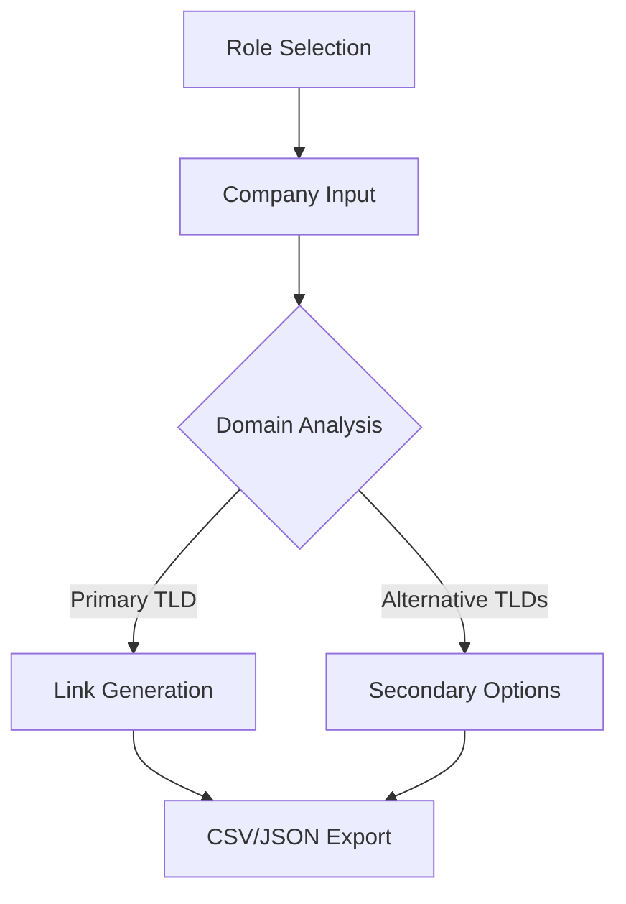

# Project Export

## Project Statistics

- Total files: 35

## Folder Structure

```
.gitignore
LICENSE
README.md
eslint.config.js
index.html
netlify.toml
package.json
postcss.config.js
public
  Screenshot 2024-11-18 at 21.17.45.png
  favicon.svg
  vite.svg
src
  App.css
  App.jsx
  assets
    react.svg
  components
    AnimatedBackground.jsx
    BucketSelector.jsx
    common
      RoleSelector.jsx
    exportDropdown.jsx
    exportUtils.js
    features
      linkGenerator
        BulkLinkGenerator.jsx
        CompanyInput.jsx
        DomainList.jsx
        GeneratedLinkCard.jsx
        SearchHistorySection.jsx
    linkUtils.js
  contexts
    RoleContext.jsx
  index.css
  main.jsx
  pages
    HomePage.jsx
    WelcomePage.jsx
  utils
    linkUtils
      jobseeker.js
      recruiter.js
      sales.js
tailwind.config.js
vite.config.js

```

### .gitignore

*(Unsupported file type)*

### LICENSE

*(Unsupported file type)*

### README.md

```md
# 🔗 LinkForge: Enterprise-Grade Search Link Generator
**Craft precision-targeted company search links at scale**  
*A React-powered solution for high-performance teams to generate bulk LinkedIn search URLs with intelligent domain handling and organizational insights*

<div align="center">
  
  
  
</div>

## ✨ Core Capabilities

### 🎯 Targeted Search Generation

| Team Type | Key Functions | Sample Use Cases |
|-----------|---------------|------------------|
| **Sales Teams** | Technical decision makers, Security | Enterprise account mapping |
| **Recruiters** | Candidate sourcing, HR contacts | High-volume talent acquisition |
| **Job Seekers** | Position discovery, Team composition | Strategic career targeting |

### 🌐 Advanced Domain Management
- Intelligent .com/.fr/.es/.it prioritization
- 100+ global TLD support with auto-suggest
- Interactive domain matrix with confidence scoring

### ⚙️ Technical Highlights
```javascript
// Dynamic team size categorization
const categorizeOrganization = (devSize, secSize) => ({
  TECH_GIANT: devSize >= 1e4,
  ENTERPRISE: devSize >= 5e3,
  MID_MARKET: devSize >= 1e3,
  STARTUP: devSize < 1e3
});
```

## 🚀 Getting Started

### 📦 Installation

```bash
git clone https://github.com/AliKelDev/LinkForge.git
cd LinkForge
```

```bash
# Install dependencies
yarn install  # Preferred
# OR
npm install
```

```bash
# Launch development environment
yarn dev
# OR
npm run dev
```

## 🖥 Usage Workflow



## 📊 Data Handling

### Export Schema Example
```json
{
  "metadata": {
    "generatedAt": "2024-02-15T09:30:00Z",
    "roleContext": "SALES_TEAM"
  },
  "results": [{
    "company": "TechCorp",
    "primaryDomain": ".com",
    "organizationSize": "ENTERPRISE",
    "searchLinks": {
      "technicalDecisionMakers": "https://linkedin.com/sales/search?...",
      "securityContacts": "https://linkedin.com/sales/search?..."
    }
  }]
}
```

## 📚 Documentation Hub

### Role Configuration Matrix

| Parameter | Sales Team | Recruiting | Job Search |
|-----------|------------|------------|------------|
| Default Filters | Dev, Security | HR, Engineering | Open Positions |
| Exclusions | Accounting, Finance | Executive | Contract Roles |
| Result Depth | 100+ | 500+ | 50+ |

## 🌟 Roadmap 2025

| Initiative | Status |
|------------|---------|
| 🛠️ CRM Integration Framework | Planned |
| 🔌 Browser Extension MVP | Planned |
| 🤝 Team Collaboration Suite | Planned |
| 🧠 AI-Powered Domain Validation | Planned |

## 🤝 Contribution Guidelines

1. Fork & Clone the repository
2. Create feature branch:
```bash
git checkout -b feature/[name]-[description]
```
3. Commit changes with semantic messages:
```bash
git commit -m "feat: add domain validation module"
```
4. Push to branch & open PR

## 📜 License & Credits

MIT Licensed - Full details in LICENSE

Crafted with precision by Jordan.M  
Maintained by the LinkForge OSS Collective

```

### eslint.config.js

```js
//
import js from '@eslint/js'
import globals from 'globals'
import react from 'eslint-plugin-react'
import reactHooks from 'eslint-plugin-react-hooks'
import reactRefresh from 'eslint-plugin-react-refresh'

export default [
  { ignores: ['dist'] },
  {
    files: ['**/*.{js,jsx}'],
    languageOptions: {
      ecmaVersion: 2020,
      globals: globals.browser,
      parserOptions: {
        ecmaVersion: 'latest',
        ecmaFeatures: { jsx: true },
        sourceType: 'module',
      },
    },
    settings: { react: { version: '18.3' } },
    plugins: {
      react,
      'react-hooks': reactHooks,
      'react-refresh': reactRefresh,
    },
    rules: {
      ...js.configs.recommended.rules,
      ...react.configs.recommended.rules,
      ...react.configs['jsx-runtime'].rules,
      ...reactHooks.configs.recommended.rules,
      'react/jsx-no-target-blank': 'off',
      'react-refresh/only-export-components': [
        'warn',
        { allowConstantExport: true },
      ],
    },
  },
]

```

### index.html

```html
<!DOCTYPE html>
<html lang="en">
  <head>
    <meta charset="UTF-8" />
    <link rel="icon" type="image/svg+xml" href="/favicon.svg" />
    <meta name="viewport" content="width=device-width, initial-scale=1.0" />
    <meta name="theme-color" content="#2563eb" />
    
    <!-- Primary Meta Tags -->
    <title>Bulk Company Link Generator | Generate Multiple Company Links Instantly</title>
    <meta name="title" content="Bulk Company Link Generator | Generate Multiple Company Links Instantly">
    <meta name="description" content="Generate and manage multiple company links in bulk. Easily create, copy, and track company-related links with search history functionality. Perfect for business research and company profiling.">

    <!-- Open Graph / Facebook -->
    <meta property="og:type" content="website">
    <meta property="og:title" content="Bulk Company Link Generator | Generate Multiple Company Links Instantly">
    <meta property="og:description" content="Generate and manage multiple company links in bulk. Easily create, copy, and track company-related links with search history functionality. Perfect for business research and company profiling.">
    
    <!-- Preconnect to font provider if you're using custom fonts -->
    <link rel="preconnect" href="https://fonts.googleapis.com">
    <link rel="preconnect" href="https://fonts.gstatic.com" crossorigin>
  </head>
  <body>
    <div id="root"></div>
    <script type="module" src="/src/main.jsx"></script>
  </body>
</html>
```

### netlify.toml

*(Unsupported file type)*

### package.json

```json
{
  "name": "reactvitetemplate",
  "private": true,
  "version": "0.0.0",
  "type": "module",
  "scripts": {
    "dev": "vite",
    "build": "vite build",
    "lint": "eslint .",
    "preview": "vite preview"
  },
  "dependencies": {
    "@headlessui/react": "^2.2.0",
    "@heroicons/react": "^2.2.0",
    "@mdx-js/react": "^3.1.0",
    "@shadcn/ui": "^0.0.4",
    "framer-motion": "^11.15.0",
    "lucide-react": "^0.468.0",
    "papaparse": "^5.4.1",
    "react": "^18.3.1",
    "react-dom": "^18.3.1",
    "react-helmet-async": "^2.0.5",
    "react-router-dom": "^7.0.2",
    "xlsx": "^0.18.5"
  },
  "devDependencies": {
    "@eslint/js": "^9.15.0",
    "@types/react": "^18.3.12",
    "@types/react-dom": "^18.3.1",
    "@vitejs/plugin-react": "^4.3.4",
    "autoprefixer": "^10.4.20",
    "eslint": "^9.15.0",
    "eslint-plugin-react": "^7.37.2",
    "eslint-plugin-react-hooks": "^5.0.0",
    "eslint-plugin-react-refresh": "^0.4.14",
    "globals": "^15.12.0",
    "postcss": "^8.4.49",
    "tailwindcss": "^3.4.17",
    "vite": "^6.0.1"
  }
}

```

### postcss.config.js

```js
export default {
  plugins: {
    tailwindcss: {},
    autoprefixer: {},
  },
}

```

### public/Screenshot 2024-11-18 at 21.17.45.png

*(Unsupported file type)*

### public/favicon.svg

*(Unsupported file type)*

### public/vite.svg

*(Unsupported file type)*

### src/App.css

```css
@tailwind base;
@tailwind components;
@tailwind utilities;
```

### src/App.jsx

```jsx
// src/App.jsx
import React from 'react';
import { BrowserRouter } from 'react-router-dom';
import { RoleProvider } from './contexts/RoleContext';
import AnimatedBackground from './components/AnimatedBackground';

function App() {
  return (
    <BrowserRouter>
      <RoleProvider>
        <AnimatedBackground />
      </RoleProvider>
    </BrowserRouter>
  );
}

export default App;
```

### src/assets/react.svg

*(Unsupported file type)*

### src/components/AnimatedBackground.jsx

```jsx
import React, { useEffect, useState } from 'react';
import { Routes, Route, useLocation } from 'react-router-dom';
import WelcomePage from '../pages/WelcomePage';
import HomePage from '../pages/HomePage';

const AnimatedBackground = () => {
  const [mousePosition, setMousePosition] = useState({ x: 0, y: 0 });
  const location = useLocation();

  useEffect(() => {
    const handleMouseMove = (e) => {
      setMousePosition({
        x: (e.clientX / window.innerWidth) * 2 - 1,
        y: (e.clientY / window.innerHeight) * 2 - 1,
      });
    };

    window.addEventListener('mousemove', handleMouseMove);
    return () => window.removeEventListener('mousemove', handleMouseMove);
  }, []);

  return (
    <div className="relative min-h-screen w-full overflow-hidden bg-gradient-to-b from-blue-900/95 to-blue-950">
      {/* Animated gradient blob */}
      <div 
        className="absolute top-1/3 left-1/4 w-[600px] h-[600px] bg-blue-400/10 rounded-full blur-[100px] opacity-30"
        style={{
          transform: `translate(
            ${mousePosition.x * 15}px, 
            ${mousePosition.y * 15}px
          )`,
          transition: 'transform 0.4s cubic-bezier(0.25, 0.1, 0.25, 1)'
        }}
      />
      
      {/* Dynamic grid pattern */}
      <div className="absolute inset-0 opacity-10 pointer-events-none">
        <div className="grid grid-cols-12 gap-2 h-full">
          {[...Array(144)].map((_, i) => (
            <div
              key={i}
              className="border border-blue-300/10 rounded-sm"
              style={{
                animation: `pulse ${8 + (i % 5)}s infinite ${i * 0.1}s`,
              }}
            />
          ))}
        </div>
      </div>

      {/* Geometric grid lines */}
      <svg className="absolute inset-0 w-full h-full opacity-15 pointer-events-none">
        <pattern
          id="grid"
          width="60"
          height="60"
          patternUnits="userSpaceOnUse"
        >
          <path
            d="M 60 0 L 0 0 0 60"
            fill="none"
            stroke="rgba(147, 197, 253, 0.1)"
            strokeWidth="0.5"
          />
        </pattern>
        <rect width="100%" height="100%" fill="url(#grid)" />
      </svg>

      {/* Main content container */}
      <div className="relative z-10">
        <Routes location={location} key={location.pathname}>
          <Route path="/" element={<WelcomePage />} />
          <Route path="/generator" element={<HomePage />} />
        </Routes>
      </div>

      {/* Radial gradient overlay */}
      <div 
        className="absolute inset-0 pointer-events-none"
        style={{
          background: 'radial-gradient(circle at 50% 50%, transparent 0%, rgba(30, 58, 138, 0.15) 100%)'
        }}
      />

      <style jsx>{`
        @keyframes pulse {
          0%, 100% { opacity: 0.05; }
          50% { opacity: 0.15; }
        }
      `}</style>
    </div>
  );
};

export default AnimatedBackground;
```

### src/components/BucketSelector.jsx

```jsx
import React, { useState, useEffect } from 'react';
import { motion } from 'framer-motion';

const determineBucket = (devTeamSize, securityTeamSize) => {
  if (!devTeamSize || !securityTeamSize) return '';
  
  if (devTeamSize >= 10000 && securityTeamSize >= 3000) return 'TECH_GIANT';
  if (devTeamSize >= 5000 && securityTeamSize >= 1500) return 'MAJOR_ENTERPRISE';
  if (devTeamSize >= 2000 && securityTeamSize >= 600) return 'LARGE_ENTERPRISE';
  if (devTeamSize >= 1000 && securityTeamSize >= 300) return 'ENTERPRISE';
  if (devTeamSize >= 500 && securityTeamSize >= 150) return 'GROWTH_PLUS';
  if (devTeamSize >= 200 && securityTeamSize >= 60) return 'GROWTH';
  if (devTeamSize >= 100 && securityTeamSize >= 30) return 'LATE_STARTUP';
  if (devTeamSize >= 50 && securityTeamSize >= 15) return 'MID_STARTUP';
  if (devTeamSize >= 20 && securityTeamSize >= 6) return 'EARLY_STARTUP';
  return 'PRE_SEED';
};

const BucketSelector = ({ selectedBucket, onChange }) => {
  const [devTeamSize, setDevTeamSize] = useState('');
  const [securityTeamSize, setSecurityTeamSize] = useState('');

  const buckets = [
    { 
      value: 'TECH_GIANT', 
      label: 'Tech Giant (10000+ devs, 3000+ security)', 
      color: 'bg-indigo-600 hover:bg-indigo-700'
    },
    { 
      value: 'MAJOR_ENTERPRISE', 
      label: 'Major Enterprise (5000+ devs, 1500+ security)', 
      color: 'bg-blue-700 hover:bg-blue-800'
    },
    { 
      value: 'LARGE_ENTERPRISE', 
      label: 'Large Enterprise (2000+ devs, 600+ security)', 
      color: 'bg-blue-600 hover:bg-blue-700'
    },
    { 
      value: 'ENTERPRISE', 
      label: 'Enterprise (1000+ devs, 300+ security)', 
      color: 'bg-blue-500 hover:bg-blue-600'
    },
    { 
      value: 'GROWTH_PLUS', 
      label: 'Growth Plus (500+ devs, 150+ security)', 
      color: 'bg-green-600 hover:bg-green-700'
    },
    { 
      value: 'GROWTH', 
      label: 'Growth (200+ devs, 60+ security)', 
      color: 'bg-green-500 hover:bg-green-600'
    },
    { 
      value: 'LATE_STARTUP', 
      label: 'Late Startup (100+ devs, 30+ security)', 
      color: 'bg-teal-500 hover:bg-teal-600'
    },
    { 
      value: 'MID_STARTUP', 
      label: 'Mid Startup (50+ devs, 15+ security)', 
      color: 'bg-cyan-500 hover:bg-cyan-600'
    },
    { 
      value: 'EARLY_STARTUP', 
      label: 'Early Startup (20+ devs, 6+ security)', 
      color: 'bg-yellow-500 hover:bg-yellow-600'
    },
    { 
      value: 'PRE_SEED', 
      label: 'Pre-Seed (<20 devs, <6 security)', 
      color: 'bg-orange-500 hover:bg-orange-600'
    }
  ];

  useEffect(() => {
    const determinedBucket = determineBucket(Number(devTeamSize), Number(securityTeamSize));
    if (determinedBucket) {
      onChange(determinedBucket);
    }
  }, [devTeamSize, securityTeamSize, onChange]);

  const getBucketDescription = (bucket) => {
    const found = buckets.find(b => b.value === bucket);
    return found ? found.label : '';
  };

  return (
    <div className="space-y-6">
      <div className="grid grid-cols-1 md:grid-cols-2 gap-4">
        <div className="space-y-2">
          <label className="block text-sm font-medium text-blue-900">
            Development Team Size
          </label>
          <input
            type="number"
            value={devTeamSize}
            onChange={(e) => setDevTeamSize(e.target.value)}
            className="w-full p-3 border-2 border-blue-100 rounded-lg focus:ring-2 focus:ring-blue-500 focus:border-transparent text-sm bg-white"
            placeholder="Enter number"
            min="0"
          />
        </div>
        
        <div className="space-y-2">
          <label className="block text-sm font-medium text-blue-900">
            Security Team Size
          </label>
          <input
            type="number"
            value={securityTeamSize}
            onChange={(e) => setSecurityTeamSize(e.target.value)}
            className="w-full p-3 border-2 border-blue-100 rounded-lg focus:ring-2 focus:ring-blue-500 focus:border-transparent text-sm bg-white"
            placeholder="Enter number"
            min="0"
          />
        </div>
      </div>

      {selectedBucket && (
        <motion.div
          initial={{ opacity: 0, y: -5 }}
          animate={{ opacity: 1, y: 0 }}
          className="text-sm bg-blue-50 p-3 rounded-lg"
        >
          <span className="font-medium text-blue-900">Selected Bucket: </span>
          <span className={`px-3 py-1 rounded-md text-white ${buckets.find(b => b.value === selectedBucket)?.color}`}>
            {getBucketDescription(selectedBucket)}
          </span>
        </motion.div>
      )}

      <div className="grid grid-cols-1 md:grid-cols-2 gap-3">
        {buckets.map((bucket) => (
          <motion.button
            key={bucket.value}
            onClick={() => onChange(bucket.value)}
            className={`p-3 rounded-xl text-left transition-all ${bucket.color} ${
              selectedBucket === bucket.value 
                ? 'ring-2 ring-blue-500 ring-offset-2' 
                : 'opacity-90 hover:opacity-100'
            }`}
            whileHover={{ scale: 1.02 }}
            whileTap={{ scale: 0.98 }}
          >
            <div className="font-medium text-white">{bucket.label.split('(')[0]}</div>
            <div className="text-xs text-white/80 mt-1">
              {bucket.label.match(/\(([^)]+)\)/)[1]}
            </div>
          </motion.button>
        ))}
      </div>
    </div>
  );
};

export const formatSearchDataForExport = (generatedLinks) => {
  const formattedData = [];
  
  generatedLinks.forEach(company => {
    const baseRow = {
      'Company Name': company.company,
      'Selected Domain': company.selectedDomain || '',
      'Bucket': company.bucket || '',
    };
    
    Object.entries(company.links).forEach(([type, linkInfo]) => {
      baseRow[`${linkInfo.title} Link`] = linkInfo.link;
      baseRow[`${linkInfo.title} Description`] = linkInfo.description;
    });
    
    formattedData.push(baseRow);
  });
  
  return formattedData;
};

export default BucketSelector;
```

### src/components/common/RoleSelector.jsx

```jsx
import React from 'react';
import { useRole, ROLES } from '../../contexts/RoleContext';
import { motion } from 'framer-motion';
import { Users, UserSearch, Briefcase } from 'lucide-react';

const RoleSelector = () => {
  const { currentRole, updateRole, availableRoles } = useRole();

  const roleIcons = {
    [ROLES.SALES]: Users,
    [ROLES.RECRUITER]: UserSearch,
    [ROLES.JOBSEEKER]: Briefcase,
  };

  return (
    <div className="w-full max-w-2xl mx-auto mb-8">
      <div className="bg-white rounded-xl shadow-sm p-2">
        <div className="flex flex-wrap gap-4 justify-center">
          {availableRoles.map(({ id, title, description }) => {
            const Icon = roleIcons[id] || Users;
            const isActive = currentRole === id;
            
            return (
              <motion.button
                key={id}
                onClick={() => updateRole(id)}
                className={`relative flex flex-col items-center p-6 rounded-xl transition-all
                  ${isActive 
                    ? 'bg-blue-50 border-2 border-blue-500 shadow-lg' 
                    : 'bg-white border-2 border-transparent hover:border-blue-100'}
                  w-full sm:w-56 shadow-sm hover:shadow-md`}
                whileHover={{ scale: 1.02 }}
                whileTap={{ scale: 0.98 }}
              >
                <Icon 
                  className={`w-10 h-10 mb-3 ${isActive ? 'text-blue-600' : 'text-gray-400'}`}
                />
                <span className="font-semibold text-sm mb-1">{title}</span>
                <span className="text-xs text-center text-gray-500 px-2">{description}</span>
                {isActive && (
                  <motion.div
                    layoutId="activeIndicator"
                    className="absolute inset-0 border-2 border-blue-500 rounded-xl"
                    initial={false}
                    transition={{ type: "spring", stiffness: 500, damping: 30 }}
                  />
                )}
              </motion.button>
            );
          })}
        </div>
      </div>
    </div>
  );
};

export default RoleSelector;
```

### src/components/exportDropdown.jsx

```jsx
import React, { useState } from 'react';
import { FileDown, HistoryIcon, ChevronDown } from 'lucide-react';
import { exportSearchResults, exportHistory } from './exportUtils';
import { motion, AnimatePresence } from 'framer-motion';

const ExportDropdown = ({ history, generatedLinks }) => {
  const [isOpen, setIsOpen] = useState(false);

  const handleExport = (type) => {
    if (type === 'current') {
      exportSearchResults(generatedLinks);
    } else if (type === 'history') {
      exportHistory(history);
    }
    setIsOpen(false);
  };

  return (
    <div className="relative">
      <motion.button
        onClick={() => setIsOpen(!isOpen)}
        className="flex items-center gap-2 px-4 py-2.5 bg-blue-100 text-blue-600 rounded-xl hover:bg-blue-200 transition-colors shadow-sm hover:shadow-md"
        whileHover={{ scale: 1.05 }}
        whileTap={{ scale: 0.95 }}
      >
        <FileDown className="w-5 h-5" />
        Export
        <motion.span
          animate={{ rotate: isOpen ? 180 : 0 }}
          transition={{ duration: 0.2 }}
        >
          <ChevronDown className="w-4 h-4" />
        </motion.span>
      </motion.button>

      <AnimatePresence>
        {isOpen && (
          <motion.div
            initial={{ opacity: 0, y: -10 }}
            animate={{ opacity: 1, y: 0 }}
            exit={{ opacity: 0, y: 10 }}
            className="absolute right-0 mt-2 w-56 bg-white rounded-xl shadow-xl z-10 border border-blue-50 overflow-hidden"
          >
            {generatedLinks?.length > 0 && (
              <button
                onClick={() => handleExport('current')}
                className="w-full text-left px-4 py-3 hover:bg-blue-50 text-gray-700 flex items-center gap-3 transition-colors duration-150"
              >
                <FileDown className="w-5 h-5 text-blue-500 min-w-[20px]" />
                <span className="truncate">Current Results</span>
              </button>
            )}
            {history?.length > 0 && (
              <button
                onClick={() => handleExport('history')}
                className="w-full text-left px-4 py-3 hover:bg-blue-50 text-gray-700 flex items-center gap-3 transition-colors duration-150"
              >
                <HistoryIcon className="w-5 h-5 text-blue-500 min-w-[20px]" />
                <span className="truncate">Search History</span>
              </button>
            )}
          </motion.div>
        )}
      </AnimatePresence>
    </div>
  );
};

export default ExportDropdown;
```

### src/components/exportUtils.js

```js
import Papa from 'papaparse';

const formatSearchDataForExport = (generatedLinks) => {
  const formattedData = [];
  
  generatedLinks.forEach(company => {
    // Add basic company info
    const baseRow = {
      'Company Name': company.company,
      'Selected Domain': company.selectedDomain || '',
      'Bucket': company.bucket || '', // Added bucket to export
    };
    
    // Add all link types
    Object.entries(company.links).forEach(([type, linkInfo]) => {
      baseRow[`${linkInfo.title} Link`] = linkInfo.link;
      baseRow[`${linkInfo.title} Description`] = linkInfo.description;
    });
    
    formattedData.push(baseRow);
  });
  
  return formattedData;
};

const exportToCSV = (data, filename = 'search_results.csv') => {
  const csv = Papa.unparse(data, {
    quotes: true,
    skipEmptyLines: true,
    delimiter: ',',
  });
  
  const csvContent = '\ufeff' + csv; // Add BOM for Excel UTF-8 compatibility
  const blob = new Blob([csvContent], { type: 'text/csv;charset=utf-8;' });
  const url = URL.createObjectURL(blob);
  
  try {
    const link = document.createElement('a');
    link.href = url;
    link.setAttribute('download', filename);
    document.body.appendChild(link);
    link.click();
    document.body.removeChild(link);
  } finally {
    URL.revokeObjectURL(url);
  }
};

export const exportSearchResults = (generatedLinks) => {
  const formattedData = formatSearchDataForExport(generatedLinks);
  exportToCSV(formattedData);
};

export const exportHistory = (history) => {
  const formattedData = history.map(item => ({
    Company: item.company,
    'Search Date': new Date(item.timestamp).toLocaleString(),
    'Search ID': item.id
  }));
  exportToCSV(formattedData, 'search_history.csv');
};
```

### src/components/features/linkGenerator/BulkLinkGenerator.jsx

```jsx
import React, { useState, useEffect } from 'react';
import { motion, AnimatePresence } from 'framer-motion';
import CompanyInput from './CompanyInput';
import GeneratedLinkCard from './GeneratedLinkCard';
import SearchHistorySection from './SearchHistorySection';
import RoleSelector from '../../../components/common/RoleSelector';
import { useRole } from '../../../contexts/RoleContext';
import { generateLinks as generateSalesLinks } from '../../../utils/linkUtils/sales';
import { generateLinks as generateRecruiterLinks } from '../../../utils/linkUtils/recruiter';
import { generateLinks as generateJobSeekerLinks } from '../../../utils/linkUtils/jobseeker';

const PRIORITY_DOMAINS = ['.com', '.fr', '.es', '.it'];
const SECONDARY_DOMAINS = [
  '.eu', '.co.uk', '.de', '.pt', '.nl', '.be', '.ch', '.at', '.dk', '.ie', '.no', '.se', '.fi',
  '.pl', '.cz', '.sk', '.hu', '.ro', '.bg', '.hr', '.si', '.ee', '.lv', '.lt',
  '.gr', '.mt', '.cy', '.il', '.ae', '.sa', '.qa', '.bh', '.kw', '.om',
  '.za', '.eg', '.ma', '.ng', '.ke', '.tz', '.io', '.ai', '.tech', '.co'
];

const BulkLinkGenerator = () => {
  const [generatedLinks, setGeneratedLinks] = useState([]);
  const [searchHistory, setSearchHistory] = useState([]);
  const { currentRole, roleConfig } = useRole();
  const [showBucketSelector, setShowBucketSelector] = useState(true);

  useEffect(() => {
    const savedHistory = localStorage.getItem(`searchHistory_${currentRole}`);
    if (savedHistory) {
      setSearchHistory(JSON.parse(savedHistory));
    }
  }, [currentRole]);

  const toggleBucketSelector = () => {
    setShowBucketSelector(!showBucketSelector);
  };

  const getRoleSpecificLinks = (company, domain) => {
    switch (currentRole) {
      case 'sales':
        return generateSalesLinks(company, domain);
      case 'recruiter':
        return generateRecruiterLinks(company, domain);
      case 'jobseeker':
        return generateJobSeekerLinks(company, domain);
      default:
        return generateSalesLinks(company, domain);
    }
  };

  const handleGenerateLinks = (companies) => {
    const newLinks = companies.map((company) => ({
      id: Date.now() + Math.random(),
      company,
      priorityDomains: PRIORITY_DOMAINS,
      secondaryDomains: SECONDARY_DOMAINS,
      selectedDomain: null,
      links: getRoleSpecificLinks(company, PRIORITY_DOMAINS[0]),
      role: currentRole
    }));

    setGeneratedLinks(newLinks);
    saveToHistory(companies);
  };

  const saveToHistory = (companies) => {
    const timestamp = new Date().toISOString();
    const newSearches = companies.map((company) => ({
      id: Date.now() + Math.random(),
      company,
      timestamp,
      role: currentRole
    }));

    const combinedHistory = [...newSearches, ...searchHistory];
    const uniqueHistory = Array.from(
      new Map(combinedHistory.map((item) => [item.company, item])).values()
    ).slice(0, 50);

    setSearchHistory(uniqueHistory);
    localStorage.setItem(`searchHistory_${currentRole}`, JSON.stringify(uniqueHistory));
  };

  return (
    <div className="min-h-screen py-12 px-4">
      <div className="max-w-5xl mx-auto">
        <div className="text-center mb-12">
          <h1 className="text-4xl font-bold text-blue-100 mb-2">
            {roleConfig.title} Link Generator
          </h1>
          <p className="text-lg text-blue-200">{roleConfig.description}</p>
          <button
            onClick={toggleBucketSelector}
            className="mt-4 px-4 py-2 bg-blue-600/80 text-white rounded-lg hover:bg-blue-700 transition-colors shadow-sm backdrop-blur-sm"
          >
            {showBucketSelector ? 'Hide Bucket Selector' : 'Show Bucket Selector'}
          </button>
        </div>

        <RoleSelector />

        <div className="bg-white/80 rounded-2xl shadow-xl p-8 backdrop-blur-lg">
          <CompanyInput onSubmit={handleGenerateLinks} />

          <AnimatePresence mode="wait">
            {generatedLinks.length > 0 && (
              <motion.div 
                className="mt-12 space-y-8"
                initial={{ opacity: 0, y: 20 }}
                animate={{ opacity: 1, y: 0 }}
                exit={{ opacity: 0, y: -20 }}
              >
                {generatedLinks
                  .filter(linkData => linkData.role === currentRole)
                  .map((linkData) => (
                    <GeneratedLinkCard 
                      key={linkData.id} 
                      linkData={linkData}
                      onUpdateLink={(updatedLink) => {
                        setGeneratedLinks(prev => 
                          prev.map(link => link.id === updatedLink.id ? updatedLink : link)
                        );
                      }}
                      showBucketSelector={showBucketSelector}
                    />
                  ))}
              </motion.div>
            )}
          </AnimatePresence>

          <SearchHistorySection
            searchHistory={searchHistory}
            onClearHistory={() => {
              setSearchHistory([]);
              localStorage.removeItem(`searchHistory_${currentRole}`);
            }}
            onSearchAgain={(company) => {
              handleGenerateLinks([company]);
            }}
          />
        </div>
      </div>
    </div>
  );
};

export default BulkLinkGenerator;
```

### src/components/features/linkGenerator/CompanyInput.jsx

```jsx
import React, { useState, useEffect, useRef } from 'react';
import { Copy, Check } from 'lucide-react';

const CompanyInput = ({ onSubmit }) => {
  const [companyInput, setCompanyInput] = useState('');
  const [companyCount, setCompanyCount] = useState(0);
  const textareaRef = useRef(null);

  useEffect(() => {
    if (textareaRef.current) {
      textareaRef.current.style.height = 'auto';
      textareaRef.current.style.height = `${textareaRef.current.scrollHeight}px`;
      setCompanyCount(companyInput.split('\n').filter(c => c.trim()).length);
    }
  }, [companyInput]);

  const handleSubmit = (e) => {
    e.preventDefault();
    const companies = companyInput
      .split('\n')
      .map((company) => company.trim())
      .filter((company) => company.length > 0);
    
    if (companies.length > 0) {
      onSubmit(companies);
    }
  };

  return (
    <form onSubmit={handleSubmit} className="space-y-6">
      <div>
        <div className="flex justify-between items-center mb-2">
          <label className="block text-lg font-semibold text-blue-900">
            Enter Company Names
          </label>
          <span className="text-sm text-blue-500">
            {companyCount} companies entered
          </span>
        </div>
        <p className="text-sm text-blue-600 mb-3">Add one company per line</p>
        <textarea
          ref={textareaRef}
          value={companyInput}
          onChange={(e) => setCompanyInput(e.target.value)}
          placeholder="CyberAgent, Inc.&#10;TechCorp LLC&#10;SecureNet Systems"
          className="w-full p-4 border-2 border-blue-100 rounded-lg focus:ring-2 focus:ring-blue-500 focus:border-transparent outline-none transition-all duration-200 text-gray-700 placeholder-gray-400 resize-none overflow-hidden"
          required
        />
      </div>

      <div className="flex gap-4">
        <button
          type="submit"
          className="flex-1 bg-blue-600 text-white py-3 px-6 rounded-lg hover:bg-blue-700 transition-colors duration-200 font-semibold shadow-md hover:shadow-lg"
        >
          Generate Links
        </button>
      </div>
    </form>
  );
};

export default CompanyInput;
```

### src/components/features/linkGenerator/DomainList.jsx

```jsx
import React, { useState } from 'react';
import { ExternalLink, ChevronDown } from 'lucide-react';
import { AnimatePresence, motion } from 'framer-motion';

const DomainList = ({ 
  priorityDomains, 
  secondaryDomains, 
  selectedDomain,
  onDomainSelect,
  companyName 
}) => {
  const [isExpanded, setIsExpanded] = useState(false);

  const renderDomainButton = (domain) => (
    <div key={domain} className="flex items-center bg-white p-3 rounded-lg shadow-sm">
      <a
        href={`https://${domain}`}
        target="_blank"
        rel="noopener noreferrer"
        className="text-blue-600 hover:text-blue-800 flex items-center gap-1 font-medium"
      >
        {domain}
        <ExternalLink className="w-4 h-4" />
      </a>
      <button
        onClick={() => onDomainSelect(domain)}
        className={`ml-3 px-3 py-1.5 rounded-md text-sm font-medium transition-all duration-200 ${
          selectedDomain === domain
            ? 'bg-green-500 text-white'
            : 'bg-blue-100 text-blue-600 hover:bg-blue-200'
        }`}
      >
        {selectedDomain === domain ? 'Selected ✓' : 'Select'}
      </button>
    </div>
  );

  return (
    <div>
      <div className="flex flex-wrap gap-3 pb-4 border-b border-blue-200">
        {priorityDomains.map(renderDomainButton)}
        
        <motion.button
          onClick={() => setIsExpanded(!isExpanded)}
          className="flex items-center gap-2 px-4 py-2 bg-blue-50 text-blue-600 rounded-lg hover:bg-blue-100 w-full justify-center"
          whileTap={{ scale: 0.98 }}
        >
          <motion.span
            animate={{ rotate: isExpanded ? 180 : 0 }}
          >
            <ChevronDown className="w-5 h-5" />
          </motion.span>
          {isExpanded ? 'Show Less' : `More Domains (${secondaryDomains.length})`}
        </motion.button>
      </div>

      <AnimatePresence>
        {isExpanded && (
          <motion.div
            initial={{ opacity: 0, height: 0 }}
            animate={{ opacity: 1, height: 'auto' }}
            exit={{ opacity: 0, height: 0 }}
            className="mt-4 grid grid-cols-2 md:grid-cols-3 lg:grid-cols-4 gap-3"
          >
            {secondaryDomains.map(renderDomainButton)}
          </motion.div>
        )}
      </AnimatePresence>
    </div>
  );
};

export default DomainList;
```

### src/components/features/linkGenerator/GeneratedLinkCard.jsx

```jsx
import React, { useState } from 'react';
import { Copy, Check, ExternalLink } from 'lucide-react';
import { motion, AnimatePresence } from 'framer-motion';
import DomainList from './DomainList';
import BucketSelector from '../../../components/BucketSelector';
import { generateLinks } from '../../../components/linkUtils';

const GeneratedLinkCard = ({ linkData, onUpdateLink, showBucketSelector }) => {
  const [copiedStates, setCopiedStates] = useState({});

  const handleDomainSelect = (domain) => {
    onUpdateLink({
      ...linkData,
      selectedDomain: domain,
      links: generateLinks(linkData.company, domain)
    });
  };

  const handleBucketSelect = (bucket) => {
    onUpdateLink({
      ...linkData,
      bucket
    });
  };

  const handleCopy = async (type, link, description) => {
    try {
      await navigator.clipboard.writeText(`${description}\n${link}`);
      setCopiedStates((prev) => ({ ...prev, [type]: true }));
      setTimeout(() => {
        setCopiedStates((prev) => ({ ...prev, [type]: false }));
      }, 2000);
    } catch (err) {
      console.error('Failed to copy:', err);
    }
  };

  return (
    <div className="bg-gradient-to-r from-blue-50 to-indigo-50 rounded-xl border border-blue-200 shadow-md overflow-hidden">
      <div className="p-6">
        <div className="flex items-center justify-between mb-4">
          <h3 className="text-xl font-bold text-blue-900">{linkData.company}</h3>
          {showBucketSelector && (
            <BucketSelector
              selectedBucket={linkData.bucket}
              onChange={handleBucketSelect}
            />
          )}
        </div>
        
        <DomainList
          priorityDomains={linkData.priorityDomains}
          secondaryDomains={linkData.secondaryDomains}
          selectedDomain={linkData.selectedDomain}
          onDomainSelect={handleDomainSelect}
          companyName={linkData.company}
        />

        <div className="mt-6 space-y-4">
          {Object.entries(linkData.links).map(([type, linkInfo]) => (
            <div key={type} className="flex items-center justify-between gap-4 p-4 bg-white rounded-lg shadow-sm">
              <div className="flex-1">
                <div className="font-semibold text-blue-900 mb-1">{linkInfo.title}</div>
                <a
                  href={linkInfo.link}
                  target="_blank"
                  rel="noopener noreferrer"
                  className="text-blue-600 hover:text-blue-800 flex items-center gap-1"
                >
                  {linkInfo.link.substring(0, 60)}...
                  <ExternalLink className="w-4 h-4" />
                </a>
              </div>
              <motion.button
                onClick={() => handleCopy(type, linkInfo.link, linkInfo.description)}
                className={`flex items-center gap-2 px-4 py-2 rounded-lg transition-all 
                  ${copiedStates[type] 
                    ? 'bg-green-500 hover:bg-green-600' 
                    : 'bg-blue-500 hover:bg-blue-600'}
                  text-white shadow-sm hover:shadow-md`}
                whileTap={{ scale: 0.95 }}
              >
                <AnimatePresence mode="wait">
                  {copiedStates[type] ? (
                    <motion.span
                      key="check"
                      initial={{ opacity: 0, scale: 0.5 }}
                      animate={{ opacity: 1, scale: 1 }}
                      exit={{ opacity: 0, scale: 0.5 }}
                    >
                      <Check className="w-4 h-4" />
                    </motion.span>
                  ) : (
                    <motion.span
                      key="copy"
                      initial={{ opacity: 0, scale: 0.5 }}
                      animate={{ opacity: 1, scale: 1 }}
                      exit={{ opacity: 0, scale: 0.5 }}
                    >
                      <Copy className="w-4 h-4" />
                    </motion.span>
                  )}
                </AnimatePresence>
                {copiedStates[type] ? 'Copied!' : 'Copy'}
              </motion.button>
            </div>
          ))}
        </div>
      </div>
    </div>
  );
};

export default GeneratedLinkCard;
```

### src/components/features/linkGenerator/SearchHistorySection.jsx

```jsx
import React, { useState } from 'react';
import { History, Trash2 } from 'lucide-react';
import { motion, AnimatePresence } from 'framer-motion';
import ExportDropdown from '../../../components/exportDropdown';

const SearchHistorySection = ({ 
  searchHistory, 
  onClearHistory, 
  onSearchAgain,
  generatedLinks 
}) => {
  const [showHistory, setShowHistory] = useState(false);

  return (
    <div className="mt-12">
      <div className="flex flex-wrap gap-4 justify-between items-center">
        <div className="flex gap-4">
          <motion.button
            onClick={() => setShowHistory(!showHistory)}
            className="flex items-center gap-2 px-6 py-3 bg-blue-100 text-blue-600 rounded-xl hover:bg-blue-200 transition-colors font-semibold shadow-sm hover:shadow-md"
            whileHover={{ scale: 1.05 }}
            whileTap={{ scale: 0.95 }}
          >
            <History className="w-5 h-5" />
            {showHistory ? 'Hide History' : 'Show History'}
          </motion.button>
          {searchHistory.length > 0 && (
            <ExportDropdown 
              history={searchHistory}
              generatedLinks={generatedLinks}
            />
          )}
        </div>

        <AnimatePresence>
          {showHistory && searchHistory.length > 0 && (
            <motion.button
              onClick={onClearHistory}
              className="flex items-center gap-2 px-6 py-3 bg-red-100 text-red-600 rounded-xl hover:bg-red-200 transition-colors font-semibold shadow-sm hover:shadow-md"
              initial={{ opacity: 0 }}
              animate={{ opacity: 1 }}
              exit={{ opacity: 0 }}
            >
              <Trash2 className="w-5 h-5" />
              Clear History
            </motion.button>
          )}
        </AnimatePresence>
      </div>

      <AnimatePresence>
        {showHistory && (
          <motion.div
            initial={{ opacity: 0, height: 0 }}
            animate={{ opacity: 1, height: 'auto' }}
            exit={{ opacity: 0, height: 0 }}
            className="mt-6 space-y-4"
          >
            {searchHistory.map((item) => (
              <motion.div
                key={item.id}
                initial={{ opacity: 0, y: -10 }}
                animate={{ opacity: 1, y: 0 }}
                exit={{ opacity: 0, y: 10 }}
                className="bg-white rounded-xl border border-blue-200 shadow-md p-6 hover:shadow-lg transition-shadow"
              >
                <div className="flex flex-col md:flex-row justify-between items-start gap-4">
                  <div>
                    <h3 className="text-xl font-semibold text-blue-900 mb-2">
                      {item.company}
                    </h3>
                    <p className="text-blue-600 text-sm">
                      Searched on {new Date(item.timestamp).toLocaleDateString('en-US', {
                        year: 'numeric',
                        month: 'short',
                        day: 'numeric',
                        hour: '2-digit',
                        minute: '2-digit'
                      })}
                    </p>
                  </div>
                  <motion.button
                    onClick={() => onSearchAgain(item.company)}
                    className="px-6 py-2 bg-blue-600 text-white rounded-lg hover:bg-blue-700 transition-colors shadow-sm font-medium whitespace-nowrap"
                    whileHover={{ scale: 1.05 }}
                    whileTap={{ scale: 0.95 }}
                  >
                    Search Again
                  </motion.button>
                </div>
              </motion.div>
            ))}
          </motion.div>
        )}
      </AnimatePresence>
    </div>
  );
};

export default SearchHistorySection;
```

### src/components/linkUtils.js

```js
/**
 * Cleans a company name by removing common suffixes and special characters
 * @param {string} companyName - The raw company name
 * @returns {string} - The cleaned company name
 */
export const cleanCompanyName = (companyName) => {
  return companyName
    .toLowerCase()
    .replace(/,?\s*(inc|llc|ltd|corp|corporation|company)\.?$/i, '')
    .replace(/[^a-z0-9]/g, '');
};

/**
 * Generates domain variants for a company based on given extensions
 * @param {string} companyName - The company name
 * @param {string[]} extensions - Array of domain extensions
 * @returns {string[]} - Array of complete domain names
 */
export const generateDomainVariants = (companyName, extensions) => {
  const cleanName = cleanCompanyName(companyName);
  return extensions.map(ext => `${cleanName}${ext}`);
};

/**
 * Generates a LinkedIn search URL for developer profiles
 * @param {string} company - The company name
 * @returns {string} - LinkedIn search URL
 */
export const generateDevSearchLink = (company) => {
  const baseUrl = 'https://www.linkedin.com/sales/search/people';
  const queryParams = '(spellCorrectionEnabled%3Atrue%2CrecentSearchParam%3A(id%3A3196859146%2CdoLogHistory%3Atrue)%2Cfilters%3AList(' + 
    // Function exclusions
    '(type%3AFUNCTION%2Cvalues%3AList(' +
    '(id%3A1%2Ctext%3AAccounting%2CselectionType%3AEXCLUDED)%2C' +
    '(id%3A10%2Ctext%3AFinance%2CselectionType%3AEXCLUDED)%2C' +
    '(id%3A12%2Ctext%3AHuman%2520Resources%2CselectionType%3AEXCLUDED)%2C' +
    '(id%3A14%2Ctext%3ALegal%2CselectionType%3AEXCLUDED)%2C' +
    '(id%3A15%2Ctext%3AMarketing%2CselectionType%3AEXCLUDED)%2C' +
    '(id%3A25%2Ctext%3ASales%2CselectionType%3AEXCLUDED)%2C' +
    '(id%3A26%2Ctext%3ACustomer%2520Success%2520and%2520Support%2CselectionType%3AEXCLUDED)%2C' +
    '(id%3A3%2Ctext%3AArts%2520and%2520Design%2CselectionType%3AEXCLUDED)%2C' +
    '(id%3A4%2Ctext%3ABusiness%2520Development%2CselectionType%3AEXCLUDED)))%2C' +
    // Company filter
    `(type%3ACURRENT_COMPANY%2Cvalues%3AList((text%3A${company}%2CselectionType%3AINCLUDED))))%2C` +
    // Keywords
    'keywords%3A%2528%2522Software%2522%2520OR%2520%2522Logiciel%2522%2520OR%2520%2522Developer%2522%2520OR%2520' +
    '%2522D%25C3%25A9veloppeur%2522%2520OR%2520%2522Entwickler%2522%2520OR%2520%2522Desarrollador%2522%2520OR%2520' +
    '%2522DevOps%2522%2520OR%2520%2522Cloud%2522%2520OR%2520%2522Engineer%2522%2520OR%2520%2522Ing%25C3%25A9nieur' +
    '%2522%2520OR%2520%2522Ingenieur%2522%2520OR%2520%2522Ingeniero%2522%2529%2520And%2520%2528NOT%2520%2522Marketing' +
    '%2522%2529)';

  return `${baseUrl}?query=${queryParams}`;
};

/**
 * Generates a LinkedIn search URL for security/IAM roles
 * @param {string} company - The company name
 * @returns {string} - LinkedIn search URL
 */
export const generateSecurityIAMLink = (company) => {
  const baseUrl = 'https://www.linkedin.com/sales/search/people';
  const queryParams = '(spellCorrectionEnabled%3Atrue%2CrecentSearchParam%3A(id%3A3196859146%2CdoLogHistory%3Atrue)%2Cfilters%3AList(' +
    // Function exclusions
    '(type%3AFUNCTION%2Cvalues%3AList(' +
    '(id%3A1%2Ctext%3AAccounting%2CselectionType%3AEXCLUDED)%2C' +
    '(id%3A10%2Ctext%3AFinance%2CselectionType%3AEXCLUDED)%2C' +
    '(id%3A12%2Ctext%3AHuman%2520Resources%2CselectionType%3AEXCLUDED)%2C' +
    '(id%3A14%2Ctext%3ALegal%2CselectionType%3AEXCLUDED)%2C' +
    '(id%3A15%2Ctext%3AMarketing%2CselectionType%3AEXCLUDED)%2C' +
    '(id%3A25%2Ctext%3ASales%2CselectionType%3AEXCLUDED)%2C' +
    '(id%3A26%2Ctext%3ACustomer%2520Success%2520and%2520Support%2CselectionType%3AEXCLUDED)%2C' +
    '(id%3A3%2Ctext%3AArts%2520and%2520Design%2CselectionType%3AEXCLUDED)%2C' +
    '(id%3A4%2Ctext%3ABusiness%2520Development%2CselectionType%3AEXCLUDED)))%2C' +
    // Company filter
    `(type%3ACURRENT_COMPANY%2Cvalues%3AList((text%3A${company}%2CselectionType%3AINCLUDED))))%2C` +
    // Keywords for security roles and management positions
    'keywords%3A%2528%2522Security%2522%2520OR%2520%2522CISO%2522%2520OR%2520%2522CTO%2522%2520OR%2520' +
    '%2522Information%2520Security%2522%2520OR%2520%2522Cybersecurity%2522%2520OR%2520%2522AppSec%2522%2520OR%2520' +
    '%2522Application%2520Security%2522%2520OR%2520%2522IAM%2522%2520OR%2520%2522Identity%2522%2520OR%2520' +
    '%2522Access%2520Management%2522%2529%2520AND%2520%2528%2522Manager%2522%2520OR%2520%2522Director%2522%2520OR%2520' +
    '%2522Head%2522%2520OR%2520%2522Lead%2522%2520OR%2520%2522Chief%2522%2520OR%2520%2522VP%2522%2529)';

  return `${baseUrl}?query=${queryParams}`;
};

/**
 * Generates all search links for a company
 * @param {string} company - The company name
 * @param {string} domain - The company's domain
 * @returns {Object} - Object containing all generated links with their metadata
 */
export const generateLinks = (company, domain) => {
  return {
    dev: {
      title: "Dev Search",
      link: generateDevSearchLink(company),
      description: "LinkedIn Search for Development Team Members",
    },
    securityIAM: {
      title: "Security/IAM",
      link: generateSecurityIAMLink(company),
      description: "LinkedIn Search for Security/IAM Decision Makers",
    }
  };
};
```

### src/contexts/RoleContext.jsx

```jsx
// src/contexts/RoleContext.jsx
import React, { createContext, useContext, useState } from 'react';

// Role configurations
export const ROLES = {
  SALES: 'sales',
  RECRUITER: 'recruiter',
  JOBSEEKER: 'jobseeker',
};

export const ROLE_CONFIGS = {
  [ROLES.SALES]: {
    title: 'Sales Team',
    description: 'Find and connect with technical decision makers',
    defaultSearchTypes: ['dev', 'securityIAM'],
    functionExclusions: [
      'Accounting', 'Finance', 'Human Resources', 'Legal',
      'Marketing', 'Sales', 'Customer Success and Support',
      'Arts and Design', 'Business Development'
    ],
  },
  [ROLES.RECRUITER]: {
    title: 'Recruiter',
    description: 'Find potential candidates and HR decision makers',
    defaultSearchTypes: ['hrTeam', 'candidates'],
    functionExclusions: [
      'Sales', 'Customer Success and Support',
      'Business Development'
    ],
  },
  [ROLES.JOBSEEKER]: {
    title: 'Job Seeker',
    description: 'Find relevant positions and company information',
    defaultSearchTypes: ['openings', 'teamInsights'],
    functionExclusions: [], // Job seekers typically want to see all departments
  },
};

const RoleContext = createContext(null);

export const RoleProvider = ({ children }) => {
  const [currentRole, setCurrentRole] = useState(ROLES.SALES); // Default to sales role
  const [roleConfig, setRoleConfig] = useState(ROLE_CONFIGS[ROLES.SALES]);

  const updateRole = (newRole) => {
    if (ROLE_CONFIGS[newRole]) {
      setCurrentRole(newRole);
      setRoleConfig(ROLE_CONFIGS[newRole]);
    }
  };

  const contextValue = {
    currentRole,
    roleConfig,
    updateRole,
    availableRoles: Object.keys(ROLE_CONFIGS).map(role => ({
      id: role,
      ...ROLE_CONFIGS[role]
    })),
  };

  return (
    <RoleContext.Provider value={contextValue}>
      {children}
    </RoleContext.Provider>
  );
};

export const useRole = () => {
  const context = useContext(RoleContext);
  if (!context) {
    throw new Error('useRole must be used within a RoleProvider');
  }
  return context;
};

// Custom hook for role-specific link generation
export const useRoleLinks = (company, domain) => {
  const { currentRole, roleConfig } = useRole();
  
  // This will be expanded as we implement role-specific link generators
  const generateRoleSpecificLinks = () => {
    switch (currentRole) {
      case ROLES.SALES:
        return {
          dev: {
            title: "Dev Search",
            link: generateDevSearchLink(company),
            description: "LinkedIn Search for Development Team Members",
          },
          securityIAM: {
            title: "Security/IAM",
            link: generateSecurityIAMLink(company),
            description: "LinkedIn Search for Security/IAM Decision Makers",
          }
        };
      case ROLES.RECRUITER:
        // To be implemented
        return {
          hrTeam: {
            title: "HR Team",
            link: "", // TODO: Implement recruiter-specific link generation
            description: "LinkedIn Search for HR Team Members",
          },
          candidates: {
            title: "Potential Candidates",
            link: "", // TODO: Implement candidate search
            description: "LinkedIn Search for Potential Candidates",
          }
        };
      case ROLES.JOBSEEKER:
        // To be implemented
        return {
          openings: {
            title: "Open Positions",
            link: "", // TODO: Implement job opening search
            description: "LinkedIn Search for Open Positions",
          },
          teamInsights: {
            title: "Team Insights",
            link: "", // TODO: Implement team insights search
            description: "LinkedIn Search for Team Information",
          }
        };
      default:
        return {};
    }
  };

  return generateRoleSpecificLinks();
};
```

### src/index.css

```css
@tailwind base;
@tailwind components;
@tailwind utilities;
```

### src/main.jsx

```jsx
// src/main.jsx
import React from 'react';
import ReactDOM from 'react-dom/client';
import App from './App';
import './index.css';

ReactDOM.createRoot(document.getElementById('root')).render(
  <React.StrictMode>
    <App />
  </React.StrictMode>
);
```

### src/pages/HomePage.jsx

```jsx
import React from 'react';
import { Link } from 'react-router-dom';
import BulkLinkGenerator from '../components/features/linkGenerator/BulkLinkGenerator';

const HomePage = () => {
  return (
    <div>
      <div className="absolute top-4 right-4">
        <Link
          to="/"
          className="px-4 py-2 text-blue-100 hover:text-white transition-colors"
        >
          ← Back to Welcome
        </Link>
      </div>
      <BulkLinkGenerator />
    </div>
  );
};

export default HomePage;
```

### src/pages/WelcomePage.jsx

```jsx
import React from 'react';
import { motion } from 'framer-motion';
import { Link } from 'react-router-dom';
import { Github, Linkedin, BookOpenText, Briefcase, Rocket, Code2, Filter } from 'lucide-react';

const WelcomePage = () => {
  const professionalLinks = [
    {
      icon: Briefcase,
      label: "Web Agency",
      url: "https://webpixelle3.netlify.app/",
    },
    {
      icon: Linkedin,
      label: "Company Profile",
      url: "https://www.linkedin.com/company/pixelle-3",
    },
    {
      icon: Github,
      label: "Code Portfolio",
      url: "https://github.com/AliKelDev",
    },
    {
      icon: BookOpenText,
      label: "Tech Blog",
      url: "https://aliceleiserblog.netlify.app/",
    }
  ];

  const features = [
    {
      icon: Rocket,
      title: "Bulk URL Generator",
      description: "Generate hundreds of LinkedIn search URLs instantly with smart domain validation and formatting."
    },
    {
      icon: Code2,
      title: "Modern Stack",
      description: "Built with React & Node.js for fast and reliable URL generation."
    },
    {
      icon: Filter,
      title: "Company Filters",
      description: "Fine-tune your search with filters for different company sectors and industries."
    }
  ];

  return (
    <div className="min-h-screen">
      {/* Hero Section */}
      <div className="relative overflow-hidden">
        <div className="max-w-7xl mx-auto px-4 sm:px-6 lg:px-8 pt-20 pb-28 relative z-10">
          <motion.div 
            initial={{ opacity: 0, y: 20 }}
            animate={{ opacity: 1, y: 0 }}
            className="text-center"
          >
            <h1 className="text-5xl md:text-6xl font-bold text-blue-100 mb-6">
              LinkForge Pro
            </h1>
            <p className="text-xl md:text-2xl text-blue-200 mb-6 max-w-2xl mx-auto">
              Supercharge your LinkedIn outreach with enterprise-grade search automation
            </p>
            <p className="text-md text-blue-300 mb-12 max-w-2xl mx-auto">
              *Requires LinkedIn Sales Navigator license to access generated links
            </p>
            
            <div className="flex justify-center">
              <motion.div whileHover={{ scale: 1.05 }} className="inline-block">
                <Link
                  to="/generator"
                  className="bg-blue-600/90 text-white px-8 py-4 rounded-lg flex items-center justify-center gap-2 hover:bg-blue-700 transition-colors shadow-lg backdrop-blur-sm"
                >
                  <Rocket className="w-5 h-5" />
                  Start Generating URLs
                </Link>
              </motion.div>
            </div>
          </motion.div>
        </div>
      </div>

      {/* Features Section */}
      <div className="max-w-7xl mx-auto px-4 sm:px-6 lg:px-8 -mt-16">
        <div className="grid md:grid-cols-3 gap-8">
          {features.map((feature, index) => (
            <motion.div
              key={feature.title}
              initial={{ opacity: 0, y: 30 }}
              animate={{ opacity: 1, y: 0 }}
              transition={{ delay: index * 0.2 }}
              className="bg-white/90 rounded-2xl p-8 shadow-xl hover:shadow-2xl transition-all duration-300 backdrop-blur-sm"
            >
              <div className="bg-blue-50/50 w-16 h-16 rounded-xl flex items-center justify-center mb-6">
                <feature.icon className="w-8 h-8 text-blue-600" />
              </div>
              <h3 className="text-xl font-bold text-blue-900 mb-4">
                {feature.title}
              </h3>
              <p className="text-blue-700 leading-relaxed">
                {feature.description}
              </p>
            </motion.div>
          ))}
        </div>
      </div>

      {/* Author Section */}
      <div className="max-w-7xl mx-auto px-4 sm:px-6 lg:px-8 py-24">
        <div className="text-center mb-12">
          <motion.div
            initial={{ opacity: 0 }}
            animate={{ opacity: 1 }}
            transition={{ delay: 0.6 }}
          >
            <h2 className="text-2xl font-bold text-blue-100 mb-4">
              Built by AliKelDev
            </h2>
            <p className="text-lg text-blue-200 mb-8">
              Co-founder of Pixelle3
            </p>
          </motion.div>
        </div>

        {/* Professional Links */}
        <div className="grid grid-cols-2 md:grid-cols-4 gap-6">
          {professionalLinks.map((link, index) => (
            <motion.a
              key={link.url}
              href={link.url}
              target="_blank"
              rel="noopener noreferrer"
              initial={{ opacity: 0, y: 20 }}
              animate={{ opacity: 1, y: 0 }}
              transition={{ delay: 0.8 + index * 0.1 }}
              className="group bg-white/90 p-6 rounded-xl shadow-lg hover:shadow-xl transition-all duration-300 backdrop-blur-sm"
              whileHover={{ y: -4 }}
            >
              <div className="flex flex-col items-center">
                <link.icon className="w-8 h-8 text-blue-600 mb-3 group-hover:scale-110 transition-transform" />
                <span className="text-sm font-semibold text-blue-900">
                  {link.label}
                </span>
              </div>
            </motion.a>
          ))}
        </div>
      </div>
    </div>
  );
};

export default WelcomePage;
```

### src/utils/linkUtils/jobseeker.js

```js
/**
 * Cleans a company name by removing common suffixes and special characters
 * @param {string} companyName - The raw company name
 * @returns {string} - The cleaned company name
 */
export const cleanCompanyName = (companyName) => {
    return companyName
      .toLowerCase()
      .replace(/,?\s*(inc|llc|ltd|corp|corporation|company)\.?$/i, '')
      .replace(/[^a-z0-9]/g, '');
};

/**
 * Generates domain variants for a company based on given extensions
 * @param {string} companyName - The company name
 * @param {string[]} extensions - Array of domain extensions
 * @returns {string[]} - Array of complete domain names
 */
export const generateDomainVariants = (companyName, extensions) => {
    const cleanName = cleanCompanyName(companyName);
    return extensions.map(ext => `${cleanName}${ext}`);
};

/**
 * Generates a LinkedIn search URL for peers in your role
 * @param {string} company - The company name
 * @returns {string} - LinkedIn search URL
 */
export const generatePeerSearchLink = (company) => {
    const baseUrl = 'https://www.linkedin.com/sales/search/people';
    const queryParams = '(spellCorrectionEnabled%3Atrue%2CrecentSearchParam%3A(id%3A3196859146%2CdoLogHistory%3Atrue)%2Cfilters%3AList(' + 
      // Function exclusions
      '(type%3AFUNCTION%2Cvalues%3AList(' +
      '(id%3A1%2Ctext%3AAccounting%2CselectionType%3AEXCLUDED)%2C' +
      '(id%3A10%2Ctext%3AFinance%2CselectionType%3AEXCLUDED)%2C' +
      '(id%3A12%2Ctext%3AHuman%2520Resources%2CselectionType%3AEXCLUDED)%2C' +
      '(id%3A14%2Ctext%3ALegal%2CselectionType%3AEXCLUDED)%2C' +
      '(id%3A15%2Ctext%3AMarketing%2CselectionType%3AEXCLUDED)%2C' +
      '(id%3A25%2Ctext%3ASales%2CselectionType%3AEXCLUDED)%2C' +
      '(id%3A26%2Ctext%3ACustomer%2520Success%2520and%2520Support%2CselectionType%3AEXCLUDED)%2C' +
      '(id%3A3%2Ctext%3AArts%2520and%2520Design%2CselectionType%3AEXCLUDED)%2C' +
      '(id%3A4%2Ctext%3ABusiness%2520Development%2CselectionType%3AEXCLUDED)))%2C' +
      // Company filter
      `(type%3ACURRENT_COMPANY%2Cvalues%3AList((text%3A${company}%2CselectionType%3AINCLUDED))))%2C` +
      // Keywords
      'keywords%3A%2528%2522Software%2522%2520OR%2520%2522Developer%2522%2520OR%2520' +
      '%2522Engineer%2522%2520OR%2520%2522Development%2522%2520OR%2520%2522Programming%2522%2520OR%2520' +
      '%2522Full%2520Stack%2522%2520OR%2520%2522Backend%2522%2520OR%2520%2522Frontend%2522%2529)';

    return `${baseUrl}?query=${queryParams}`;
};

/**
 * Generates a LinkedIn search URL for HR and recruiting contacts
 * @param {string} company - The company name
 * @returns {string} - LinkedIn search URL
 */
export const generateHRContactLink = (company) => {
    const baseUrl = 'https://www.linkedin.com/sales/search/people';
    const queryParams = '(spellCorrectionEnabled%3Atrue%2CrecentSearchParam%3A(id%3A3196859146%2CdoLogHistory%3Atrue)%2Cfilters%3AList(' +
      // Function inclusions for HR
      '(type%3AFUNCTION%2Cvalues%3AList(' +
      '(id%3A12%2Ctext%3AHuman%2520Resources%2CselectionType%3AINCLUDED)))%2C' +
      // Company filter
      `(type%3ACURRENT_COMPANY%2Cvalues%3AList((text%3A${company}%2CselectionType%3AINCLUDED))))%2C` +
      // Keywords for HR and recruiting
      'keywords%3A%2528%2522Recruiter%2522%2520OR%2520%2522Recruiting%2522%2520OR%2520%2522Talent%2522%2520OR%2520' +
      '%2522HR%2522%2520OR%2520%2522Human%2520Resources%2522%2520OR%2520%2522Talent%2520Acquisition%2522%2529)';

    return `${baseUrl}?query=${queryParams}`;
};

/**
 * Generates all search links for a company
 * @param {string} company - The company name
 * @param {string} domain - The company's domain
 * @returns {Object} - Object containing all generated links with their metadata
 */
export const generateLinks = (company, domain) => {
    return {
      peers: {
        title: "Find Peers",
        link: generatePeerSearchLink(company),
        description: "LinkedIn Search for People in Similar Roles",
      },
      hrContacts: {
        title: "HR Contacts",
        link: generateHRContactLink(company),
        description: "LinkedIn Search for HR and Recruiting Team Members",
      }
    };
};
```

### src/utils/linkUtils/recruiter.js

```js
/**
 * Cleans a company name by removing common suffixes and special characters
 * @param {string} companyName - The raw company name
 * @returns {string} - The cleaned company name
 */
export const cleanCompanyName = (companyName) => {
    return companyName
      .toLowerCase()
      .replace(/,?\s*(inc|llc|ltd|corp|corporation|company)\.?$/i, '')
      .replace(/[^a-z0-9]/g, '');
};

/**
 * Generates domain variants for a company based on given extensions
 * @param {string} companyName - The company name
 * @param {string[]} extensions - Array of domain extensions
 * @returns {string[]} - Array of complete domain names
 */
export const generateDomainVariants = (companyName, extensions) => {
    const cleanName = cleanCompanyName(companyName);
    return extensions.map(ext => `${cleanName}${ext}`);
};

/**
 * Generates a LinkedIn search URL for developer profiles
 * @param {string} company - The company name
 * @returns {string} - LinkedIn search URL
 */
export const generateDevSearchLink = (company) => {
    const baseUrl = 'https://www.linkedin.com/sales/search/people';
    const queryParams = '(spellCorrectionEnabled%3Atrue%2CrecentSearchParam%3A(id%3A3196859146%2CdoLogHistory%3Atrue)%2Cfilters%3AList(' + 
      // Function exclusions
      '(type%3AFUNCTION%2Cvalues%3AList(' +
      '(id%3A1%2Ctext%3AAccounting%2CselectionType%3AEXCLUDED)%2C' +
      '(id%3A10%2Ctext%3AFinance%2CselectionType%3AEXCLUDED)%2C' +
      '(id%3A12%2Ctext%3AHuman%2520Resources%2CselectionType%3AEXCLUDED)%2C' +
      '(id%3A14%2Ctext%3ALegal%2CselectionType%3AEXCLUDED)%2C' +
      '(id%3A15%2Ctext%3AMarketing%2CselectionType%3AEXCLUDED)%2C' +
      '(id%3A25%2Ctext%3ASales%2CselectionType%3AEXCLUDED)%2C' +
      '(id%3A26%2Ctext%3ACustomer%2520Success%2520and%2520Support%2CselectionType%3AEXCLUDED)%2C' +
      '(id%3A3%2Ctext%3AArts%2520and%2520Design%2CselectionType%3AEXCLUDED)%2C' +
      '(id%3A4%2Ctext%3ABusiness%2520Development%2CselectionType%3AEXCLUDED)))%2C' +
      // Company filter
      `(type%3ACURRENT_COMPANY%2Cvalues%3AList((text%3A${company}%2CselectionType%3AINCLUDED))))%2C` +
      // Keywords
      'keywords%3A%2528%2522Software%2522%2520OR%2520%2522Logiciel%2522%2520OR%2520%2522Developer%2522%2520OR%2520' +
      '%2522D%25C3%25A9veloppeur%2522%2520OR%2520%2522Entwickler%2522%2520OR%2520%2522Desarrollador%2522%2520OR%2520' +
      '%2522DevOps%2522%2520OR%2520%2522Cloud%2522%2520OR%2520%2522Engineer%2522%2520OR%2520%2522Ing%25C3%25A9nieur' +
      '%2522%2520OR%2520%2522Ingenieur%2522%2520OR%2520%2522Ingeniero%2522%2529%2520And%2520%2528NOT%2520%2522Marketing' +
      '%2522%2529)';

    return `${baseUrl}?query=${queryParams}`;
};

/**
 * Generates a LinkedIn search URL for tech leaders and hiring managers
 * @param {string} company - The company name
 * @returns {string} - LinkedIn search URL
 */
export const generateTechLeadersLink = (company) => {
    const baseUrl = 'https://www.linkedin.com/sales/search/people';
    const queryParams = '(spellCorrectionEnabled%3Atrue%2CrecentSearchParam%3A(id%3A3196859146%2CdoLogHistory%3Atrue)%2Cfilters%3AList(' +
      // Function exclusions
      '(type%3AFUNCTION%2Cvalues%3AList(' +
      '(id%3A1%2Ctext%3AAccounting%2CselectionType%3AEXCLUDED)%2C' +
      '(id%3A10%2Ctext%3AFinance%2CselectionType%3AEXCLUDED)%2C' +
      '(id%3A12%2Ctext%3AHuman%2520Resources%2CselectionType%3AEXCLUDED)%2C' +
      '(id%3A14%2Ctext%3ALegal%2CselectionType%3AEXCLUDED)%2C' +
      '(id%3A15%2Ctext%3AMarketing%2CselectionType%3AEXCLUDED)%2C' +
      '(id%3A25%2Ctext%3ASales%2CselectionType%3AEXCLUDED)%2C' +
      '(id%3A26%2Ctext%3ACustomer%2520Success%2520and%2520Support%2CselectionType%3AEXCLUDED)%2C' +
      '(id%3A3%2Ctext%3AArts%2520and%2520Design%2CselectionType%3AEXCLUDED)%2C' +
      '(id%3A4%2Ctext%3ABusiness%2520Development%2CselectionType%3AEXCLUDED)))%2C' +
      // Company filter
      `(type%3ACURRENT_COMPANY%2Cvalues%3AList((text%3A${company}%2CselectionType%3AINCLUDED))))%2C` +
      // Keywords for tech leadership roles
      'keywords%3A%2528%2522Engineering%2522%2520OR%2520%2522Software%2522%2520OR%2520%2522Development%2522%2520OR%2520' +
      '%2522Tech%2522%2520OR%2520%2522Technology%2522%2520OR%2520%2522R%2526D%2522%2520OR%2520%2522Product%2522%2520OR%2520' +
      '%2522Platform%2522%2520OR%2520%2522Architecture%2522%2529%2520AND%2520%2528%2522Manager%2522%2520OR%2520%2522Director%2522%2520OR%2520' +
      '%2522Head%2522%2520OR%2520%2522Lead%2522%2520OR%2520%2522Chief%2522%2520OR%2520%2522VP%2522%2529)';

    return `${baseUrl}?query=${queryParams}`;
};

/**
 * Generates all search links for a company
 * @param {string} company - The company name
 * @param {string} domain - The company's domain
 * @returns {Object} - Object containing all generated links with their metadata
 */
export const generateLinks = (company, domain) => {
    return {
      dev: {
        title: "Tech Candidates",
        link: generateDevSearchLink(company),
        description: "LinkedIn Search for Development Team Members",
      },
      techLeaders: {
        title: "Tech Leaders",
        link: generateTechLeadersLink(company),
        description: "LinkedIn Search for Tech Leaders and Hiring Managers",
      }
    };
};
```

### src/utils/linkUtils/sales.js

```js
/**
 * Cleans a company name by removing common suffixes and special characters
 * @param {string} companyName - The raw company name
 * @returns {string} - The cleaned company name
 */
export const cleanCompanyName = (companyName) => {
    return companyName
      .toLowerCase()
      .replace(/,?\s*(inc|llc|ltd|corp|corporation|company)\.?$/i, '')
      .replace(/[^a-z0-9]/g, '');
  };
  
  /**
   * Generates domain variants for a company based on given extensions
   * @param {string} companyName - The company name
   * @param {string[]} extensions - Array of domain extensions
   * @returns {string[]} - Array of complete domain names
   */
  export const generateDomainVariants = (companyName, extensions) => {
    const cleanName = cleanCompanyName(companyName);
    return extensions.map(ext => `${cleanName}${ext}`);
  };
  
  /**
   * Generates a LinkedIn search URL for developer profiles
   * @param {string} company - The company name
   * @returns {string} - LinkedIn search URL
   */
  export const generateDevSearchLink = (company) => {
    const baseUrl = 'https://www.linkedin.com/sales/search/people';
    const queryParams = '(spellCorrectionEnabled%3Atrue%2CrecentSearchParam%3A(id%3A3196859146%2CdoLogHistory%3Atrue)%2Cfilters%3AList(' + 
      // Function exclusions
      '(type%3AFUNCTION%2Cvalues%3AList(' +
      '(id%3A1%2Ctext%3AAccounting%2CselectionType%3AEXCLUDED)%2C' +
      '(id%3A10%2Ctext%3AFinance%2CselectionType%3AEXCLUDED)%2C' +
      '(id%3A12%2Ctext%3AHuman%2520Resources%2CselectionType%3AEXCLUDED)%2C' +
      '(id%3A14%2Ctext%3ALegal%2CselectionType%3AEXCLUDED)%2C' +
      '(id%3A15%2Ctext%3AMarketing%2CselectionType%3AEXCLUDED)%2C' +
      '(id%3A25%2Ctext%3ASales%2CselectionType%3AEXCLUDED)%2C' +
      '(id%3A26%2Ctext%3ACustomer%2520Success%2520and%2520Support%2CselectionType%3AEXCLUDED)%2C' +
      '(id%3A3%2Ctext%3AArts%2520and%2520Design%2CselectionType%3AEXCLUDED)%2C' +
      '(id%3A4%2Ctext%3ABusiness%2520Development%2CselectionType%3AEXCLUDED)))%2C' +
      // Company filter
      `(type%3ACURRENT_COMPANY%2Cvalues%3AList((text%3A${company}%2CselectionType%3AINCLUDED))))%2C` +
      // Keywords
      'keywords%3A%2528%2522Software%2522%2520OR%2520%2522Logiciel%2522%2520OR%2520%2522Developer%2522%2520OR%2520' +
      '%2522D%25C3%25A9veloppeur%2522%2520OR%2520%2522Entwickler%2522%2520OR%2520%2522Desarrollador%2522%2520OR%2520' +
      '%2522DevOps%2522%2520OR%2520%2522Cloud%2522%2520OR%2520%2522Engineer%2522%2520OR%2520%2522Ing%25C3%25A9nieur' +
      '%2522%2520OR%2520%2522Ingenieur%2522%2520OR%2520%2522Ingeniero%2522%2529%2520And%2520%2528NOT%2520%2522Marketing' +
      '%2522%2529)';
  
    return `${baseUrl}?query=${queryParams}`;
  };
  
  /**
   * Generates a LinkedIn search URL for security/IAM roles
   * @param {string} company - The company name
   * @returns {string} - LinkedIn search URL
   */
  export const generateSecurityIAMLink = (company) => {
    const baseUrl = 'https://www.linkedin.com/sales/search/people';
    const queryParams = '(spellCorrectionEnabled%3Atrue%2CrecentSearchParam%3A(id%3A3196859146%2CdoLogHistory%3Atrue)%2Cfilters%3AList(' +
      // Function exclusions
      '(type%3AFUNCTION%2Cvalues%3AList(' +
      '(id%3A1%2Ctext%3AAccounting%2CselectionType%3AEXCLUDED)%2C' +
      '(id%3A10%2Ctext%3AFinance%2CselectionType%3AEXCLUDED)%2C' +
      '(id%3A12%2Ctext%3AHuman%2520Resources%2CselectionType%3AEXCLUDED)%2C' +
      '(id%3A14%2Ctext%3ALegal%2CselectionType%3AEXCLUDED)%2C' +
      '(id%3A15%2Ctext%3AMarketing%2CselectionType%3AEXCLUDED)%2C' +
      '(id%3A25%2Ctext%3ASales%2CselectionType%3AEXCLUDED)%2C' +
      '(id%3A26%2Ctext%3ACustomer%2520Success%2520and%2520Support%2CselectionType%3AEXCLUDED)%2C' +
      '(id%3A3%2Ctext%3AArts%2520and%2520Design%2CselectionType%3AEXCLUDED)%2C' +
      '(id%3A4%2Ctext%3ABusiness%2520Development%2CselectionType%3AEXCLUDED)))%2C' +
      // Company filter
      `(type%3ACURRENT_COMPANY%2Cvalues%3AList((text%3A${company}%2CselectionType%3AINCLUDED))))%2C` +
      // Keywords for security roles and management positions
      'keywords%3A%2528%2522Security%2522%2520OR%2520%2522CISO%2522%2520OR%2520%2522CTO%2522%2520OR%2520' +
      '%2522Information%2520Security%2522%2520OR%2520%2522Cybersecurity%2522%2520OR%2520%2522AppSec%2522%2520OR%2520' +
      '%2522Application%2520Security%2522%2520OR%2520%2522IAM%2522%2520OR%2520%2522Identity%2522%2520OR%2520' +
      '%2522Access%2520Management%2522%2529%2520AND%2520%2528%2522Manager%2522%2520OR%2520%2522Director%2522%2520OR%2520' +
      '%2522Head%2522%2520OR%2520%2522Lead%2522%2520OR%2520%2522Chief%2522%2520OR%2520%2522VP%2522%2529)';
  
    return `${baseUrl}?query=${queryParams}`;
  };
  
  /**
   * Generates all search links for a company
   * @param {string} company - The company name
   * @param {string} domain - The company's domain
   * @returns {Object} - Object containing all generated links with their metadata
   */
  export const generateLinks = (company, domain) => {
    return {
      dev: {
        title: "Dev Search",
        link: generateDevSearchLink(company),
        description: "LinkedIn Search for Development Team Members",
      },
      securityIAM: {
        title: "Security/IAM",
        link: generateSecurityIAMLink(company),
        description: "LinkedIn Search for Security/IAM Decision Makers",
      }
    };
  };
```

### tailwind.config.js

```js
/** @type {import('tailwindcss').Config} */
export default {
  content: [
    "./index.html",
    "./src/**/*.{js,ts,jsx,tsx}",
  ],
  theme: {
    extend: {
      animation: {
        'float': 'float 6s ease-in-out infinite',
        'gradient': 'gradient 8s linear infinite',
      },
      keyframes: {
        float: {
          '0%, 100%': { transform: 'translateY(0)' },
          '50%': { transform: 'translateY(-20px)' },
        },
        gradient: {
          '0%': { backgroundPosition: '0% 50%' },
          '50%': { backgroundPosition: '100% 50%' },
          '100%': { backgroundPosition: '0% 50%' },
        },
      },
    },
  },
  plugins: [],
}
```

### vite.config.js

```js
import { defineConfig } from 'vite'
import react from '@vitejs/plugin-react'

// https://vite.dev/config/
export default defineConfig({
  plugins: [react()],
})

```
